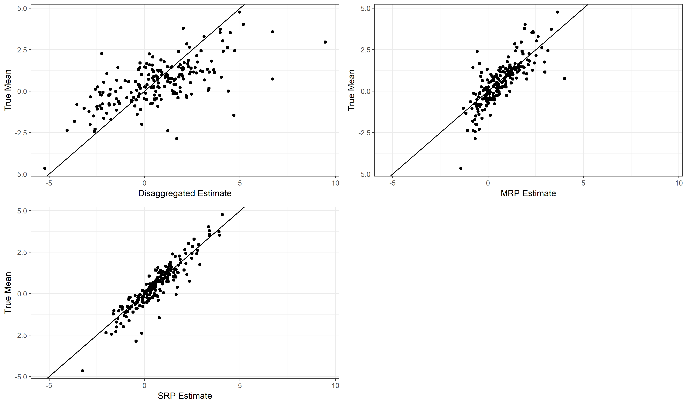
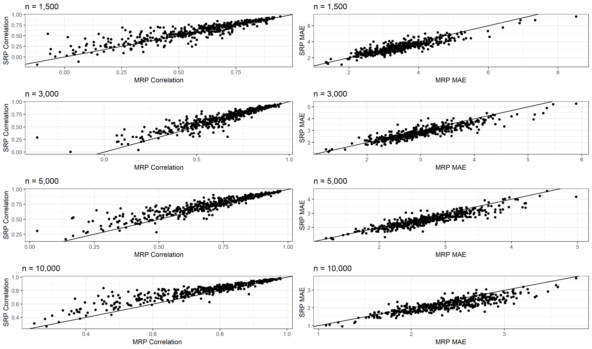

```{r setup, include=FALSE}
knitr::opts_chunk$set(echo = TRUE)
```

Ornstein, Joseph T. (2020). "Stacked Regression and Poststratification" *Political Analysis*.

- [Paper](https://www.cambridge.org/core/journals/political-analysis/article/stacked-regression-and-poststratification/560867941715901378FD9FD00D300CB2)
- [PDF](papers/SRP.pdf)
- [Supplementary Materials](papers/SRP_appendix.pdf)
- [R Package](srp-vignette.html)

## Abstract

I develop a procedure for estimating local-area public opinion called stacked regression and poststratification (SRP), a generalization of classical multilevel regression and poststratification (MRP). This procedure employs a diverse ensemble of predictive models -- including multilevel regression, LASSO, k-nearest neighbors, random forest, and gradient boosting -- to improve the cross-validated fit of the first-stage predictions. In a Monte Carlo simulation, SRP significantly outperforms MRP when there are deep interactions in the data generating process, without requiring the researcher to specify a complex parametric model in advance. In an empirical application, I show that SRP produces superior local public opinion estimates on a broad range of issue areas, particularly when trained on large datasets. 

## Monte Carlo Analysis

When multiplicative interaction effects are large -- and therefore a linear-additive model is misspecified -- SRP produces significant improvements in predictive accuracy. 

 
 
## Empirical Application
 
SRP outperforms classical MRP across 89 different public opinion issues (data from Buttice & Highton, 2013), particularly when trained on large datasets.

 
