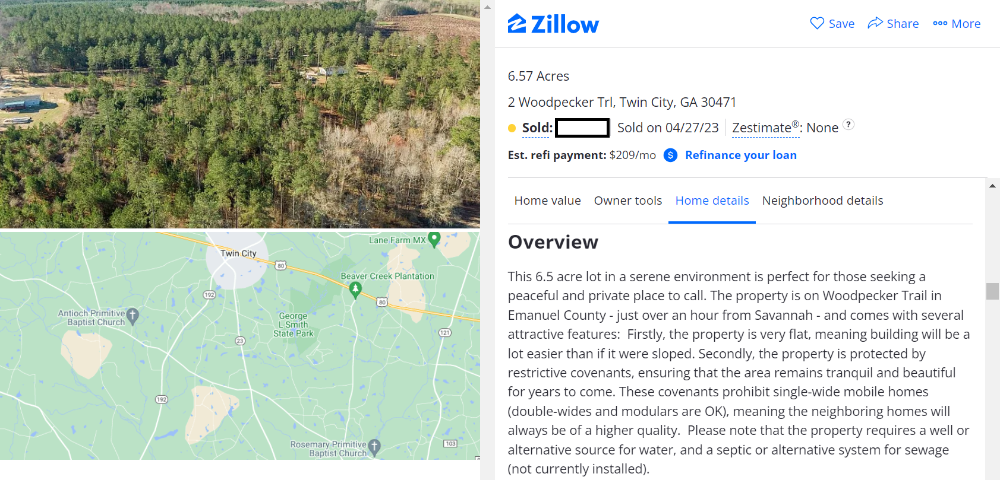
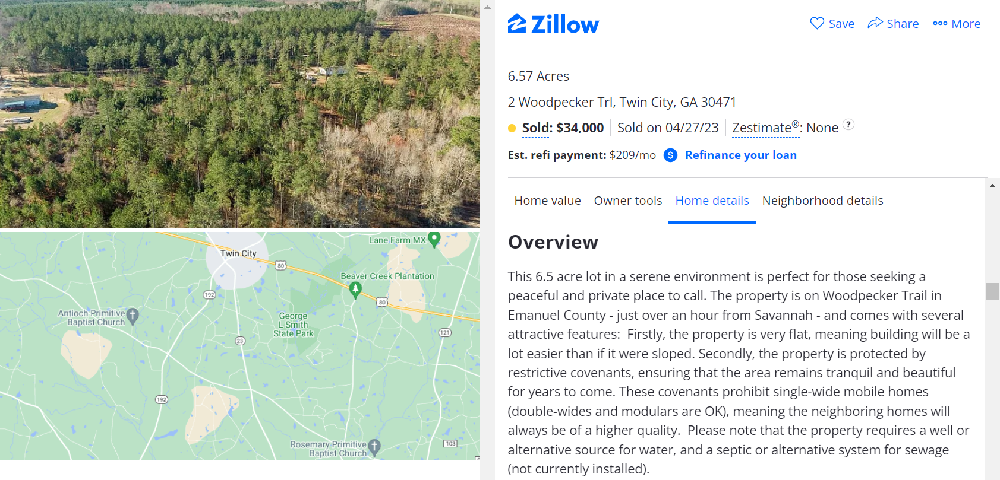
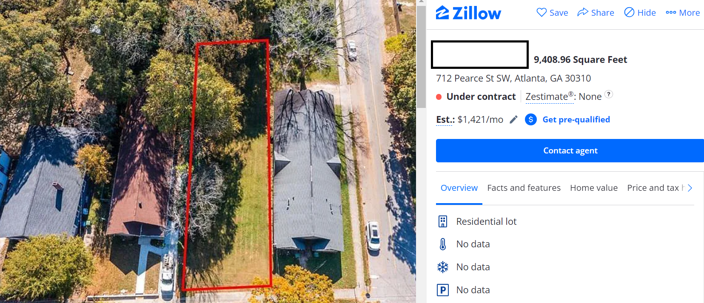
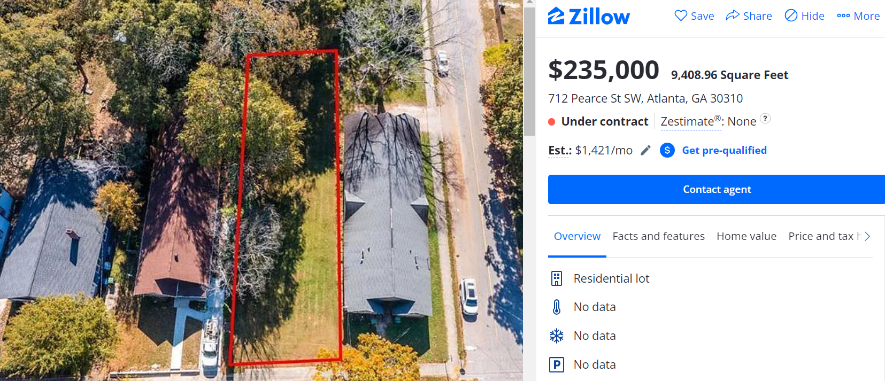
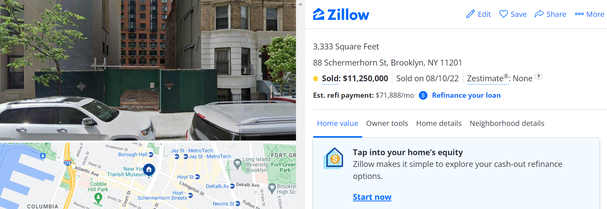
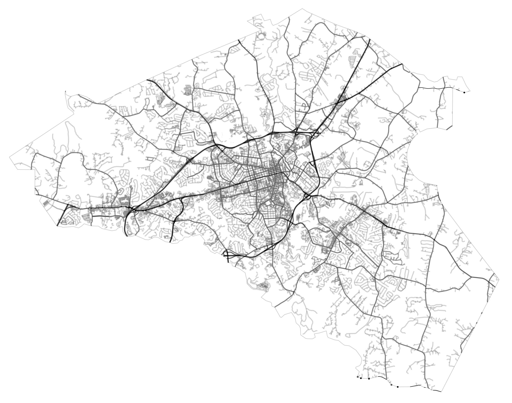
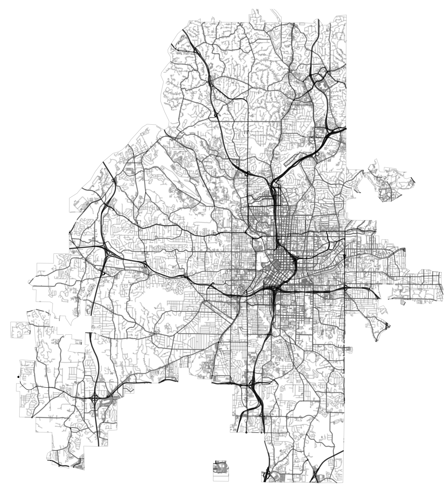
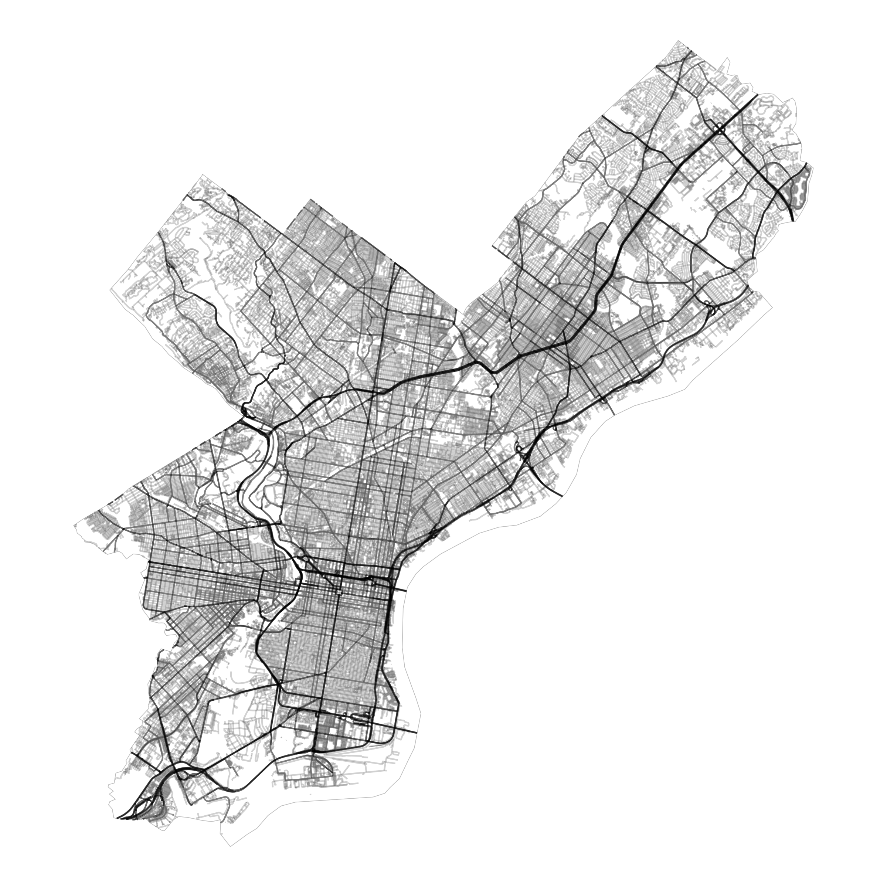

```{css, echo = FALSE}
.cite {
  font-weight: bold;
  font-size: 0.75em;
  color: #BA0C2F;
}
```

```{r Setup, include=FALSE}
library(tidyverse)
library(here)
theme_set(theme_minimal(base_size = 16))
knitr::opts_chunk$set(comment=NA, fig.width=7, fig.height=5,
                      fig.align = 'center', out.width = 600,
                      message=FALSE, warning=FALSE, echo=FALSE)
```


## Fill in the blank:

In the United States (minus Alaska and Hawaii), half of the population lives on roughly \_\_\_\_\_% of the land.

---

## Fill in the blank:

In the United States (minus Alaska and Hawaii), half of the population lives on roughly **1%** of the land.

```{r, out.width=800}
knitr::include_graphics('img/tracts50.png')
```

???

Northeast Megalopolis: ~50 million
Greater Los Angeles: ~20 million
Texas Triangle: ~20 million
Chicagoland: ~10 million
Metro Atlanta: ~5 million

---

## Land Values

Let's play **The Price Is Right**. How much did this 6.5 acre lot sell for in April?

--

[](https://www.google.com/maps/place/2+Woodpecker+Trail,+Twin+City,+GA+30471/@32.5408803,-82.1596253,642m/data=!3m1!1e3!4m5!3m4!1s0x88fa0bb81013c68b:0x8cceffedeeb62f6f!8m2!3d32.5409024!4d-82.1567244?entry=ttu)

???

Actual retail price:



About $5,175 per acre.

---

## Land Values

Next item on **The Price Is Right**: this 9400 sq. foot lot (about 1/5 acre) in Atlanta.

[](https://www.google.com/maps/place/712+Pearce+St+SW,+Atlanta,+GA+30310/@33.735582,-84.4315899,6142m/data=!3m1!1e3!4m6!3m5!1s0x88f503112142a50b:0xc48f55ac55c1c458!8m2!3d33.72919!4d-84.410953!16s%2Fg%2F11c20_408r?entry=ttu)

???

Actual Retail Price:



About $1 million per acre!!

---

## Land Values

Last item on **The Price Is Right**: this vacant lot in Brooklyn, NY.

[](https://www.google.com/maps/place/88+Schermerhorn+St,+Brooklyn,+NY+11201/@40.6988093,-74.0290343,10153m/data=!3m1!1e3!4m6!3m5!1s0x89c25a4eeb5072b9:0x1699dfec9d9cc7c9!8m2!3d40.6903751!4d-73.9904225!16s%2Fg%2F11hds309dq?entry=ttu)

???

Actual Retail Price:



Roughly $150 million per acre.

[Zillow Link](https://www.zillow.com/homedetails/88-Schermerhorn-St-Brooklyn-NY-11201/338819772_zpid/)

[Project Link](https://www.dannyforster.com/project/brooklyn-motto-hotel-architecture-project-brooklyn-new-york/)


---

## Why Cities?

Why are some places on the map in such high demand compared to others? In a country with so much space, why do we crowd ourselves so much? And pay so much for it?

--

- To answer these questions, today we'll introduce the concept of **scale economies**.

--

- Scale economies are the benefits that come from bringing large numbers of people together in one place.

--

- Three sources of scale economies that we'll discuss:

  - Geometry
  
  - Fixed Costs
  
  - Network Effects

---

class: center, middle, inverse

# Scale Economies from Geometry

---

## Scale Economies from Geometry

To illustrate this idea, let's take a tour of some famous city walls.

--

- First Stop: [Monteriggioni, Italy](https://earth.google.com/web/search/Monteriggioni,+Province+of+Siena,+Italy/@43.38945675,11.22413305,265.92426554a,742.63459661d,35y,0h,45t,0r/data=CpIBGmgSYgolMHgxMzJhMmUyNzQ3YzA4YmQxOjB4ODQ0YjNkZjIwZjNiNjRjZBnwQRn077FFQCG3v2mwX3ImQConTW9udGVyaWdnaW9uaSwgUHJvdmluY2Ugb2YgU2llbmEsIEl0YWx5GAIgASImCiQJNWVAMIDcNEARNGVAMIDcNMAZyVTNncCoRUAhnnOmQcuuTcAoAg)

--

- Second Stop: [Carcassone, France](https://earth.google.com/web/search/Carcassonne,+France/@43.20639725,2.36586874,139.23666918a,1092.56384986d,35y,358.03767514h,0t,0r/data=Cn4aVBJOCiUweDEyYWUyYzM5MDExNmJkOGI6MHhlMjhmZGYzYjc3YTExNGM3GbbB5KFKm0VAIQSicfJs0AJAKhNDYXJjYXNzb25uZSwgRnJhbmNlGAEgASImCiQJYh1wouWaRUARjlsPyvCZRUAZfSnBqbsBA0Ah1tih9dzYAkA)

--

- Third Stop: [Palmanova, Italy](https://earth.google.com/web/search/Palmanova,+Province+of+Udine,+Italy/@45.90266633,13.31645381,21.35961588a,5104.81359948d,35y,0h,0t,0r/data=CigiJgokCUNusu1QLkhAEWLf9HkKEUhAGTJrnHxjzTBAIW6I8m71BzBA)

--

- Fourth Stop: [Bruges, Belgium](https://earth.google.com/web/search/Bruges,+Belgium/@51.26078315,3.22210815,1.4800063a,46551.80501176d,35y,0h,0t,0r/data=CnoaUBJKCiUweDQ3YzM1MGQwYzExZTQyMGQ6MHgxYWEyZjM1YWM4ODM0ZGY3GSm65G7GmklAIfbYTHRMzAlAKg9CcnVnZXMsIEJlbGdpdW0YAiABIiYKJAliHXCi5ZpFQBGOWw_K8JlFQBl9KcGpuwEDQCHW2KH13NgCQA)

--

- Fifth Stop: [Xi'An, China](https://earth.google.com/web/search/Xi%27An,+Shaanxi,+China/@34.25938035,108.96720885,406.98459581a,122967.04510274d,35y,0h,0t,0r/data=CoABGlYSUAolMHgzNjYzNzllOTIyYWMxN2I5OjB4ODVkNDY2ZmRhNzk0NTgyZRmp6cQvBiJBQCGqVJreDz1bQCoVWGknQW4sIFNoYWFueGksIENoaW5hGAIgASImCiQJFFZjzDSySUARCoQ1iFmQSUAZaALbmlhADUAhqMqrq2hNBkA)

--

- Final Stop: [Paris, France](https://earth.google.com/web/search/Paris,+France/@48.85885485,2.347035,35.23780348a,24471.33975347d,35y,0h,0t,0r/data=CncaTRJHCiQweDQ3ZTY2ZTFmMDZlMmI3MGY6MHg0MGI4MmMzNjg4Yzk0NjAZ26UNh6VtSEAh2Hort1nRAkAqDVBhcmlzLCBGcmFuY2UYAiABIiYKJAk4-Wt6niFBQBGx3abwLRxBQBnpcN4yTT5bQCGkp32gpTdbQA)

---

## Scale Economies

Double the length of the wall, and you *quadruple* the size of the city you can protect.

```{r}
library(readxl)
walls <- read_xlsx('data/walls.xlsx') |> 
  filter(!(city %in% c('Constantinople (413)')))

W <- seq(min(walls$`length (km)`),36,0.01)
A <- 1/(4*pi)*W^2

library(ggrepel)
ggplot(data = walls |> 
                    filter(city %in% c("Xi'An (1370)", 'Paris (1846)',
                                       "Bruges (1128)", "Monteriggioni (1219)", "Palmanova (1593)", "Carcassonne (1130)"))) +
  theme_minimal() +
  labs(x = 'Wall Length (km)', y = 'City Size (sq. km)') +
       #y = expression(paste('City Size (',km^{2},')'))) +
  geom_point(mapping = aes(x=`length (km)`, y=`area (km2)`)) +
  geom_text_repel(mapping = aes(x=`length (km)`, y=`area (km2)`,
                           label = city))
```

---


## Scale Economies from Geometry

To see why, imagine a perfectly circular medieval city.

```{r, out.width='300'}
knitr::include_graphics('img/circle.png')
```
--

- The **area** of the city is $A = \pi R^2$. The **circumference** is the length of the wall you need $(C = 2\pi R)$.

--

- Do some algebra, and you get $A = \frac{1}{4\pi} C^2$.

---

## Scale Economies

Double the length of the wall, and you *quadruple* the size of the city you can protect.

```{r}

W <- seq(min(walls$`length (km)`),36,0.01)
A <- 1/(4*pi)*W^2

ggplot() +
  theme_minimal() +
  labs(x = 'Wall Length (km)', y = 'City Size (sq. km)') +
       #y = expression(paste('City Size (',km^{2},')'))) +
  geom_point(data = walls |> 
                    filter(city %in% c("Xi'An (1370)", 'Paris (1846)',
                                       "Bruges (1128)", "Monteriggioni (1219)", "Palmanova (1593)", "Carcassonne (1130)")),
       mapping = aes(x=`length (km)`, y=`area (km2)`)) +
  geom_text_repel(data = walls |> 
                    filter(city %in% c("Xi'An (1370)", 'Paris (1846)',
                                       "Bruges (1128)", "Monteriggioni (1219)", "Palmanova (1593)", "Carcassonne (1130)")),
       mapping = aes(x=`length (km)`, y=`area (km2)`,
                           label = city)) +
  geom_line(mapping = aes(x=W, y=A), linetype = 'dashed')
```

---

## Scale Economies from Geometry

Put another way: big cities are cheaper to protect on a per-person basis. Double the size of a city, and you *less* than double the size of the necessary wall.

```{r}
library(ggrepel)
ggplot() +
  geom_line(mapping = aes(y=W, x=A), linetype = 'dashed') +
  theme_minimal() +
  labs(y = 'Wall Length (km)', x = 'City Size (sq. km)') +
       #y = expression(paste('City Size (',km^{2},')'))) +
  geom_point(data = walls |> 
                    filter(city %in% c("Xi'An (1370)", 'Paris (1846)',
                                       "Bruges (1128)", "Monteriggioni (1219)", "Palmanova (1593)", "Carcassonne (1130)")),
             mapping = aes(y=`length (km)`, x=`area (km2)`)) +
  geom_text_repel(data = walls |> 
                    filter(city %in% c("Xi'An (1370)", 'Paris (1846)',
                                       "Bruges (1128)", "Monteriggioni (1219)", "Palmanova (1593)", "Carcassonne (1130)")),
             mapping = aes(y=`length (km)`, x=`area (km2)`,
                           label = city)) + 
  scale_y_log10(limits = c(min(walls$`length (km)`),max(walls$`length (km)`))) +
  scale_x_log10(limits = c(min(walls$`area (km2)`),max(walls$`area (km2)`)))
```

???

Richter scale is logarithmic (e.g. a magnitude 8 earthquake is 10 times more powerful than a magnitude 7 earthquake).

---

## Scale Economies from Geometry

This sort of relationship holds for other (more modern) infrastructure as well, like streets.

--

```{r, out.width='60%'}

```

--

Athens has 1,274 kilometers of streets for 128,000 people -- roughly 10 meters per person.

???

Enough to stretch from here to Dallas, TX!

---

## Scale Economies from Geometry

Atlanta is 4x larger than Athens. About half a million people live in the city.

--

```{r, out.width = '50%'}

```

But it only has about twice the length of roadway (3,052 km) -- 6 meters per person.

---

## Scale Economies from Geometry

Philadelphia is about 3x bigger than Atlanta (1.6 million people). 

--

```{r, out.width = '55%'}

```

But it only has about 1.5x the length of roadways (4,539 km) -- 3 meters per person.

???

Shipping containers scale similarly: volume is $L^3$, but metal is proportional to $6L^2$.

---

## Scale Economies from Geometry

```{r}
roads <- c(1274, 3052, 4539)
pop <- c(128000, 500000, 1600000)
```

---

## Scale Economies from Geometry

This is all eerily similar to the geometric scaling laws we see in nature. 

--

- Double the size of an animal, and the energy necessary to keep it alive less than doubles.

```{r, out.width='500'}
knitr::include_graphics('img/metabolic-scaling.jpeg')
```

---

class: center, middle, inverse

## Scale Economies from Fixed Costs

---

## Scale Economies from Fixed Costs

Another source of increasing returns comes from the way businesses operate.

--

```{r}
knitr::include_graphics('img/cheese.png')
```

--

Each block of cheese costs you $c$ dollars (marginal costs). You also have *fixed costs* of $F$ dollars each month (rent, wages, electricity, etc.).

--

If you sell $x$ blocks of cheese, then your average cost is:

$$
\frac{F + cx}{x}
$$

---

## Scale Economies from Fixed Costs

Let's say your fixed costs are \$10,000 and marginal costs are \$5. 

```{r}
fixed <- 10000
marginal <- 5

x <- seq(0,100,1)
cost <- (fixed + marginal * x) / x

ggplot(mapping = aes(x=x, y=cost)) +
  geom_line(linetype = 'solid') +
  labs(x = 'Cheese Blocks Sold', y = 'Average Cost')

```

--

Unless you can sell cheese blocks for $5000 each, you need a large number of customers in order to cover your fixed costs!

---

## Scale Economies from Fixed Costs

This explains why:

- Businesses with large fixed costs (major league sports stadiums, live theater, museums, **zoos**) can only operate in big cities.

- Niche businesses (weird restaurants, esoteric bookstores, artisan cheese shops) typically operate in larger markets too.

???

Doesn't matter how many people visit your zoo. You gotta feed that elephant 350 pounds of vegetation every day.

---

## Scale Economies from Fixed Costs

.cite[Schiff (2015):]

```{r}
knitr::include_graphics('img/schiff-2015-fig-1.png')
```


---

## Scale Economies from Fixed Costs

```{r}
library(readxl)
library(janitor)
library(ggrepel)

data <- read_xlsx('data/sports-teams.xlsx')

data |> 
  clean_names() |> 
  filter(b4 != 0) |> 
  mutate(population = population/1e6) |> 
  ggplot(mapping = aes(x=population, y=b4, 
                       label = metropolitan_area)) + 
  geom_point(aes(x=population, y=b4)) +
  geom_text_repel() +
  geom_smooth(method = 'lm', se = FALSE) +
  labs(x='Metropolitan Population (Millions)',
       y='Big Four Sports Teams') +
  theme_classic() +
  scale_x_continuous(labels = scales::comma_format()) +
  scale_y_continuous(breaks = 1:10)
```

???

Pop Quiz: Which is the smallest metro area to have a major league team? (Green Bay! Likely because they're the only fan-owned team in the NFL.)

Atlanta Falcons spend $230 million each year in player salaries alone. You can only cover fixed costs like that if you sell a *lot* of tickets. You need to operate in a big market.

---

class: center, middle, inverse

# Scale Economies from Network Effects

---

## Scale Economies from Network Effects


.pull-left[
```{r, out.width = '50%'}
knitr::include_graphics('img/metcalfe.svg')
```
]

.pull-right[
- 1 telephone is useless. There's no one to talk to.

- Larger networks are increasingly more valuable, because the number of possible connections scales with $n^2$.

```{r}
n <- 1:20
y <- n*(n-1)/2

ggplot(mapping = aes(x=n,y=y)) +
  geom_point() +
  labs(x = 'Number of Nodes', y = 'Number of Connections')
```
]

---

class: center, middle, inverse

# Agglomeration Effects

---

## A Puzzle: Clusters of Industry


Scale economies explain why individual organizations would want to locate in large markets, but why would *multiple*, competing firms locate in the same place?

--

```{r}
knitr::include_graphics('img/silicon-valley.png')
```

???

Why do you get clusters of industry? What are some other clusters?

- Finance in New York

- Films in Los Angeles

- Tech in San Francisco

- Cars in Detroit

- Hip hop in Atlanta

---

## A Puzzle: Clusters of Industry


Scale economies explain why individual organizations would want to locate in large markets, but why would *multiple*, competing firms locate in the same place?


```{r}
knitr::include_graphics('img/silicon-valley-logos.png')
```

---

## Agglomeration Economies

Why is it valuable to locate in the same city as your competitors?

--

<br>

.pull-left[

- **Forward Linkages**

- Backward Linkages

- Labor Market Pooling

- Knowledge Spillovers
]

.pull-right[
```{r}
knitr::include_graphics('img/Metropolitan_Opera_House,_a_concert_by_pianist_Josef_Hofmann_-_NARA_541890_-_Edit.jpg')
```
]

---

## Agglomeration Economies

Why is it valuable to locate in the same city as your competitors?

<br>

.pull-left[

- Forward Linkages

- **Backward Linkages**

- Labor Market Pooling

- Knowledge Spillovers
]

.pull-right[
```{r}
knitr::include_graphics('img/Automotive-Factory-Parts_in_Bins.jpg')
```
]

---

## Agglomeration Economies

Why is it valuable to locate in the same city as your competitors?

<br>

.pull-left[

- Forward Linkages

- Backward Linkages

- **Labor Market Pooling**

- Knowledge Spillovers
]

.pull-right[
```{r}
knitr::include_graphics('img/job-seekers.jpg')
```
]


---

## Agglomeration Economies

Why is it valuable to locate in the same city as your competitors?

<br>

.pull-left[

- Forward Linkages

- Backward Linkages

- Labor Market Pooling

- **Knowledge Spillovers**
]

.pull-right[
```{r}
knitr::include_graphics('img/knowledge-spillovers.png')
```
]


---

class: center, middle, inverse

## Power Laws

---

## Warmup

Let's try to name as many US cities as we can in the [City Quiz](https://cityquiz.io/quizzes/usa).

- How many cities do you need to name before you reach 10% of the US urban population? 15%? 20%? 25%?

???

**The Best Possible Scores**:

- 5%: 3 cities (Chicago)
- 10%: 10 cities (San Jose)
- 15%: 27 cities (Detroit)
- 20%: 54 cities (Cleveland)
- 25%: 101 cities (Hialeah, FL)
- 30%: 171 cities (Killeen, TX)
- 35%: 272 cities (Temecula, CA)

---

## City Size Distribution

```{r}
library(readxl)
d <- read_xlsx('data/us-cities.xlsx')

d <- arrange(d, -pop2020)
d$rank <- 1:nrow(d)

d$cumulative_pop2020 <- cumsum(d$pop2020)
urban_pop <- 260638021
d$pct_urban <- d$cumulative_pop2020 / urban_pop * 100

# remove footnotes
d$city <- str_remove_all(d$city, '\\[.*\\]')

ggplot(data = d,
       mapping = aes(x=rank, y=pct_urban)) +
  geom_point(alpha = 0.2) +
  geom_text(data = d |> 
                    filter(city %in% c('Chicago', 'San Jose', 'Detroit', 'Cleveland',
                                       'Hialeah', 'Killeen', 'Temecula')),
                  mapping = aes(label = city)) +
  labs(x = 'Number of Cities',
       y = '% of Urban Population')
```

---

## Power Law Distribution

Once again, if you make the axes logarithmic, everything fits nicely on a straight line!

```{r}
ggplot(data = d,
       mapping = aes(x=rank, y=pct_urban)) +
  geom_point(alpha = 0.2) +
  geom_text(data = d |> 
                    filter(city %in% c('Chicago', 'San Jose', 'Detroit', 'Cleveland',
                                       'Hialeah', 'Killeen', 'Temecula')),
                  mapping = aes(label = city)) +
  # geom_text_repel(mapping = aes(label = city)) +
  labs(x = 'Number of Cities',
       y = '% of Urban Population') +
  scale_x_log10() +
  scale_y_log10()


## Probability Distribution
# library(ggrepel)
# ggplot(data = d,
#        mapping = aes(x=pop2020, y=rank)) +
#   geom_point(alpha = 0.5) +
#   geom_text_repel(mapping = aes(label=city)) +
#   labs(x = 'Population (2020)',
#        y = 'Rank') +
#   scale_x_log10(labels = scales::comma_format()) +
#   scale_y_log10()
```

???

TODO:

- Power laws are ubiquitous (word use, wealth)
- Where do power laws come from? Preferential attachment game (agglomeration economies and preferential attachment / the "Matthew Effect").
- Primate cities: cities that are much bigger than you would expect given power laws. 


---

class: center, middle, inverse

## Historical Path Dependence

---

## Stories about Historical Path Dependence

- **Story 1:** The Fall Line

- **Story 2:** Hiroshima and Nagasaki

- **Story 3:** Pirates of the Mediterranean

- **Story 4:** QWERTY Keyboards

---

## Story 1: The Fall Line

```{r}
knitr::include_graphics('img/cretaceous.png')
```

---

## Story 1: The Fall Line

```{r}
knitr::include_graphics('img/portage.jpeg')
```

---

## Story 1: The Fall Line

```{r}
knitr::include_graphics('img/watermill.jpg')
```

---

## Story 1: The Fall Line

```{r}
knitr::include_graphics('img/bleakley-lin-fig-a1.png')
```

---

## Story 2: Hiroshima and Nagasaki

```{r}
knitr::include_graphics('img/nagasaki.jpg')
```

???

Hundreds of thousands of people dead. Roughly 70% of the buildings destroyed.

---

## Story 2: Hiroshima and Nagasaki

```{r}
knitr::include_graphics('img/hiroshima.webp')
```

???

As a high schooler, I honestly just assumed that Hiroshima and Nagasaki were no longer cities.

---

## Story 2: Hiroshima and Nagasaki

```{r}
knitr::include_graphics('img/Atomic_Bomb_Dome_and_Motoyaso_River,_Hiroshima,_Northwest_view_20190417_1.jpg')
```

???

Thriving city of roughly 1.2 million people

---

## Story 2: Hiroshima and Nagasaki

.cite[Davis & Weinstein (2002):]

```{r}
knitr::include_graphics('img/davis-fig-2.png')
```

???

As if nothing happened! By 1975, both cities are *exactly* where you would have predicted their population to be if you just naively projected forward their growth rates, without knowing anything about the war. 

A remarkable example of Historical Path Dependence. Even in a situation where so many people died, others evacuated, 70% of the buildings destroyed, stigma surrounding radiation, the cities still survived.

---

## Story 3: Pirates of the Mediterranean

```{r, out.width = '400'}
knitr::include_graphics('img/pirate-attacks.png')
```

---

## Story 3: Pirates of the Mediterranean

```{r, out.width='800'}
knitr::include_graphics('img/italian-cities.png')
```

???

Even 500 years afterwards, you still get this inefficient location of Italian urban activity. It would be more efficient for these places to be on the seaside, where you can have a port and trade. But path dependence locks you into this weird historical trajectory.

---

## Story 4: QWERTY

--

Why is history "sticky"?

```{r}
knitr::include_graphics('img/QWERTY_keyboard.jpg')
```

???


## Historical Path Dependence

- The Krugman model tells us **when** countries will urbanize.

--

- But does it tell us **where** they will urbanize?

--

```{r, out.width = '400'}
knitr::include_graphics('img/krugman.png')
```

--

- Villages A, B, and C are all equally likely to become the city!

--

- And once an industry locates somewhere, powerful forces (forward and backward linkages, labor market pooling, knowledge spillovers), conspire to keep it there.

(If you've taken economics before, notice that this is very different than the idea of "comparative advantage". One location specializes in shirt-making and the others specialize in agriculture, but not because of any particular locational advantage...)
