```{css, echo = FALSE}
.cite {
  font-weight: bold;
  font-size: 0.75em;
  color: #BA0C2F;
}
```

```{r Setup, include=FALSE}
library(tidyverse)
theme_set(theme_minimal(base_size = 16))
knitr::opts_chunk$set(comment=NA, fig.width=7, fig.height=5,
                      fig.align = 'center', out.width = 600,
                      message=FALSE, warning=FALSE, echo=FALSE)
```


## Fill in the blank:

In the United States (minus Alaska and Hawaii), half of the population lives on roughly \_\_\_\_\_% of the land.

---

## Fill in the blank:

In the United States (minus Alaska and Hawaii), half of the population lives on roughly **1%** of the land.

```{r, out.width=800}
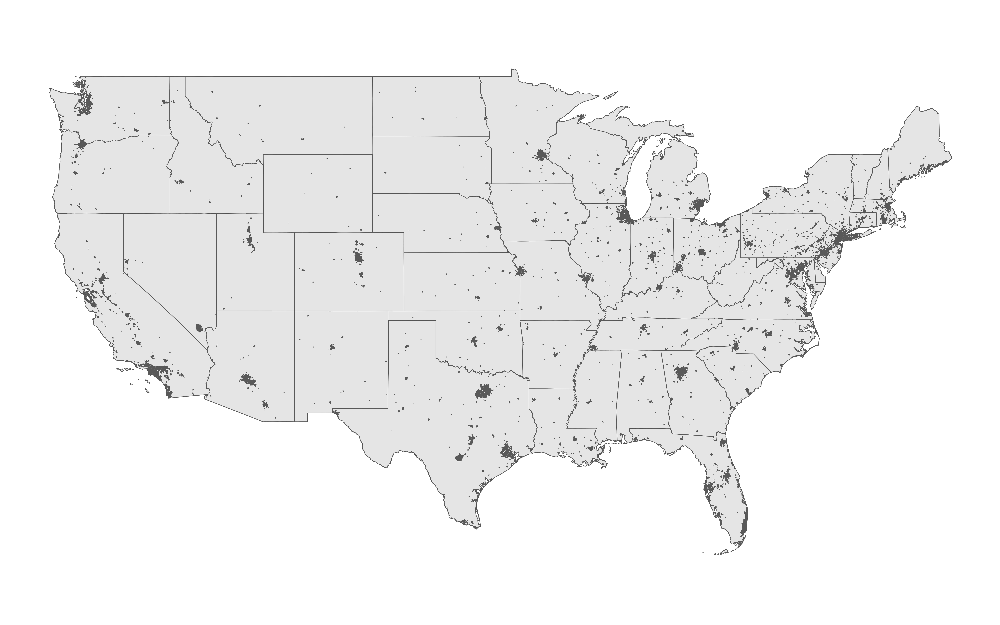
```

???

Northeast Megalopolis: ~50 million
Greater Los Angeles: ~20 million
Texas Triangle: ~20 million
Chicagoland: ~10 million
Metro Atlanta: ~5 million


---

## Why Cities?

In a country with so much open space, why do we crowd ourselves into relatively small areas?

--

- Today, we'll introduce a concept from economics called **increasing returns to scale** (aka **economies of scale**)

--

- This concept not only explains why cities exist, but also implies a number of other interesting facts about cities:

--

  - Why cities promotes economic growth

  - The origins of urbanization
  
  - Path dependence


---

## Increasing Returns to Scale

--

Imagine a [perfectly circular medieval city](https://www.google.com/maps/place/33057+Palmanova,+Province+of+Udine,+Italy/@45.9062316,13.3034413,2296m/data=!3m1!1e3!4m5!3m4!1s0x477bb089f331a869:0x5d2129dbb7a04c79!8m2!3d45.909424!4d13.3057286).

```{r, out.width='350'}
knitr::include_graphics('img/circle.png')
```

--

- The **area** of the circle represents how many people the city can hold. 

- The **circumference** of the circle represents how much wall you need to build to protect them.

---

## Increasing Returns to Scale

$$
\text{Wall Cost Per Person} = \frac{2 \pi R}{\pi R^2} = \frac{2}{R}
$$

--

```{r, fig.width=5, fig.height=3, fig.retina=3, out.width='700'}
R <- seq(1, 10, 0.1)
cpp <- 2/R

ggplot(mapping = aes(x=pi*R^2, y=cpp)) +
  geom_line() +
  theme_minimal() +
  labs(x = 'City Size (A)',
       y = 'Wall Cost Per Unit Area')
```

---

## Increasing Returns to Scale

Double the size of the city, and the size of the necessary infrastructure increases by *less* than double.

```{r, fig.width=5, fig.height=3, fig.retina=3, out.width='700'}

A <- c(1, 2, 5, 10, 20, 50, 100)

ggplot(mapping = aes(x=A, y=2 * sqrt(A / pi) * pi)) +
  geom_point() +
  theme_minimal() +
  labs(x = 'City Area',
       y = 'Necessary Wall Size') +
  scale_x_log10(limits = c(1, 150)) +
  scale_y_log10(limits = c(3, 40))
```

---

## Increasing Returns to Scale

```{r}
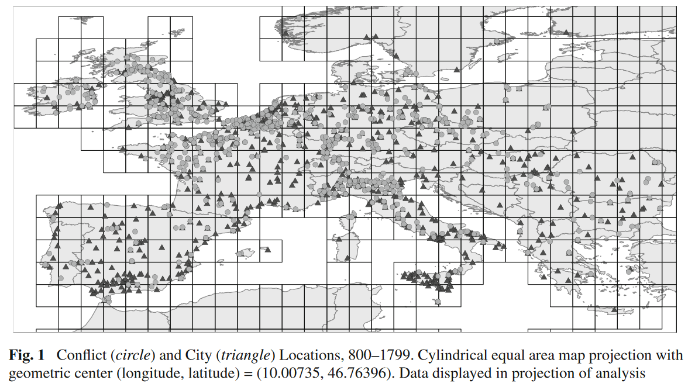
```

.cite[Dincecco & Onorato (2016)]

???

Tough to untangle causality here, but places with more widespread warfare in the millenium before the Industrial Revolution became more urbanized!

---

## Increasing Returns to Scale

This is eerily similar to the geometric scaling laws we see in nature. 

--

- Double the size of an animal, and the energy necessary to keep it alive less than doubles!

```{r, out.width='500'}
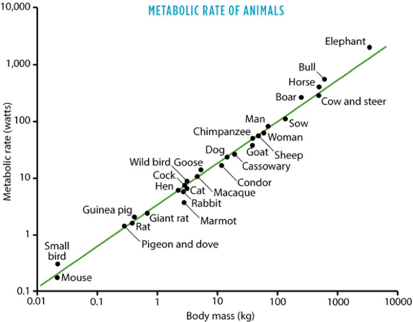
```

---

## Increasing Returns to Scale

--

- These *geometric* economies to scale apply not only to city walls, but to other, more modern, infrastructure needs, like pipes, power lines, and roads.

--

  - The math is a bit more complicated, though .cite[(Bettencourt, 2013)].
  
--

```{r}
knitr::include_graphics('img/maersk.jpg')
```

---

## Increasing Returns to Scale

Another source of increasing returns comes from the way businesses operate.

--

```{r}

```

--

Each block of cheese costs you $c$ dollars, and you sell it for $p$ dollars. You also have *fixed costs* of $F$ dollars each month (rent, wages, electricity, etc.).

--

How many blocks of cheese do you need to sell to stay in business?

---

## Increasing Returns to Scale

$$
\text{Units Sold} > \frac{F}{p - c}
$$
--

This explains why:

- Businesses with large fixed costs (major league sports stadiums, live theater, museums, **zoos**) only operate in big cities.

- Niche businesses (weird restaurants, esoteric bookstores, artisan cheese shops) typically operate in larger markets too.

???

Doesn't matter how many people visit your zoo. You gotta feed that elephant 350 pounds of vegetation every day.

---

## Increasing Returns to Scale

.cite[Schiff (2015):]

```{r}
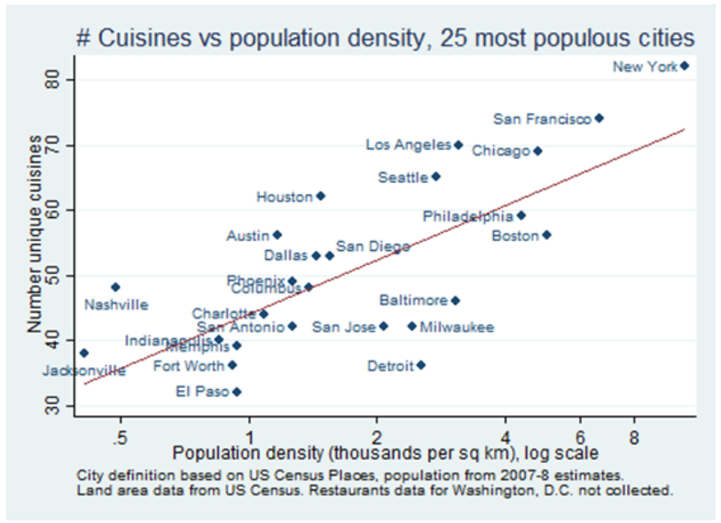
```


---

## Increasing Returns to Scale

```{r}
library(readxl)
library(janitor)
library(ggrepel)

data <- read_xlsx('data/sports-teams.xlsx')

data |> 
  clean_names() |> 
  filter(b4 != 0) |> 
  mutate(population = population/1e6) |> 
  ggplot(mapping = aes(x=population, y=b4, 
                       label = metropolitan_area)) + 
  geom_point(aes(x=population, y=b4)) +
  geom_text_repel() +
  geom_smooth(method = 'lm', se = FALSE) +
  labs(x='Metropolitan Population (Millions)',
       y='Big Four Sports Teams') +
  theme_classic() +
  scale_x_continuous(labels = scales::comma_format()) +
  scale_y_continuous(breaks = 1:10)
```

???

Pop Quiz: Which is the smallest metro area to have a major league team? (Green Bay! Likely because they're the only fan-owned team in the NFL.)

---

## Cities and Economic Growth

Because cities make more types of economic activity possible, countries with more cities tend to be richer.

--

```{r}
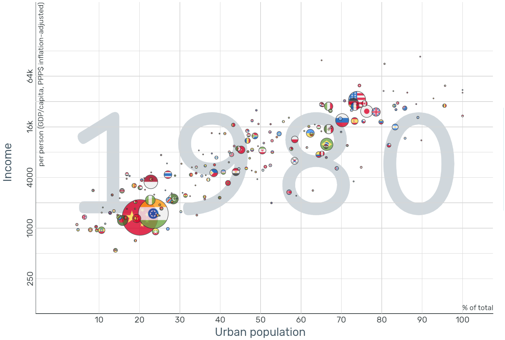
```

(Source: [Gapminder](https://www.gapminder.org/tools/#$model$markers$bubble$encoding$size$scale$extent@:0&:0.74;;;&y$data$concept=income_per_person_gdppercapita_ppp_inflation_adjusted&space@=country&=time;;&scale$domain:null&zoomed@:224&:209113;&type:null;;&x$data$concept=urban_population_percent_of_total&space@=country&=time;;&scale$domain:null&zoomed@:2.08&:100;&type:null;;&color$data$concept=flag_svg&source=country_flags;&scale$type:null&domain:null&zoomed:null;;&frame$speed:100&value=1981;;;;;&chart-type=bubbles&url=v1))

???

In the animation, highlight in particular the different trajectories of India and China. India started wealthier on average than China. Now the average Indian is half as wealthy as the average Chinese person, and half as many live in cities. Not a coincidence!

---

## Origins of Urbanization

Why are some countries more urban while others are predominantly rural? When should we expect a country to **urbanize**?

--

To answer these questions, consider a stripped-down version of the mathematical model in .cite[Krugman (1991)]:

--

.pull-left[
  
- Three villages: A, B, and C

- $N$ people total. $F$ people are farmers. $N-F$ are weavers.

- It costs $1 for a solitary weaver to make a shirt.

- There are **economies of scale**. It only costs $(1 - c) to make a shirt if all the weavers work together in one place.

- It costs $T$ to transport a shirt to another village.

]

.pull-right[
```{r, out.width=400}
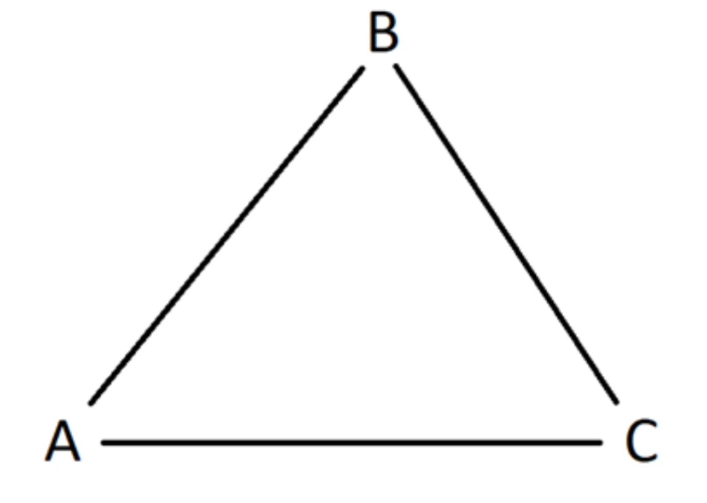
```
]

---

## Origins of Urbanization

When does it cost less to make all your shirts in one location and ship them to the others?

--

$$
(1-c)N + TF < 1N
$$
---

## Origins of Urbanization

When does it cost less to make all your shirts in one location and ship them to the others?

$$\underbrace{(1-c)N}_\text{factory production cost} + \underbrace{TF}_\text{transport cost} < \underbrace{1N}_\text{village production cost}$$
--

Do some algebra, and you can find the conditions under which agglomeration is cheaper:

--

$$T\left(\frac{F}{N}\right) < c$$

--

In other words, you should expect countries to urbanize when:

- Transportation is cheap
- The share of the population in agriculture is low
- Cost-savings from scale economies are large

---

## Origins of Urbanization

```{r}
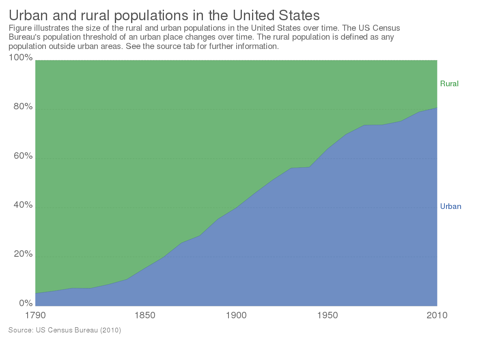
```

---

## Origins of Urbanization

```{r}
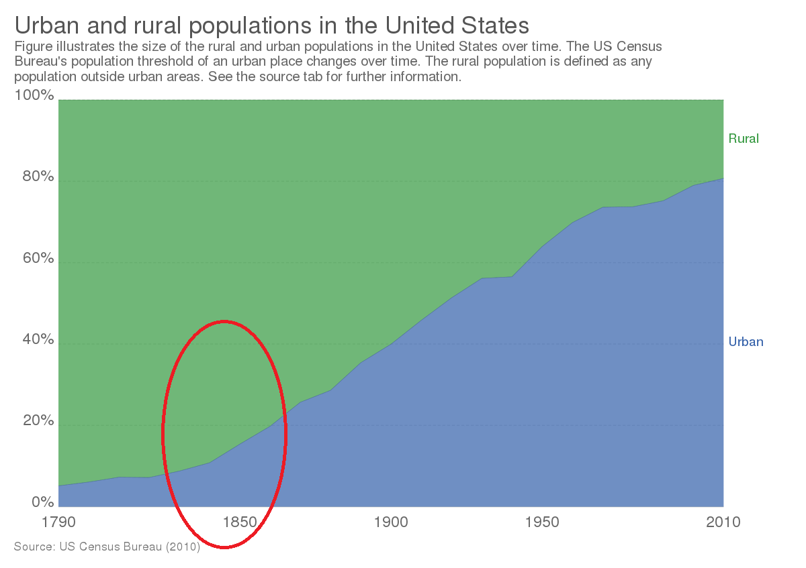
```

What happened here??


---

## Origins of Urbanization

.pull-left[
  - ["2nd Agricultural Revolution"](https://en.wikipedia.org/wiki/British_Agricultural_Revolution)
]

.pull-right[
```{r}
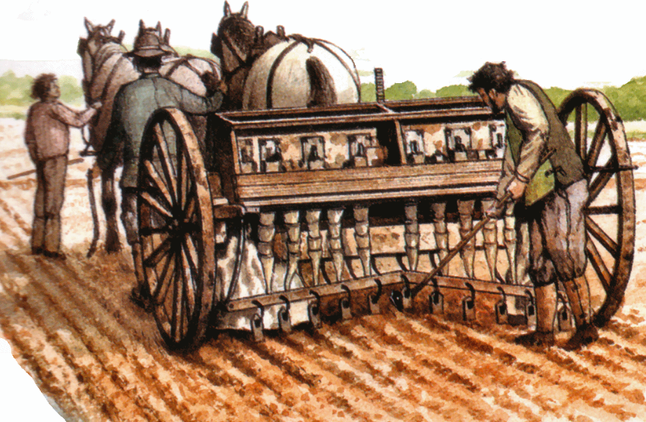
```
]


---

## Origins of Urbanization

.pull-left[
- "2nd Agricultural Revolution"
  
- Factory production
]

.pull-right[
```{r}
knitr::include_graphics('img/factory.jpg')
```
]

---

## Origins of Urbanization

.pull-left[
- "2nd Agricultural Revolution"
  
- Factory production

- New forms of transportation
]

.pull-right[
```{r}
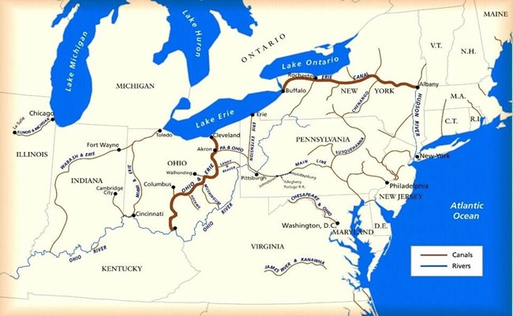

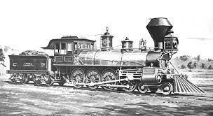
```
]

---

## A Puzzle: Clusters of Industry


The Krugman model explains why an *individual* firm would locate in a city, but why would *multiple*, competing firms locate in the same place?

--

```{r}

```

???

Why do you get clusters of industry? What are some other clusters?

- Finance in New York

- Films in Los Angeles

- Tech in San Francisco

- Cars in Detroit

- Hip hop in Atlanta

---

## A Puzzle: Clusters of Industry


The Krugman model explains why an *individual* firm would locate in a city, but why would *multiple*, competing firms locate in the same place?

```{r}
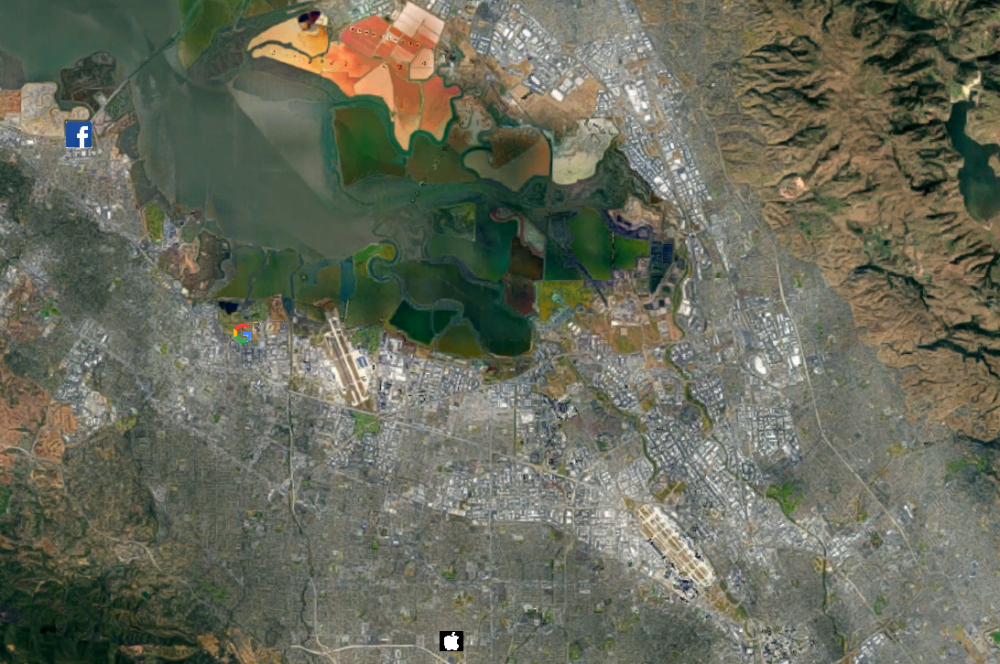
```

---

## Spillover Effects

Why is it valuable to locate in the same city as your competitors?

--

<br>

.pull-left[

- **Forward Linkages**

- Backward Linkages

- Labor Market Pooling

- Knowledge Spillovers
]

.pull-right[
```{r}
knitr::include_graphics('img/Metropolitan_Opera_House,_a_concert_by_pianist_Josef_Hofmann_-_NARA_541890_-_Edit.jpg')
```
]

---

## Spillover Effects

Why is it valuable to locate in the same city as your competitors?

<br>

.pull-left[

- Forward Linkages

- **Backward Linkages**

- Labor Market Pooling

- Knowledge Spillovers
]

.pull-right[
```{r}
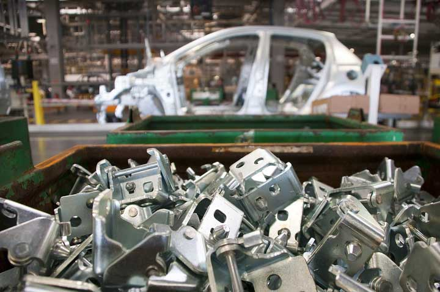
```
]

---

## Spillover Effects

Why is it valuable to locate in the same city as your competitors?

<br>

.pull-left[

- Forward Linkages

- Backward Linkages

- **Labor Market Pooling**

- Knowledge Spillovers
]

.pull-right[
```{r}

```
]


---

## Spillover Effects

Why is it valuable to locate in the same city as your competitors?

<br>

.pull-left[

- Forward Linkages

- Backward Linkages

- Labor Market Pooling

- **Knowledge Spillovers**
]

.pull-right[
```{r}
knitr::include_graphics('img/knowledge-spillovers.png')
```
]


---

class: center, middle, inverse

## Path Dependence

---

## Path Dependence

- The Krugman model tells us **when** countries will urbanize.

--

- But does it tell us **where** they will urbanize?

--

```{r, out.width = '400'}

```

--

- Villages A, B, and C are all equally likely to become the city!

--

- And once an industry locates somewhere, powerful forces (forward and backward linkages, labor market pooling, knowledge spillovers), conspire to keep it there.

???

(If you've taken economics before, notice that this is very different than the idea of "comparative advantage". One location specializes in shirt-making and the others specialize in agriculture, but not because of any particular locational advantage...)

---

class: center, middle

### **Path Dependence**: History has enduring influence!

---

## Stories about Path Dependence

- **Story 1:** The Fall Line

- **Story 2:** Hiroshima and Nagasaki

- **Story 3:** Pirates of the Mediterranean

- **Story 4:** QWERTY Keyboards

---

## Story 1: The Fall Line

```{r}
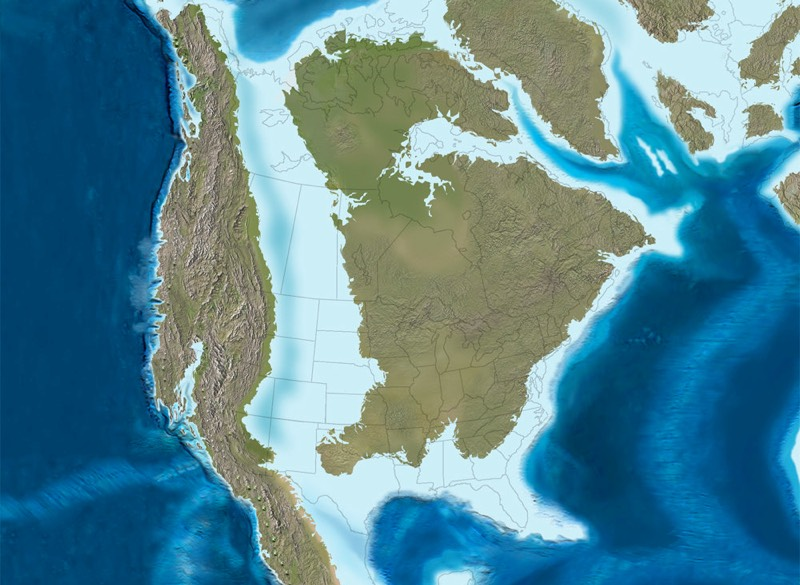
```

---

## Story 1: The Fall Line

```{r}

```

---

## Story 1: The Fall Line

```{r}
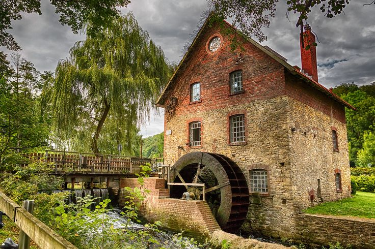
```

---

## Story 1: The Fall Line

```{r}
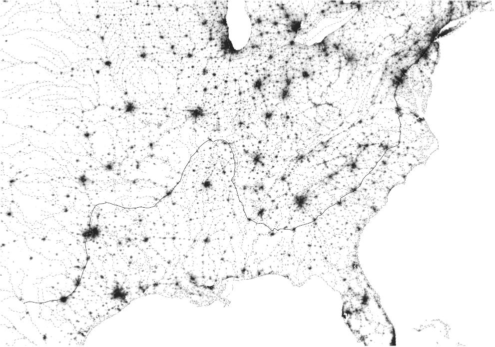
```

---

## Story 2: Hiroshima and Nagasaki

```{r}
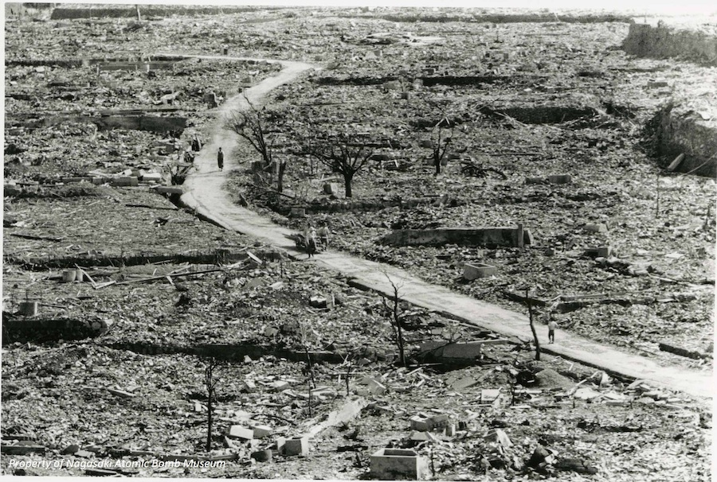
```

???

Hundreds of thousands of people dead. Roughly 70% of the buildings destroyed.

---

## Story 2: Hiroshima and Nagasaki

```{r}
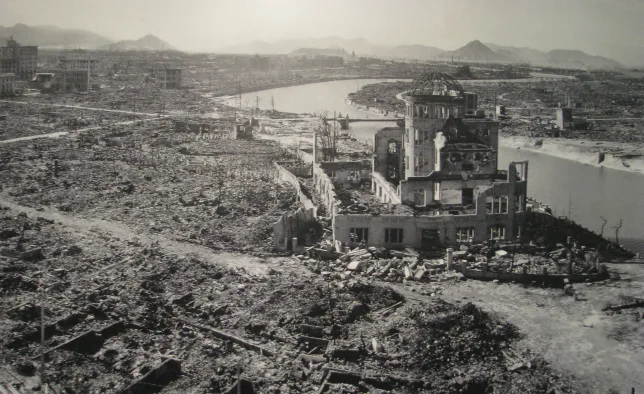
```

???

As a high schooler, I honestly just assumed that Hiroshima and Nagasaki were no longer cities.

---

## Story 2: Hiroshima and Nagasaki

```{r}
knitr::include_graphics('img/Atomic_Bomb_Dome_and_Motoyaso_River,_Hiroshima,_Northwest_view_20190417_1.jpg')
```

???

Thriving city of roughly 1.2 million people

---

## Story 2: Hiroshima and Nagasaki

.cite[Davis & Weinstein (2002):]

```{r}
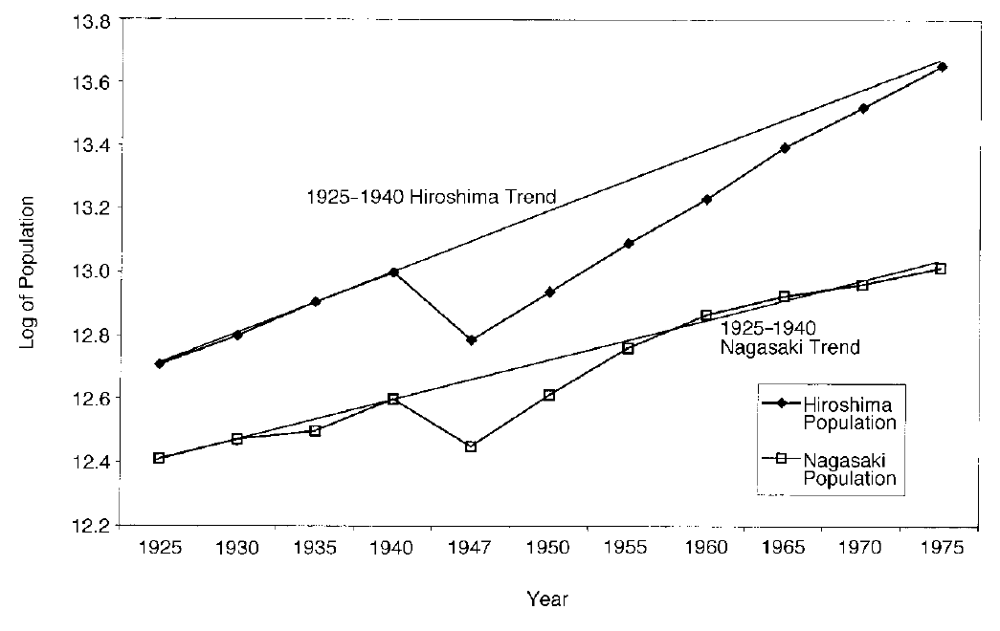
```

???

As if nothing happened! By 1975, both cities are *exactly* where you would have predicted their population to be if you just naively projected forward their growth rates, without knowing anything about the war. 

A remarkable example of path dependence. Even in a situation where so many people died, others evacuated, 70% of the buildings destroyed, stigma surrounding radiation, the cities still survived.

---

## Story 3: Pirates of the Mediterranean

```{r, out.width = '400'}
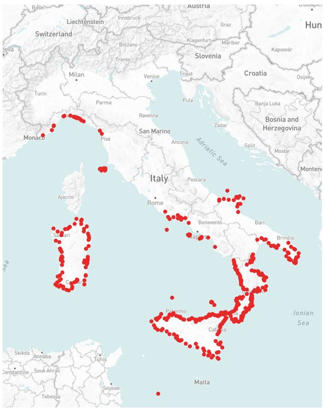
```

---

## Story 3: Pirates of the Mediterranean

```{r, out.width='800'}
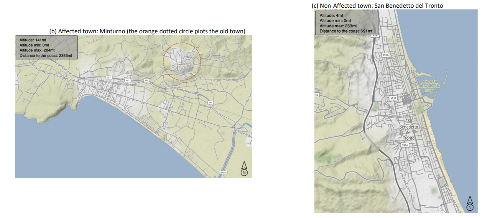
```

???

Even 500 years afterwards, you still get this inefficient location of Italian urban activity. It would be more efficient for these places to be on the seaside, where you can have a port and trade. But path dependence locks you into this weird historical trajectory.

---

## Story 4: QWERTY

--

Why is history "sticky"?

```{r}

```


---


class: center, middle, inverse

## Discussion

---

## Discussion

The COVID-19 pandemic led many to predict that cities would become obsolete. 

- New communication technologies (Zoom, the Metaverse) reduce the value of face-to-face communication, so firms no longer need to agglomerate in a single place.

- Fears of contagion reduce the value that people place on dense city living.

In light of what we've learned today, do you agree with these predictions? What do you expect the "city of the future" to look like?

