```{css, echo = FALSE}
.cite {
  font-weight: bold;
  font-size: 0.75em;
  color: #BA0C2F;
}
```

```{r Setup, include=FALSE}
library(tidyverse)
theme_set(theme_minimal(base_size = 16))
knitr::opts_chunk$set(comment=NA, fig.width=7, fig.height=5,
                      fig.align = 'center', out.width = 600,
                      message=FALSE, warning=FALSE, echo=FALSE)

image_link <- function(image,url,...){
  htmltools::a(
    href=url,
    htmltools::img(src=image,...)
    )
}
```


## Today

Three stories about how our cities are divided:

--

- By Political Party

--

- By Race

--

- By Land Use


---

class: center, middle, inverse

# Story 1: 

# The Density Divide

---

## Let's Play The Google Street View Game

<br>

```{r}
image_link('img/street-view-game.png', 'https://www.nytimes.com/interactive/2021/upshot/trump-biden-geography-quiz.html')
```


---

## Densely Populated Places Are More Democratic

```{r}
image_link('img/2016-map.png', 'https://www.nytimes.com/interactive/2018/upshot/election-2016-voting-precinct-maps.html')
```


---

## Why Are We Sorted?

.pull-left[

- **Selective Migration**

- Party Polarization: Age

- Party Polarization: Race

- Party Polarization: Personality

]

.pull-right[
```{r, out.width = 300}
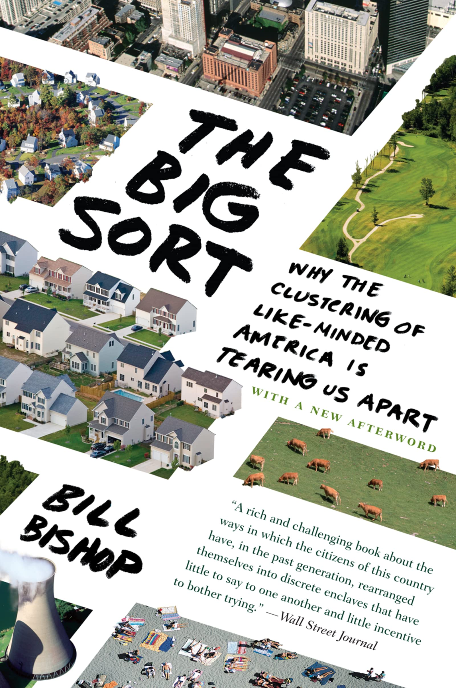
```
]

---

## Why Are We Sorted?

.pull-left[

- **Selective Migration**

  - Caveats: .cite[Mummolo & Nall (2017)]

- Party Polarization: Age

- Party Polarization: Race

- Party Polarization: Personality

]

.pull-right[
```{r, out.width = 300}

```
]


---

## Why Are We Sorted?

.pull-left[

- Selective Migration

  - **Caveats: .cite[Mummolo & Nall (2017)]**

- Party Polarization: Age/Race

- Party Polarization: Personality

]

.pull-right[
```{r}
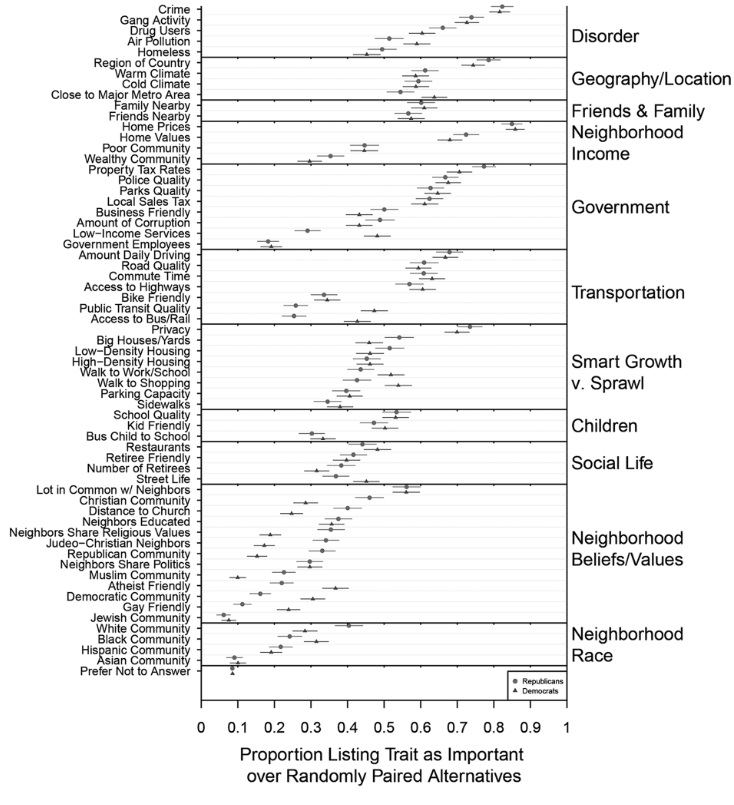
```
]

???

When you ask people what they're looking for in a neighborhood, and look at actual migration patterns, "partisanship of neighbors" rarely cracks the top 50 in the list of concerns.

---

## Why Are We Sorted?

.pull-left[

- Selective Migration

  - Caveats: .cite[Mummolo & Nall (2017)]

- **Party Polarization: Age/Race**

- Party Polarization: Personality

]

.pull-right[
```{r}
load('data/cleaned-CES.RData')

ces |> 
  filter(!is.na(age), !is.na(trump_approval)) |> 
  filter(age < 85) |> 
  group_by(age) |> 
  summarize(pct_trump = sum(trump_approval == 'Somewhat approve' | 
                              trump_approval == 'Strongly approve') / n() * 100) |> 
  ggplot(mapping = aes(x= age,
                       y=pct_trump)) + 
  geom_point() +
  geom_smooth() +
  labs(x = 'Age',
       y = 'Trump Approval Rating') 

```
]


---

## Why Are We Sorted?

.pull-left[

- Selective Migration

  - Caveats: .cite[Mummolo & Nall (2017)]

- **Party Polarization: Age/Race**

- Party Polarization: Personality

]

.pull-right[
```{r}
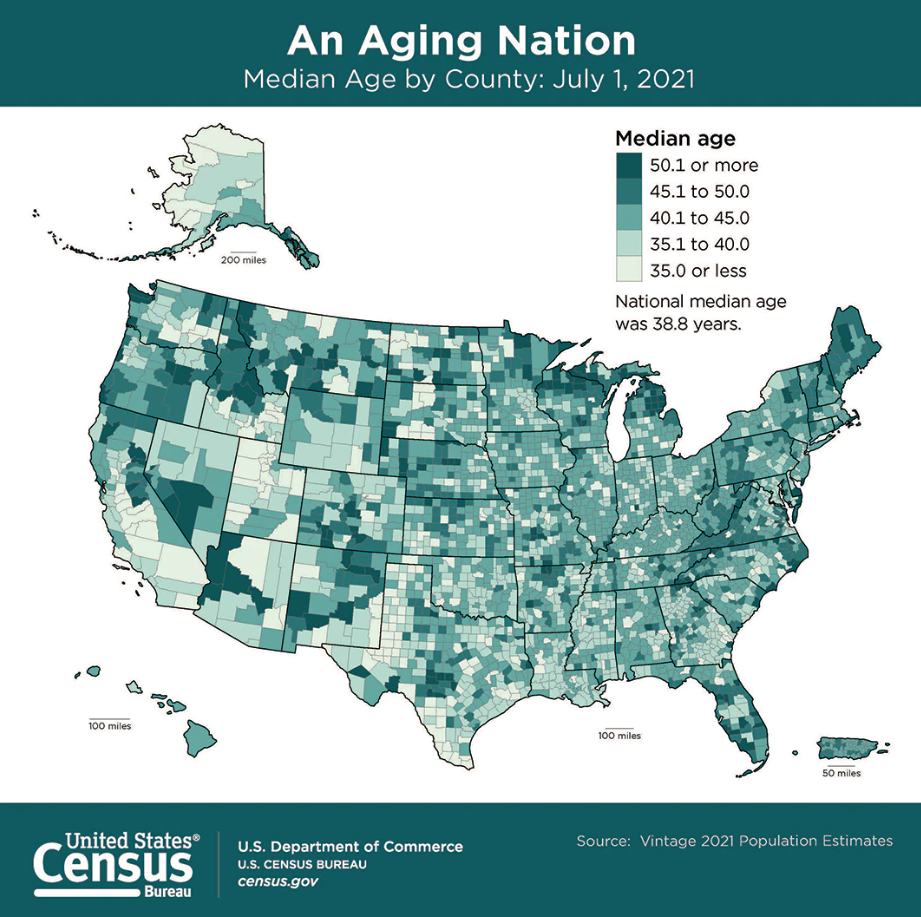
```
]

---

## Why Are We Sorted?

.pull-left[

- Selective Migration

  - Caveats: .cite[Mummolo & Nall (2017)]

- Party Polarization: Age/Race

- **Party Polarization: Personality**

]

.pull-right[
```{r, out.width=240}
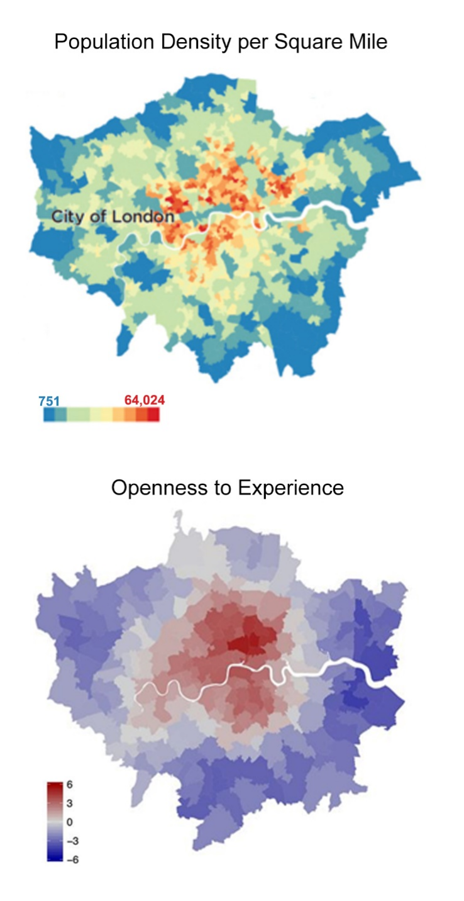
```
]


---


## Why Does It Matter?

--

- **Affective Polarization**: If your only exposure to members the other party is on the Internet, then you're less likely to view them favorably.

--

- **Political Geography**: With single-member districts, the party that is densely packed into cities has a structural disadvantage in electoral politics.

--

```{r, fig.align='center'}
image_link('img/mander.jpg', 'http://gametheorytest.com/gerry/game/', style="display: block; margin-left: auto; margin-right: auto;")
```


---

## Why Does It Matter?

.pull-left[
```{r}

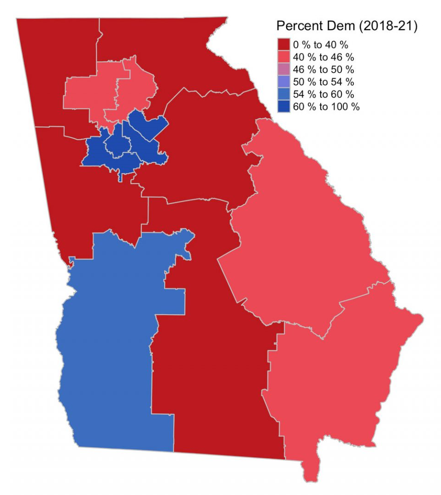
```
]

--

.pull-right[
```{r}
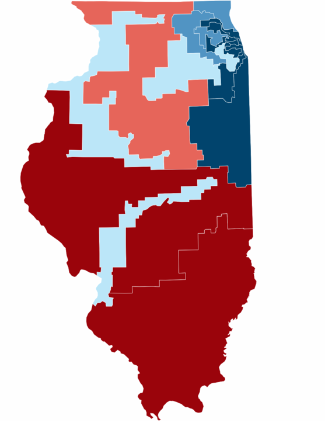
```
]

???

[Atlanta Magazine](https://www.atlantamagazine.com/news-culture-articles/heres-how-redistricting-changed-georgias-2022-maps-for-the-house-state-senate-and-u-s-house/)


---

```{r, out.width=400}
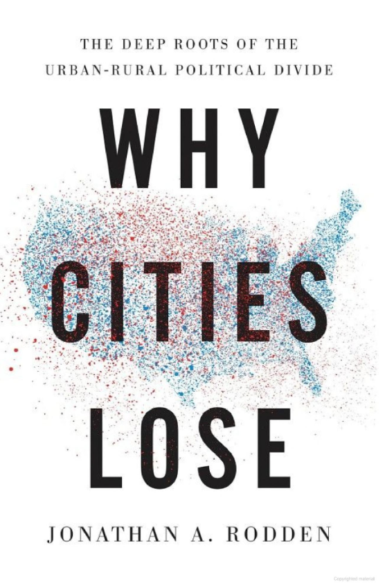
```

---

class: center, middle, inverse

# Story 2: 

# Why Your Neighbors All Look Like You


---

## Residential Segregation

Think for a moment about the neighborhood where you grew up.

```{r}
image_link('img/segregation-quiz.png', 'https://forms.gle/WaXEEVcKnoAcg5Rr5')
```


???

https://docs.google.com/spreadsheets/d/1qn-49VIEQfKy26uBrtfY2H4MTYjhF5SDhkQ6Hkt0Q6Q/edit?usp=sharing

---

## The Dot Map

```{r}
image_link('img/the-dot-map.png', 'https://www.arcgis.com/apps/mapviewer/index.html?webmap=30d2e10d4d694b3eb4dc4d2e58dbb5a5')
```


---

## Why Are We Segregated?

--

One set of explanations emphasizes *de jure* segregation. Laws that deliberately created segregated neighborhoods.

--

.pull-left[

- **Jim Crow Laws**

- Racial Covenants

- Redlining

]


.pull-right[
```{r, out.width=600}

```
]

???

- HITLER'S LOVE LIFE REVEALED!!
- But in the country more broadly, there were a multitude of laws and governmental interventions that segregated the housing market. 

---


## Why Are We Segregated?


One set of explanations emphasizes *de jure* segregation. Laws that deliberately created segregated neighborhoods.


.pull-left[

- Jim Crow Laws

- **Racial Covenants**

- Redlining

]


.pull-right[
```{r, out.width=600}
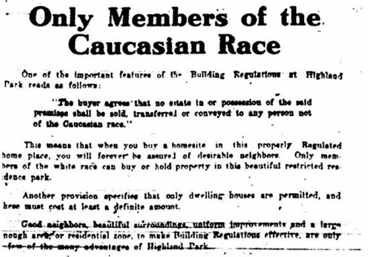
# https://www.planetizen.com/news/2021/03/112695-new-mexico-communities-reflect-racial-restrictive-covenants
```
]


---


## Why Are We Segregated?


One set of explanations emphasizes *de jure* segregation. Laws that deliberately created segregated neighborhoods.


.pull-left[

- Jim Crow Laws

- Racial Covenants

- **Redlining**

]


.pull-right[
```{r, out.width=600}
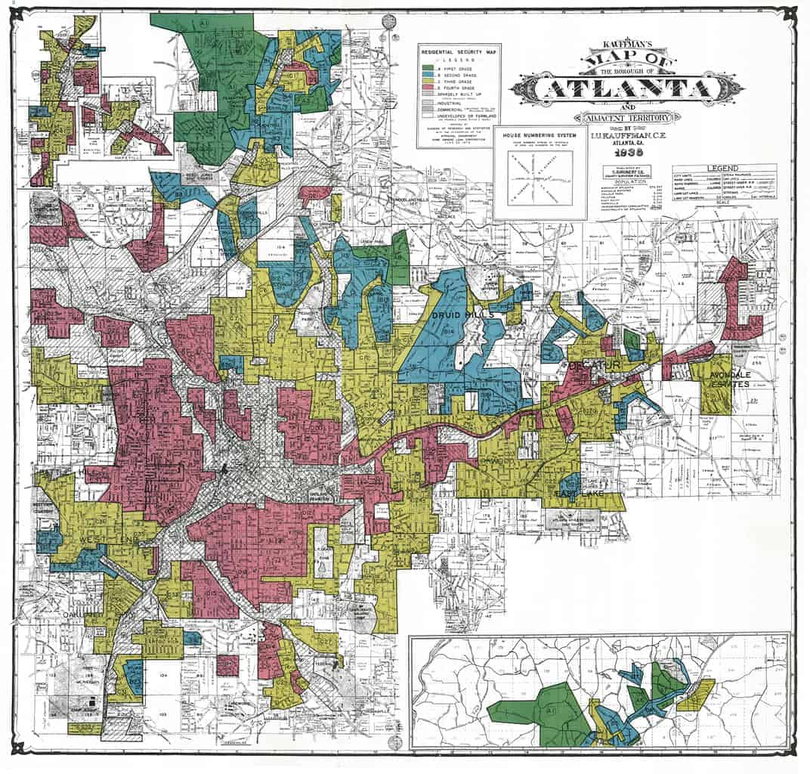
```
]

???

New Deal Era federal agencies (like HOLC, the Home Owner's Loan Corporation) designed to help people finance their homes were more likely to extend loans in less "risky" neighborhoods. Guess which areas they colored in red (risky)? Cities that HOLC appraised are more likely to be segregated today, and have larger racial wealth gaps (Faber)


---

.pull-left[
```{r}
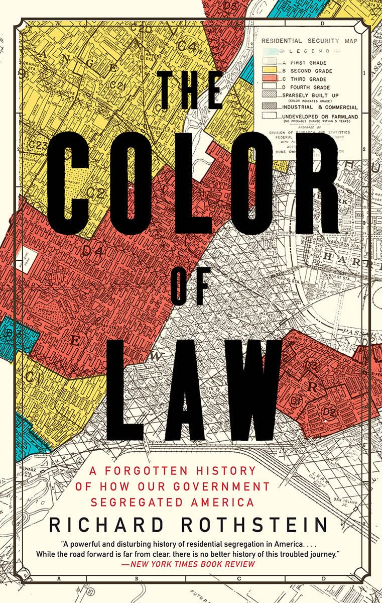
```
]


.pull-right[


```{r}
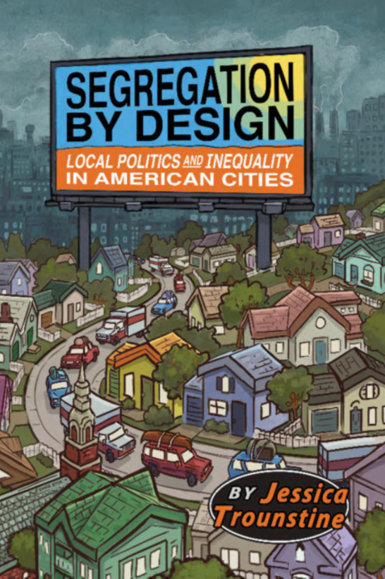
```

]

---

## Why Are We Segregated?

Another set of explanations emphasizes *de facto* segregation. People prefer living near similar people.

--

```{r}
image_link('img/polygons.png', 'https://ncase.me/polygons/', style="display: block; margin-left: auto; margin-right: auto;")
```

---

## Why Does It Matter?

--

- So much *economic opportunity* is linked to our neighborhoods .cite[(Chetty et al.)].

--

- Racially segregated cities are more politically polarized .cite[Trounstine (2015)].

--

- **Contact Hypothesis:** We're more likely to trust and understand people if we interact with them regularly .cite[Carrell et al. (2015); Brown et al. (2021).]

--

Fortunately, there is some good news:

```{r, out.width = 400}
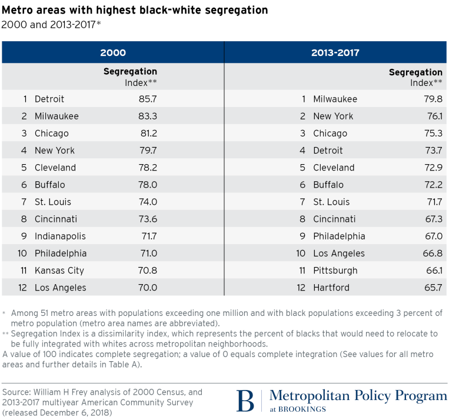
```

???

Dissimilarity index: roughly speaking, what percent of people need to move before an area becomes perfectly integrated? In Detroit in 2000, it was about 85%. But now it's 15 points lower! Diversification of downtowns, plus increasing numbers of Black Americans moving to suburbs, means that we've started making a dent in racial segregation. Still a long way to go, but I for one am cautiously optimistic.

---


class: center, middle, inverse

# Story 3: 

# The High Modernists

### (Or, Why You Can't Get Anywhere Without A Car)

---

## Zoning

<br>

```{r, out.width=800}

```

???

In SimCity, the very first thing you do is segregate your city...by land use. Houses go here, shops go here, the landfill and coal power plants go way off in the corner.

---

## Zoning

This is pretty true to life. Nearly every city in the United States has a map like this:

```{r}
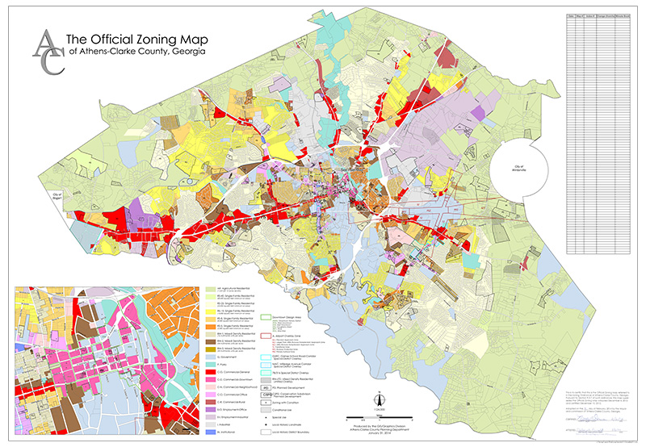
```

---

## Zoning

It didn't used to be this way...

[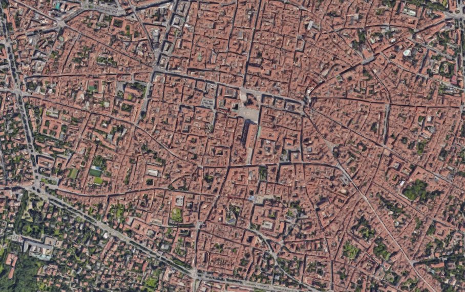](https://www.google.com/maps/@44.4940617,11.3440081,2243m/data=!3m1!1e3)

???

In any pre-modern city, there's city planning, sure. You lay out the roads, you set aside some public space for a plaza, but the idea of dividing up a city into "zones", each with their own particular purpose, is a thoroughly modern, 20th century, invention.

---

## The Happy Bedtime Story About Zoning

```{r, out.width=500}
# image credit: DALLE-2

```

---

## Pittsburgh, 1940s

.pull-left[
```{r, out.width=200}
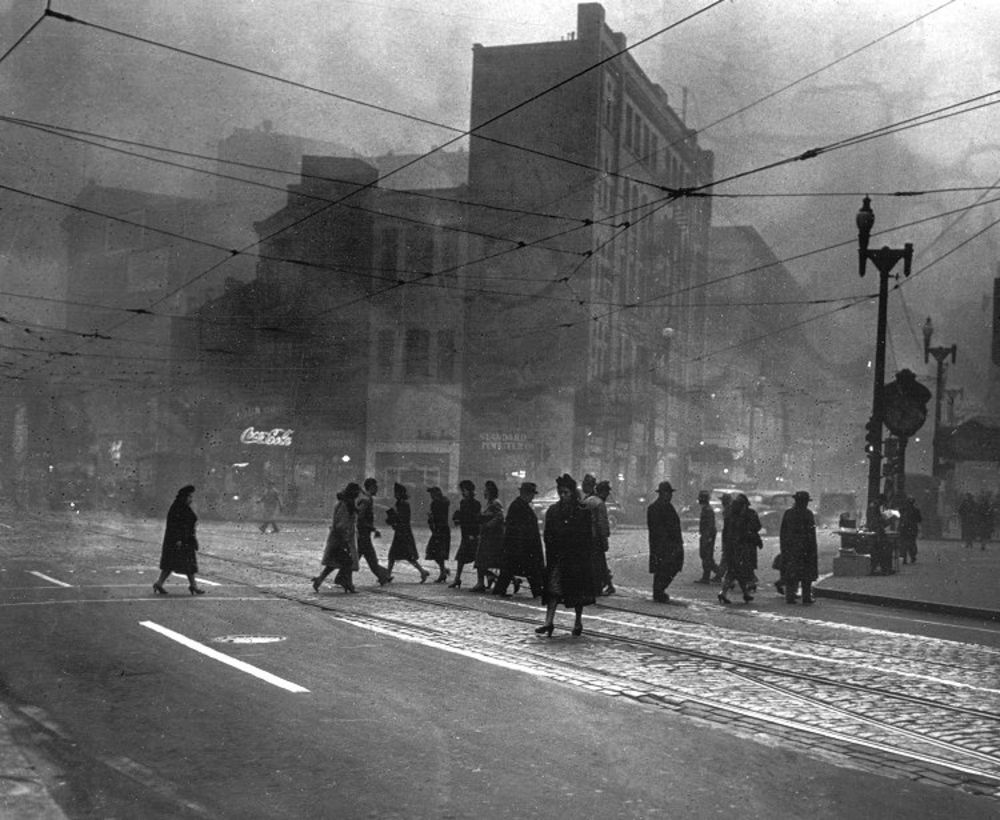
```

```{r, out.width=250}
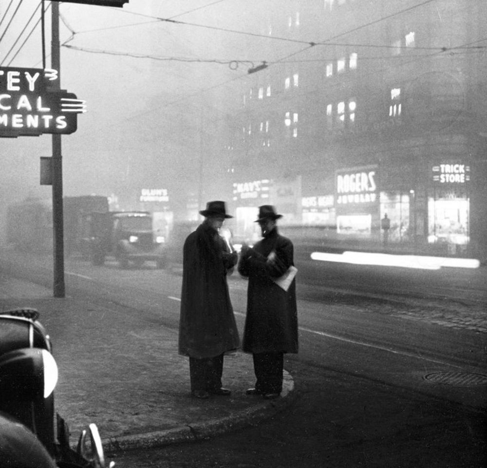
```

]

.pull-right[

```{r, out.width=300}

```

]

Image Credit: [Bloomberg / University of Pittsburgh](https://www.bloomberg.com/news/articles/2012-06-05/what-pittsburgh-looked-like-when-it-decided-it-had-a-pollution-problem)


???

Bloomberg published this series of photographs from Pittsburgh back in its steel-producing heyday that I love.

https://www.bloomberg.com/news/articles/2012-06-05/what-pittsburgh-looked-like-when-it-decided-it-had-a-pollution-problem

---


## Negative Externalities

Some land uses impose *negative externalities* on others. 

--

```{r}
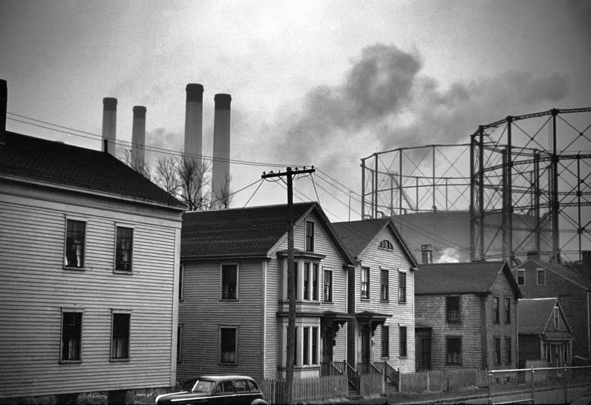
# https://transformplace.files.wordpress.com/2014/09/houses-next-to-factory.jpg
```

--

The free market alone has a hard time handling negative externalities. And so the government steps in, using zoning to separate incompatible uses. 


???

- Some uses of land impose *negative externalities* on other people. And it's not easy for private citizens to negotiate the problem away.
- One of the key roles of government is to resolve these sorts of collective action problems.
- Zoning separates these incompatible uses. 

---

## *Euclid v. Ambler* (1926)

<br>

```{r}
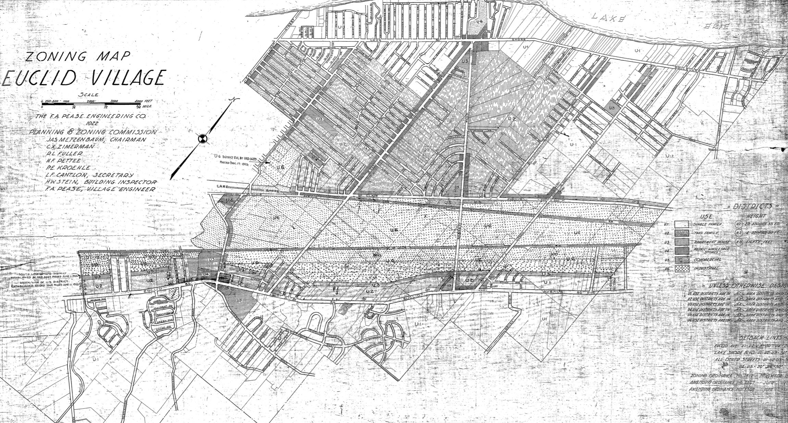
```

???

In our happy story, towns like Euclid OH create land use maps to separate incompatible uses. Ambler Realty sues, arguing that the village violated the 14th amendment, seizing the value of its land without due process. The practice gets upheld by the Supreme Court in 1926. 

---

## Pittsburgh Today

```{r, out.width=800}
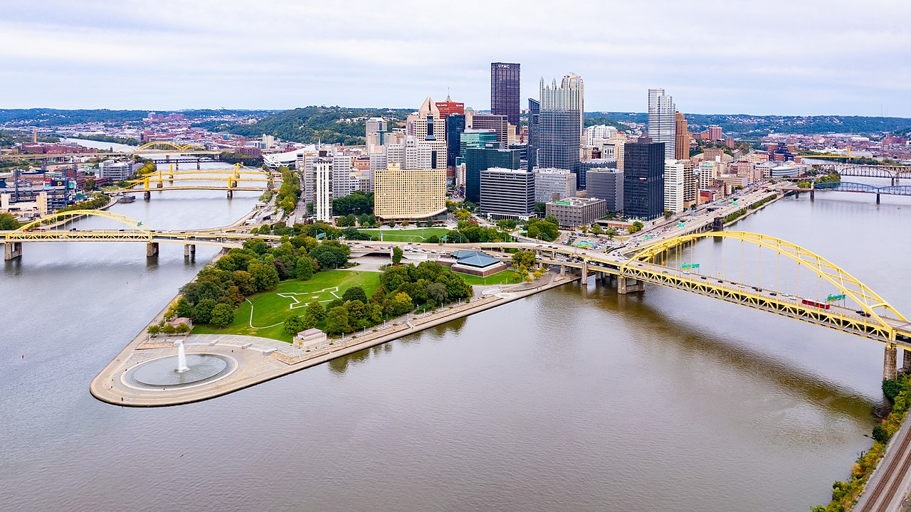
```


---

```{r, out.width = 400}
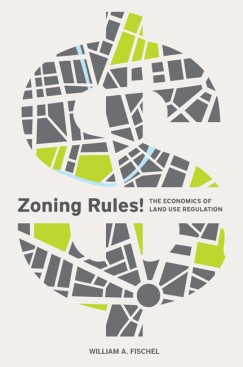
```

---

## The Gritty Rebooted Bedtime Story About Zoning

```{r, out.width=450}

```

---

## New York, 1880s

```{r, out.width=700}

```

???

My guilty pleasure TV: HBO's the Gilded Age. Real Housewives of New York, but in 1880. You know, the new money Vanderbilt stand-ins build a gaudy Upper East Side mansion directly across from the old money Van Rhijns, but the Astors obviously can't let them into polite society just because they have a lot of money I mean for God's sakes their chef isn't even from France and they eat with all the wrong silverware.

---

## New York, 1880s

.pull-left[

<br>

<br> 

Where do you build your gaudy New York City mansion in the 1880s?

- 61st Street and 5th Avenue

(Historical Path Dependence Alert!)

]


.pull-right[
```{r}
image_link('img/nyc-1871.jpg', 'https://iiif-prod.nypl.org/index.php?id=1691409&t=g', width = 350, style="display: block; margin-left: auto; margin-right: auto;")
```
]

???

At any rate, where do the wealthiest New Yorkers live? 61st street and 5th Avenue. Why? Well, before New York had a zoning code, it's the closest you can be to the Financial District while safely avoiding the poors and the factories. Factories can't be far away from rail depots or the docks, because that's where you load and unload your goods. Poor people in their apartment buildings can't be far from the street car lines.

- This is *pre-zoning*, so the Astors and Vanderbilts can't keep slaughterhouses away from their grand houses by making it illegal. Instead, they simply build their houses *here*, where you can still ride a carriage to get downtown, but away from the street cars and elevated railways and docks. (Historical path dependence alert! The Upper East Side is still the place where all the New York old money live today, despite the original reason for living there disappearing.)


---

## The Internal Combustion Engine Changes Everything

--

.pull-left[

**1904-1905:**

```{r, out.width = 300}
knitr::include_graphics('img/nyc-bus.jpg')
```

```{r, out.width=300}
knitr::include_graphics('img/double-decker-bus.jpeg')
```
]

--

.pull-right[

**1917:**

```{r, out.width = 500}

```

<br> 

Suddenly, industry is not confined to the railyards and the docks, and the apartment buildings are not confined to the streetcar lines!

]


???

- Trucks (model-tt, rolled out in 1917) and buses (nyc-bus, 1904, and double-decker (1905). https://ephemeralnewyork.wordpress.com/tag/first-bus-new-york-city/
- Suddenly, industry is not confined to the docks and the railroad lines, and poor people can live *anywhere*. Naturally, the city's monied classes are outraged, and lobby for change. 


---

## New York's First Zoning Map (1916)

```{r}

```

???

At first, rudimentary height restrictions (what multiple of street size your building can be without setbacks.)

---

## The High Modernists

Adoption of zoning codes coincides with a movement that James Scott calls "High Modernism".

--

.pull-left[
```{r, out.width=270}

```
]

.pull-right[
```{r}
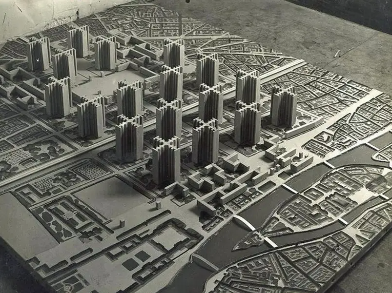
```
]

--

<br>

Characterized by a love of rectangles, open space, strict separation of uses, and a general zest for tearing everything down and starting over.

???

Le Corbusier / High Modernists viewed pre-modern cities as dirty, unorganized, and in need of rationalist urban planning.


---

## Why Does It Matter?

--

- Strict zoning regulations create housing shortages (more on this in the **Housing** module).

--

- Single-use zoning strains transportation systems by putting distance between where people live, work, and play (more on this in the **Transportation** module).

--

- Strict separation of uses saps cities of *life*.

.pull-left[
```{r, out.width=300}
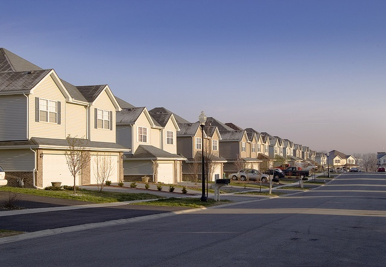
```
]

.pull-right[
```{r}
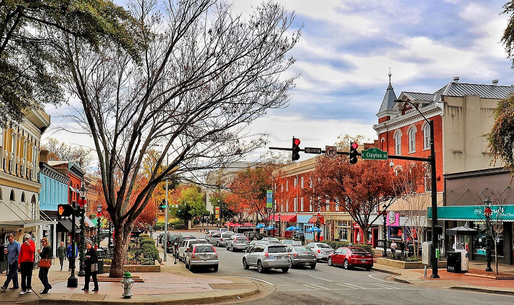
```
]


???

- Manhattan has fewer people today than it did a hundred years ago when it created its first zoning map.
- I encourage you to take the next few weeks walking around Athens, and think about the way you *feel* in different places. Which places feel alive? Which places feel dead? Chances are the living places contain a mixture of uses, such that there's always somebody there doing something.


---


.pull-left[
```{r, out.width = 200}
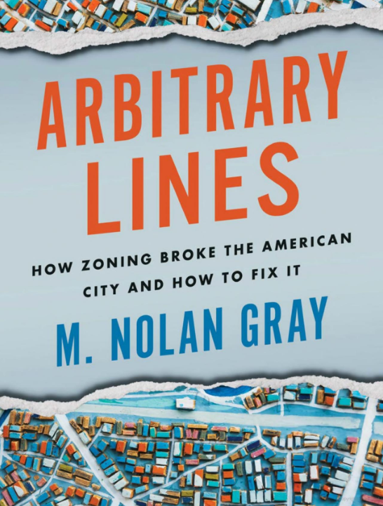
```

```{r, out.width=200}
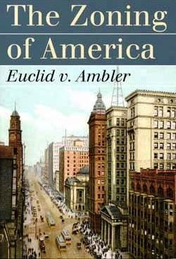
```
]


.pull-right[
```{r, out.width=200}

```

```{r, out.width=200}
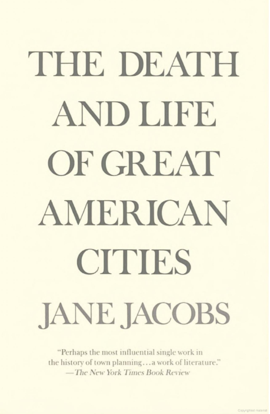
```
]