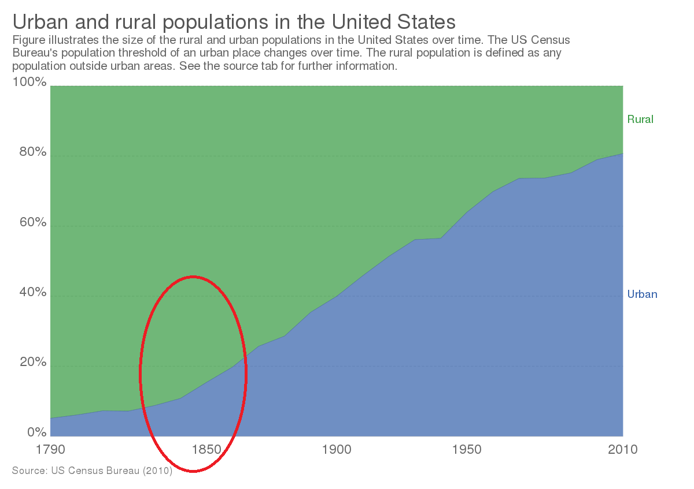
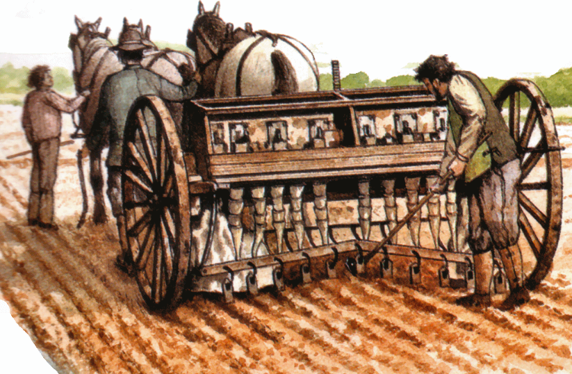
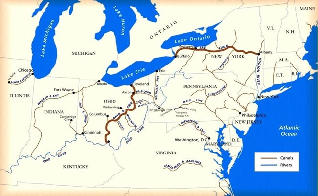

```{css, echo = FALSE}
.cite {
  font-weight: bold;
  font-size: 0.75em;
  color: #BA0C2F;
}
```

```{r Setup, include=FALSE}
library(tidyverse)
theme_set(theme_minimal(base_size = 16))
knitr::opts_chunk$set(comment=NA, fig.width=7, fig.height=5,
                      fig.align = 'center', out.width = 600,
                      message=FALSE, warning=FALSE, echo=FALSE)
```

---

## Urbanization

--

By our [best estimates](https://www.un.org/en/dayof8billion), the world's population reached 8 billion in November 2022.

--

The majority of these people live in cities.

```{r}
knitr::include_graphics('img/global-urbanization.png')
```

--

$$
\frac{3.35 \text{ billion}}{60 \text{y} \times 365.25 \text{d} \times 24\text{h} \times 60\text{m} \times 60\text{s}} =
$$
--

Roughly 2 people added to cities per *second* over a period of 60 years!


???

https://medium.com/@paigevsmyth/day-58-global-urbanization-slope-chart-629bc90800ef

---

## Urbanization

Much of this growth today is in Southeast Asia and Africa.

```{r, out.width='120%'}
knitr::include_graphics('img/guardian-urban-growth-per-hour.png')
```

???

https://www.theguardian.com/cities/2015/nov/23/cities-in-numbers-how-patterns-of-urban-growth-change-the-world#:~:text=Of%20the%20Urban%20Age%20cities,at%209%20and%2010%20people%2F

---

## Urbanization

For all the reasons we discussed in Module 1 (Foundations), cities create economic opportunities for people, so countries that have urbanized tend to be wealthier.

--

```{r}
knitr::include_graphics('img/gapminder.png')
```

(Source: [Gapminder](https://www.gapminder.org/tools/#$model$markers$bubble$encoding$size$scale$extent@:0&:0.74;;;&y$data$concept=income_per_person_gdppercapita_ppp_inflation_adjusted&space@=country&=time;;&scale$domain:null&zoomed@:224&:209113;&type:null;;&x$data$concept=urban_population_percent_of_total&space@=country&=time;;&scale$domain:null&zoomed@:2.08&:100;&type:null;;&color$data$concept=flag_svg&source=country_flags;&scale$type:null&domain:null&zoomed:null;;&frame$speed:100&value=1981;;;;;&chart-type=bubbles&url=v1))

???

In the animation, highlight in particular the different trajectories of India and China. India started wealthier on average than China. Now the average Indian is half as wealthy as the average Chinese person, and half as many live in cities. Not a coincidence!

---

## Urbanization of the Globe

This week:

--

- Why do some countries urbanize while others have remained predominantly rural?

--

- What explains "waves" of urbanization throughout human history?

--

- How does living in cities transform a society?

---

class: center, middle, inverse

# Theory

---

## Theory

When should we expect a country to **urbanize**?

--

To get some intuition, let's consider a stripped-down version of the mathematical model in .cite[Krugman (1991)]:

--

.pull-left[
  
- Three villages: A, B, and C

- $N$ people total. $F$ people are farmers. $N-F$ are weavers.

- It costs $1 for a solitary weaver to make a shirt.

- There are **scale economies**. It only costs $(1 - c) to make a shirt if all the weavers work together in one place.

- It costs $T$ to transport a shirt to another village.

]

.pull-right[
```{r, out.width=400}
knitr::include_graphics('img/krugman.png')
```
]

---

## Theory

When does it cost less to make all your shirts in one location and ship them to the others?

--

$$
(1-c)N + TF < 1N
$$
---

## Theory

When does it cost less to make all your shirts in one location and ship them to the others?

$$\underbrace{(1-c)N}_\text{factory production cost} + \underbrace{TF}_\text{transport cost} < \underbrace{1N}_\text{village production cost}$$
--

Divide each side by $N$, add $c - 1$, and you get the conditions under which agglomeration is cheaper:

--

$$T\left(\frac{F}{N}\right) < c$$

--

In other words, you should expect countries to urbanize when:

- **Transportation** is cheap $(T)$
- **Agricultural productivity** is high ($\frac{F}{N}$ small)
- Cost-savings from **scale economies** are large $(c)$

---

class: center, middle, inverse

# Four Waves of Urbanization

---

## Four Waves of Urbanization

Over the next week, we'll talk about four significant periods of urbanization in human history. 

--

- The United States (19th Century)

--

- The First Cities (~3000 BC)

--

- Pre-Industrial Europe (1300-1800)

--

- China (20th and 21st Centuries)

--

Each one was preceded by new technologies that:

--

- Reduced the cost of **transportation**

--

- Increased **agricultural productivity**

--

- Facilitated **scale economies**


---

class: center, middle

# The United States Urbanizes (19th Century)

---

## US Urbanization (19th Century)

```{r}
knitr::include_graphics('img/urban-pop-usa.png')
```

---

## US Urbanization (19th Century)

```{r}

```

What happened here??

???

Take a minute to discuss with your group. We're looking for technologies that improved transportation, agricultural productivity, and facilitated scale economies

---

## US Urbanization (19th Century)

.pull-left[
  - ["2nd Agricultural Revolution"](https://en.wikipedia.org/wiki/British_Agricultural_Revolution)
]

.pull-right[
```{r}



```
]

???

In 1800s, 90% of Americans lived on farms. Today, it's roughly 1 percent.


---

## US Urbanization (19th Century)

.pull-left[
- "2nd Agricultural Revolution"
  
- Improved methods of factory production
]

.pull-right[
```{r}
knitr::include_graphics('img/factory.jpg')
```
]

???

At the very same time that productivity improvements made it so that fewer people needed to work on farms, we had new technologies that made it particularly lucrative to agglomerate laborers into cities.

---

## US Urbanization (19th Century)

.pull-left[
- "2nd Agricultural Revolution"
  
- Improved methods of factory production

- New forms of transportation
]

.pull-right[
```{r}


knitr::include_graphics('img/locomotive.jpg')
```
]


---

## US Urbanization (19th Century)

These three technological advances -- improvements in transportation, agriculture, and scale economies -- transformed US society. From a country where 90% of people lived on farms to a predominantly urban nation within 50 years. 

--

```{r}
knitr::include_graphics('img/great-migration.png')
```

One of the historical legacies of this era is the "Great Migration".

???

This will set the stage for a number of topics we'll talk about in Module 3, including residential segregation in US cities and the nature of US political parties.

---

class: center, middle, inverse

# The First Cities (~3000 BC)

---

## The First Cities (~3000 BC)


