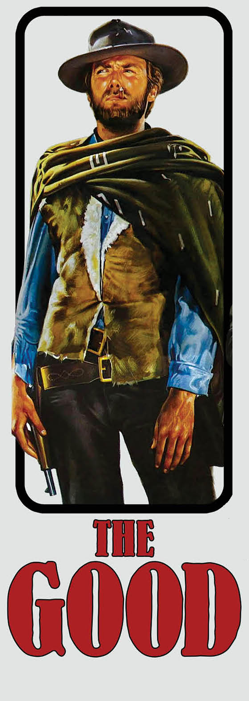

```{css, echo = FALSE}
.cite {
  font-weight: bold;
  font-size: 0.75em;
  color: #BA0C2F;
}
```

```{r Setup, include=FALSE}
library(tidyverse)
theme_set(theme_minimal(base_size = 16))
knitr::opts_chunk$set(comment=NA, fig.width=7, fig.height=5,
                      fig.align = 'center', out.width = 600,
                      message=FALSE, warning=FALSE, echo=FALSE)

image_link <- function(image,url,...){
  htmltools::a(
    href=url,
    htmltools::img(src=image,...)
    )
}
```

## Guessing Game

How many governments are there in the United States? 


???

Answer [here](https://data.census.gov/table?text=census+of+governments&g=0100000US&tid=GOVSTIMESERIES.CG00ORG01): no peeking!!


---

## Today

.pull-left[

]

.pull-right[

]

---

class: center, middle, inverse

# Story 1: 

# The Density Divide

