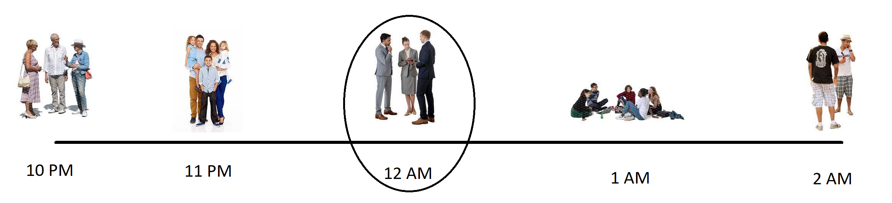
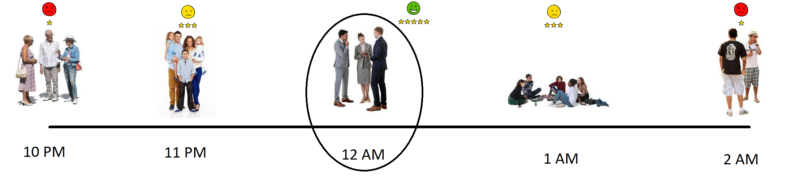
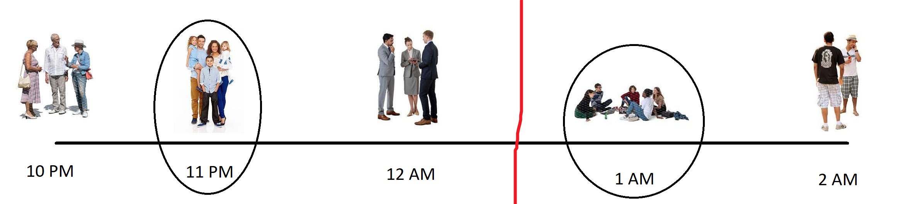
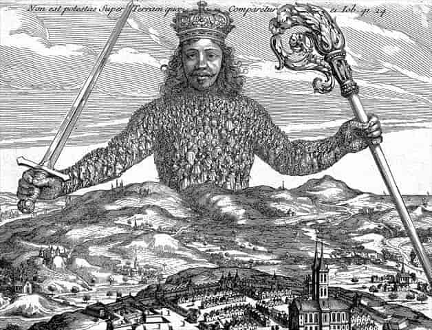
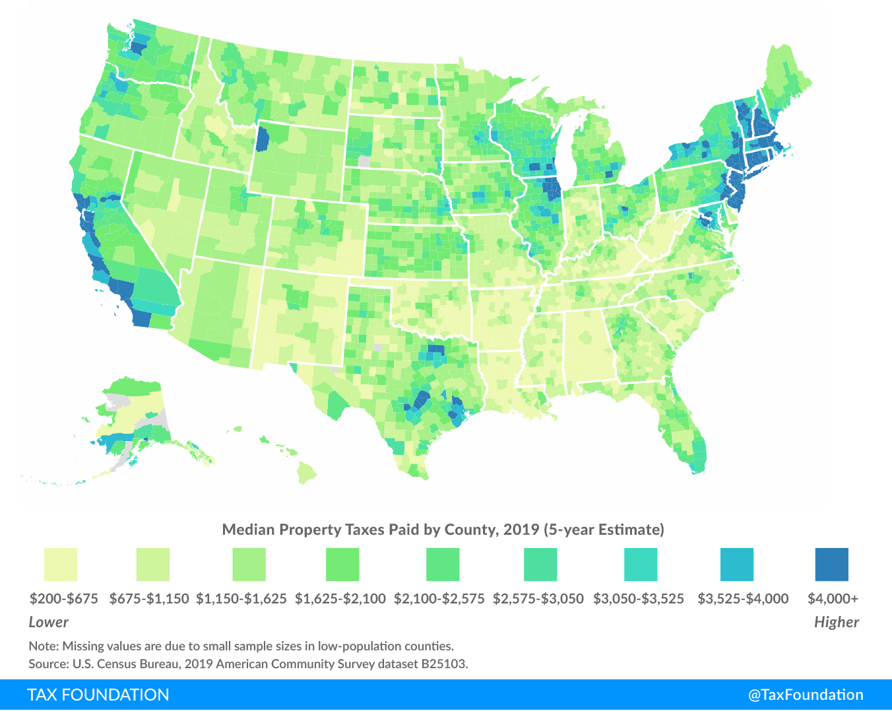
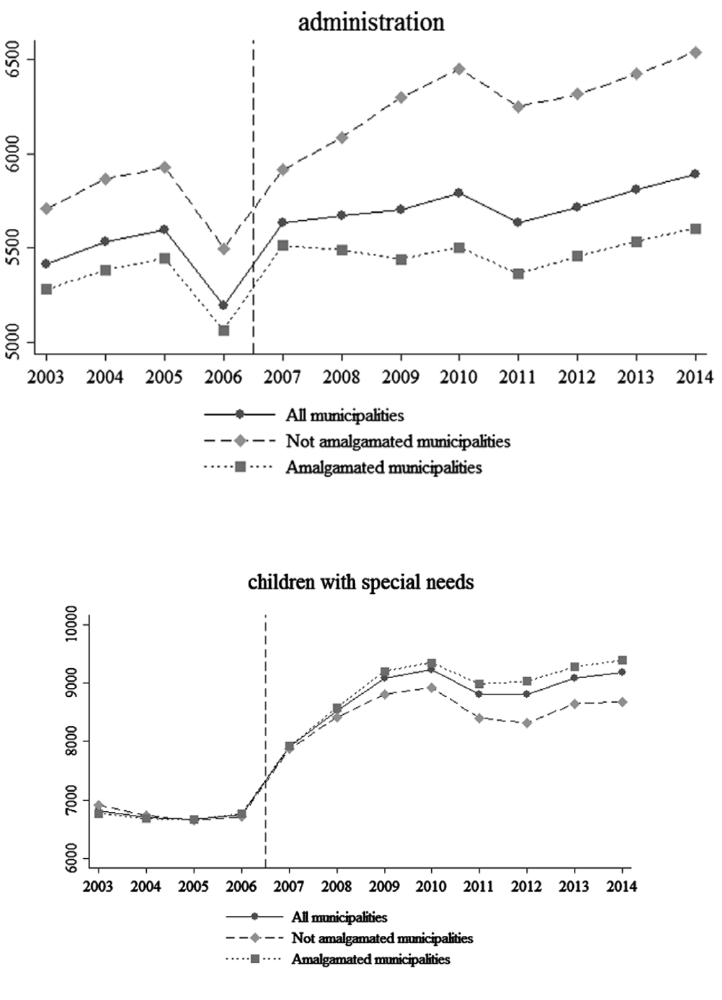

```{css, echo = FALSE}
.cite {
  font-weight: bold;
  font-size: 0.75em;
  color: #BA0C2F;
}
```

```{r Setup, include=FALSE}
library(tidyverse)
theme_set(theme_minimal(base_size = 16))
knitr::opts_chunk$set(comment=NA, fig.width=7, fig.height=5,
                      fig.align = 'center', out.width = 600,
                      message=FALSE, warning=FALSE, echo=FALSE)

image_link <- function(image,url,...){
  htmltools::a(
    href=url,
    htmltools::img(src=image,...)
    )
}
```

## Guessing Game

[](https://forms.gle/ZuWDy6WnW9jFYpup7)


???

[Google Form Responses](https://docs.google.com/spreadsheets/d/1lRo9eHioQiB8qTJeikLGLW6xfcXVGXRPImYp68zrZzU/edit?usp=sharing)

Answer [here](https://data.census.gov/table?text=census+of+governments&g=0100000US&tid=GOVSTIMESERIES.CG00ORG01): no peeking!!


---

## Today

Is this too many governments? Too few? What are the consequences of having so many overlapping sources of political power? 

--

```{r, out.width=350}

```

---

class: inverse

## Benefits of Fragmentation

.pull-left[


- **Tiebout Sorting**: People can "vote with their feet" for the policies they prefer.

<br>

- **Tax Competition**: Faced with mobile voters and mobile capital, governments have an incentive to restrain taxation and spending.
]


.pull-right[
```{r, out.width=160}

```
]
---

## Tiebout ("TEE-bow") Sorting

--

Imagine a polity trying to decide when to impose a noise ordinance.

--

```{r}

```

---

## Tiebout ("TEE-bow") Sorting

Imagine a polity trying to decide when to impose a noise ordinance.

```{r}

```

---

## Tiebout ("TEE-bow") Sorting

Imagine a polity trying to decide when to impose a noise ordinance.

```{r}

```

---

## Tiebout ("TEE-bow") Sorting

Imagine a polity trying to decide when to impose a noise ordinance.

```{r}

```


---

## Tiebout ("TEE-bow") Sorting

Imagine a polity trying to decide when to impose a noise ordinance.

```{r}
knitr::include_graphics('img/noise-ordinance-tiebout.png')
```

---

## Tiebout ("TEE-bow") Sorting

Imagine a polity trying to decide when to impose a noise ordinance.

```{r}

```

---

## Tiebout ("TEE-bow") Sorting

Imagine a polity trying to decide when to impose a noise ordinance.

```{r}
knitr::include_graphics('img/noise-ordinance-tiebout-smileys.png')
```

--

- "Voting with your feet" can unlock far more happiness than voting at the ballot box.

--

- This is all very Jeffersonian. In a big, diverse country, people aren't always going to agree on the best policy, so it's best to devolve lots of decisionmaking to local government.

--

<br>

$\displaystyle \mathrm {N} \!\!\mathrm {B}$: *Voting at the ballot box is free, but voting with your feet is not!*

???


[Athens Noise Ordinance](https://www.nonoise.org/lawlib/cities/ordinances/Athens,%20Georgia.pdf)


---

## Tax Competition

- Another benefit of **horizontal fragmentation** (splitting a metropolitan area into multiple local governments) is that it creates competition between governments.

--

- In markets for private goods, competition between firms brings down prices and improves quality. The **Leviathan Hypothesis** .cite[(Brennan & Buchanan 1977)] argues that the same thing happens when governments compete.

```{r, out.width=300}

```

--

- In countries with lots of competing local governments, tax rates tend to be lower .cite[(Rodden 2003)].

---

## Tax Competition

- In the United States, local governments tend not to impose significantly higher taxes than their neighbors, to avoid losing residents and businesses. 
- As a result, property tax rates are **spatially autocorrelated**.

--

```{r, out.width=500}

```

---

class: inverse

## Drawbacks of Fragmentation

.pull-left[


- **Coordination Problems**: When there are lots of independent decisionmakers, they often fail to coordinate on the best outcome.

<br>

- **Accountability**: Lots of governments make it difficult for voters and media to keep track of what's going on.

<br>

- **Inefficiencies of Small Scale**: Remember economies of scale? With lots of small governmental units, it's hard to take advantage of those.


]


.pull-right[
```{r, out.width=160}

```
]
---

## Coordination Problems

```{r, out.width=370}
knitr::include_graphics('img/Rhein-Karte2.png')
```

???

Major industrial heartland of Europe to this day, thanks to ease of transportation. But during the medieval era, governance on the river had this problem. There were a bunch of independent city states (I count about 13 major ones on this map), and each one of them charged tolls to any river boat that went by. Every prince along the river wanted to get their share of taxation, but in so doing, they made it incredibly expensive to ship anything for long distances, effectively stifling trade for centuries. 

---

## Common Pool Resource Problems

.pull-left[
```{r, out.width = 300}

```

```{r, out.width = 300}
knitr::include_graphics('img/overfishing.jpg')
```


]

.pull-right[
<br>
```{r}

```
]
---

## Vertical Fragmentation

.pull-left[

- The same thing that happens with sheep and fish and smog happens with taxes too.

- When too many governments are "fishing from the same tax pool", they tend to tax more than what would be optimal .cite[(Berry 2008)].

]

.pull-right[
```{r, out.width=300}
knitr::include_graphics('img/imperfect-union-cover.jpg')
```
]

---

## "Overfishing The Common Tax Pool"


```{r}
knitr::include_graphics('img/clarke-sample-tax-bill.png')
```

There are three governments with the authority to tax my home in Clarke County.


---

## "Overfishing The Common Tax Pool"

```{r}
knitr::include_graphics('img/evanston-sample-tax-bill.png')
```

By contrast, there are **fourteen** governments taxing this home in Evanston, Illinois!

---


## Accountability

--

- A single local government is easier to keep track of and hold to account than dozens of overlapping general and special-purpose governments.

--

- Most special districts / school districts hold their elections **off-cycle**, when few people bother to turn out to vote.

--

  - Those who *do* turn out tend to be groups with an strong interest in the outcome. 
  
  - e.g. lots of teachers turn out to school district elections, which causes those school districts to spend more on teachers .cite[(Anzia 2011)].


???

Okay, so why not just vote for lower taxes?

---

## Inefficiency

.pull-left[

- Lots of small governments mean lots of duplicate activities.

- Harder to take advantage of **economies of scale**.

- When Denmark compelled many of its local governments to **amalgamate**, the new, larger governments spent less on administration and more on public goods .cite[(Blom-Hansen et al. 2016).]

]

.pull-right[

]

---


class: inverse

## The Ugly Side of Fragmentation

.pull-left[


- **Race To The Bottom**: Taken to its logical extreme, competition can leave everyone worse off.

<br>

- **City Limits**: Redistribution is tough to pull off at the local level, because rich people can just move to another city.


]


.pull-right[
```{r, out.width=160}
knitr::include_graphics('img/the-ugly.png')
```
]


---

## The Kansas City Border War

.pull-left[

]

.pull-right[
[](https://www.google.com/maps/@39.1055065,-94.6021232,5190m/data=!3m1!1e3)
]

--

- For years, state and local governments spent hundreds of millions of dollars in subsidies ("corporate welfare") to lure businesses across the state line.

---

## Two Theories

.pull-left[
- **Race To The Bottom**: If I don't offer incentives, the other side will. It's a Prisoner's Dilemma.
]

.pull-right[

]

---

## Two Theories

.pull-left[
- **Race To The Bottom**: If I don't offer incentives, the other side will. It's a Prisoner's Dilemma.

- **Incentives To Pander**: Subsidies aren't effective at luring business investment, and politicians know it. But it's a visible signal of effort to voters.
]

.pull-right[

]

???


---

## Stadiums

As of 2023, there is a "truce" in the Kansas City Border War between the two state governors. Except...

--

```{r, out.width=500}
knitr::include_graphics('img/Aerial_view_of_Arrowhead_Stadium_08-31-2013.jpg')
```

--

The KC Chiefs are currently in Missouri, and Kansas is gearing up to attract them away when their lease on Arrowhead Stadium runs out in 2031.

---

## City Limits

.pull-left[

- Three types of public spending .cite[Peterson (1981)]:

]

.pull-right[
```{r, out.width=300}
knitr::include_graphics('img/city-limits-cover.png')
```
]


---

## City Limits

.pull-left[

- Three types of public spending .cite[Peterson (1981)]:

  - **Developmental**: spending designed to attract private investment.
  
  - **Redistributive**: tax the rich, give to the poor.
  
  - **Allocative:** Everything else, basic services.

]

.pull-right[
```{r, out.width=300}
knitr::include_graphics('img/city-limits-cover.png')
```
]


---

## City Limits

.pull-left[

- Three types of public spending .cite[Peterson (1981)]:

  - **Developmental**: spending designed to attract private investment.
  
  - **Redistributive**: tax the rich, give to the poor.
  
  - **Allocative:** Everything else, basic services.

- City governments love to spend on development, but are pressured not to spend on redistribution by mobile voters / capital.

- (Most of a city's budget is allocative spending.)

]

.pull-right[
```{r, out.width=300}
knitr::include_graphics('img/city-limits-cover.png')
```
]

---

## City Limits


.pull-left[
[](https://www.axios.com/2022/10/07/new-york-adams-emergency-migrant-buses)
]

.pull-right[
[](https://www.theatlantic.com/politics/archive/2015/04/fergusons-fortune-500-company/390492/)
]