```{css, echo = FALSE}
.cite {
  font-weight: bold;
  font-size: 0.75em;
  color: #BA0C2F;
}
```

```{r Setup, include=FALSE}
library(tidyverse)
theme_set(theme_minimal(base_size = 16))
knitr::opts_chunk$set(comment=NA, fig.width=7, fig.height=5,
                      fig.align = 'center', out.width = 600,
                      message=FALSE, warning=FALSE, echo=FALSE)

image_link <- function(image,url,...){
  htmltools::a(
    href=url,
    htmltools::img(src=image,...)
    )
}
```

## Warmup

--

As a table:

--

- Write down as many **federal** elected officials as you can name (e.g. president, members of Congress) in 3 minutes.

--

- Write down as many **local** elected officials as you can name (e.g. mayors, city councilmembers, school board members, county commissioners) in 3 minutes.

???

[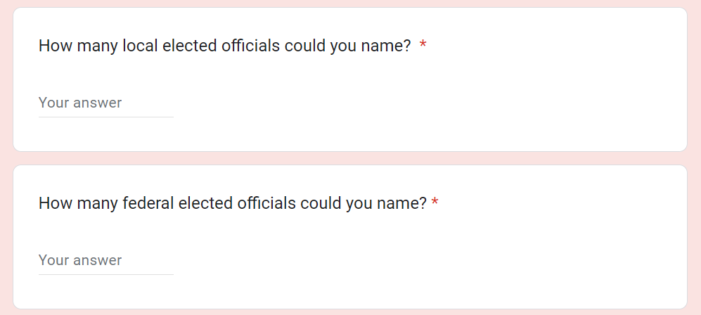](https://forms.gle/53XXXS3JkJ6bwLHZ8)

Suffice to say, this is deeply at odds with the way that the founders thought we'd be interacting with our democracy.


---

## It's Strange We Can't Name More Local Politicians...

--

```{r, out.width=290}
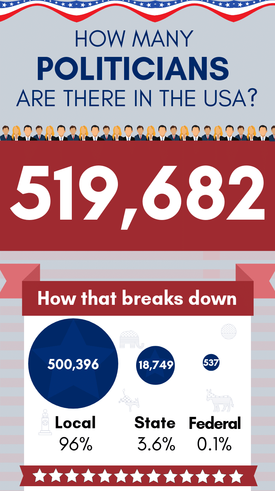
```


???

https://poliengine.com/blog/how-many-politicians-are-there-in-the-us

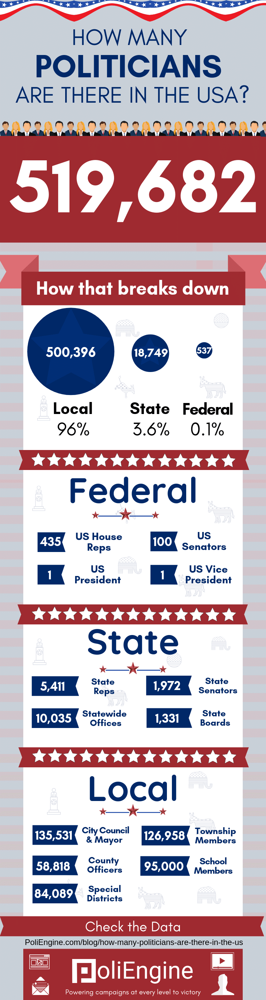


---

## Today

Two big questions this week:

--

1. Why has American politics become so **nationalized**?

--

2. How can local democracy function if no one is paying attention to it?

---

class: center, middle, inverse

# Nationalization

---

## Nationalization

.pull-left[
- Voters pay much more attention to national level political issues than to politics in their own town.

- When we pay attention to local level political issues, it's often through the lens of national political fights (e.g. school curricula, police reform).

- It wasn't always this way! The Founders would probably be pretty surprised.

]

.pull-right[
```{r, out.width=300}
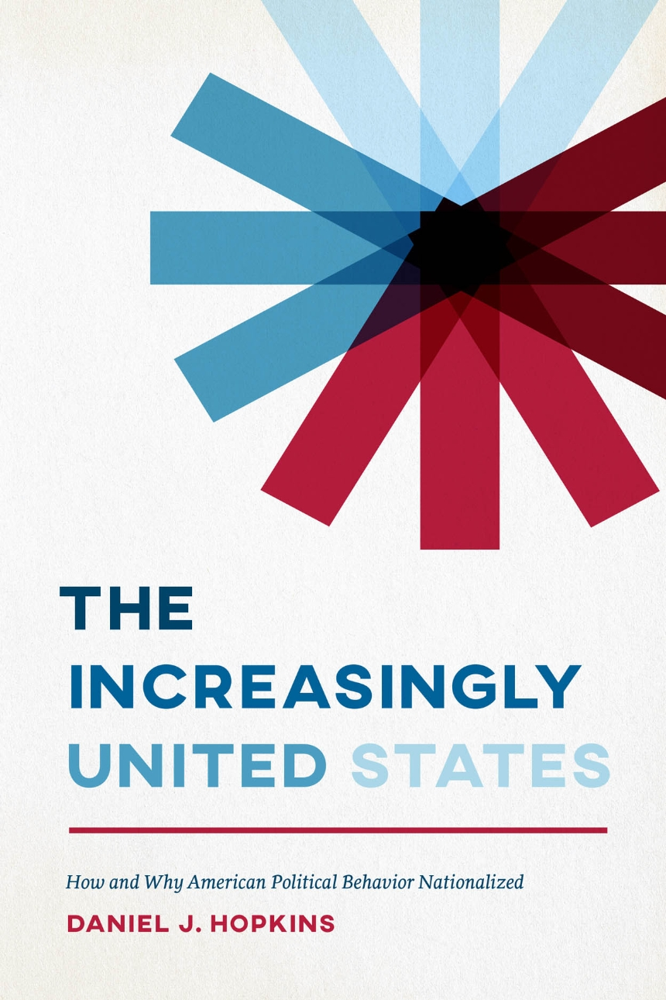
```
]


---

## Why has politics nationalized?

--

One important explanation involves changes to the media landscape.

--

- In the 18th century, information traveled at the speed of a horse. 

--

  - Newspapers served local audiences, funded by subscriptions and advertisements. 
  
  - It makes sense that you'd know more about local politics and less about national politics.

--

- First television, then the Internet, changed the way Americans consumed news. 

--

  - Because these platforms reach a national (or global) audience, there's an incentive to focus on news that appeals to the widest possible audience. 
  
  - Thus a focus on national news.

---

## Decline of Local News

Losing ad and subscription revenue to TV/Internet and national papers like the *New York Times*, local newspaper circulations took a nose dive in the late 20th century.

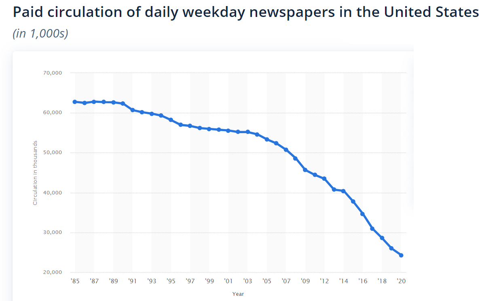

???

https://www.statista.com/statistics/183422/paid-circulation-of-us-daily-newspapers-since-1975/

---

## Decline of Local News

It's tough to definitively say what effect the decline of local news has on people's political behavior, but there are some clever ways to research it.

--

```{r, out.width=550}
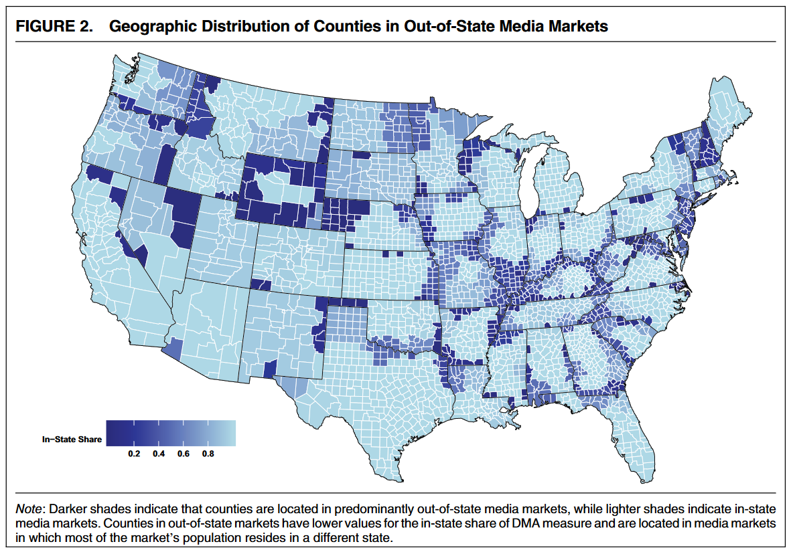
```

--

In areas where you get your TV news from a another state, people are less knowlegeable about their own state/local politicians, and less likely to split ticket vote .cite[(Moskowitz 2021)].

---

class: center, middle inverse

## How does democracy work when no one's paying attention?

---

### How does democracy work when no one's paying attention?

--

Well, the usual answer is **political parties** .cite[(Aldrich 1995)].

--

- Voters can't be expected to pay attention to every political issue.

- Parties give voters a clear choice; most voters can basically tell you what the two parties stand for, and which they prefer.
  
--

But at the local level, there is basically no meaningful party competition.

.pull-left[
[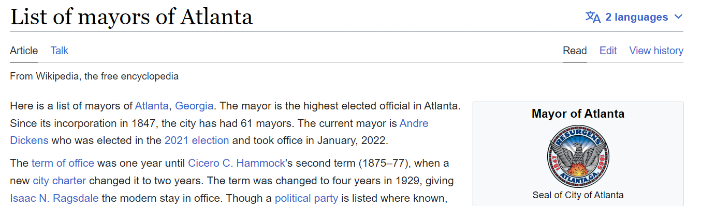](https://en.wikipedia.org/wiki/List_of_mayors_of_Atlanta)
]

.pull-right[
[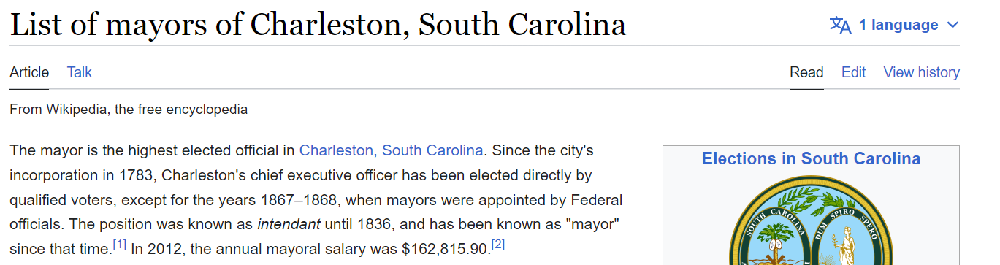](https://en.wikipedia.org/wiki/List_of_mayors_of_Charleston,_South_Carolina)
]

--

Even in places where there's meaningful party competition for mayor (e.g. New York City), the city council tends to be dominated by one party or another .cite[(Schleicher 2007)].

???

But at the local level, this isn't the way that political competition plays out!

Charleston, Atlanta. Combination of Southern Democratic dominance in the early 20th century, followed by the sort of partisan sorting we discussed a few weeks ago. 

---

## Why no local political parties?

- Why don't we have *local level* political parties? 

--

  - Maybe Republicans aren't competitive in Atlanta mayoral elections, but perhaps the Green Party could be? Or some new party dedicated to Atlanta politics specifically?

--

- Reasons are multifaceted .cite[(Schleicher, 2007)], but basically this problem comes from the top. 

--

  - In winner-take-all presidential systems, there's a strong incentive for different political factions to coalesce into two parties (Duverger's Law). 
  
  - US election law allows national political parties to compete in local political races. It is tough for purely local political parties to compete for voters.

---

## Why no local political parties?

Another reason we don't have party competition at the local level: in most places it's illegal!

--

- Only 17% of US cities hold partisan elections .cite[(Tausanovitch & Warshaw 2014)].

--

- In the early 20th century, reformers deliberately set out to *weaken* partisan politics at the local level, in response to the dominance of party machines in major US cities. 

```{r, out.width=300}
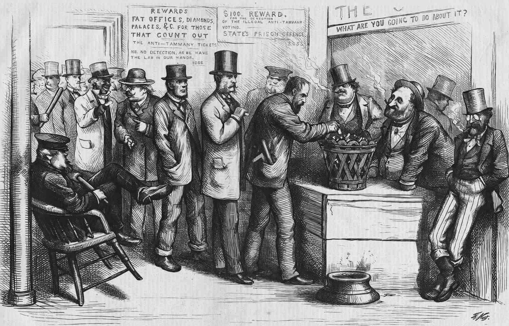
```

--

- This was part of a broad set of reforms during the "Progressive Era" in the early 20th century, designed to weaken machines and make local politics more professional / like the private sector.

---

## Summary: The Nationalization of Local Politics

.pull-left[

The two things that we usually rely on to inform voters about politics -- media and parties -- barely function at the local level.

- The decline of local news media has reduced voters' knowledge of local politics.

- The US party system is divided between two national parties that are evenly matched at the federal level, but rarely competitive at the local level.

- Even when party labels appear on ballots for local races, knowing a candidate's national party ID doesn't really help voters make an informed decision.

]

.pull-right[
```{r}
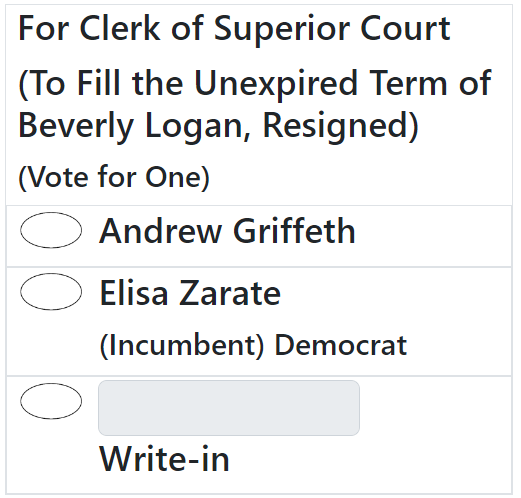
```
]

???

Knowing the candidates' national party ID doesn't really help anyone make an informed decision. Case in point: the November 2023 Clarke County special election for Clerk of Superior Courts

---

class: center, middle, inverse

# Local Democracy Is Different

---

## Local Democracy Is Different

One prominent school of thought says that none of this really matters. Local politics is more pragmatic than national politics, and the kinds of decisions that need to be made are fundamentally non-ideological. 

--

.pull-left[
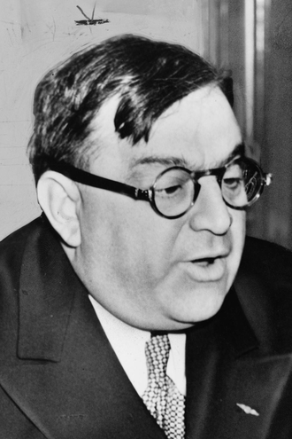
]

.pull-right[

<br>

<br>

<br>

*There is no Democratic or Republican way of cleaning the streets.*

Fiorello La Guardia (NYC Mayor 1934-1945).

]

???

What are some things that local governments *do*?

---

## Local Democracy Is Different

--

According to this view, the most important locus for political competition is not *within* cities, but *between* cities.

--

- Citizens make their voices heard not by voting at the ballot box, but by "voting with their feet" .cite[(Tiebout 1956)].

--

- This is ultimately what holds cities accountable. To avoid losing residents, they need to do things that make their residents happy.

--

- In this way, one can think of cities like firms in a marketplace, and their residents like consumers, choosing the city that offers their preferred set of public goods without charging too much in taxes.

---

## Tiebout ("TEE-bow") Sorting

Let's illustrate this idea with a game.

???

We'll write everything out on the board.

---

## Tiebout ("TEE-bow") Sorting

"Voting with your feet" can unlock far more happiness than voting at the ballot box.

--

- This is all very Jeffersonian. In a big, diverse country, people aren't always going to agree on the best policy, so it's best to devolve lots of decisionmaking to local government.

---

class: center, middle, inverse

# A Few Caveats

---

## A Few Caveats

At least, that's how it works in theory. In reality, there are a few frictions that keep everything from working so perfectly:

--

- **Inequities**: Voting at the ballot box is free, but voting with your feet is not. It's quite expensive to move from one jurisdiction to another because you're dissatisfied with your town's government.

--

- **Coordination Problems**: When there are lots of independent governments making policy, it can be difficult to coordinate on solutions to region-wide problems.

--

- **Accountability**: Lots of little governments make it difficult for voters and media to keep track of what's going on.

--

- **Inefficiencies of Small Scale**: Remember economies of scale? With lots of small governmental units, it's hard to take advantage of those.

--

- **Race To The Bottom**: Taken to its logical extreme, competition can leave everyone worse off.

---

## Coordination Problems

Nice illustration of this problem in .cite[Berry (2009)].

.pull-left[

- Rhine River is an important trade route through western Europe.

- During the 13th century, the river was divided among a bunch of independent principalities and city-states, and each one charged tolls to any river boat that went by. 

- Every prince along the river wanted to get their share of taxation, but in so doing, they made it incredibly expensive to ship anything for long distances, effectively stifling trade for centuries. 


]

.pull-right[
```{r, out.width=330}
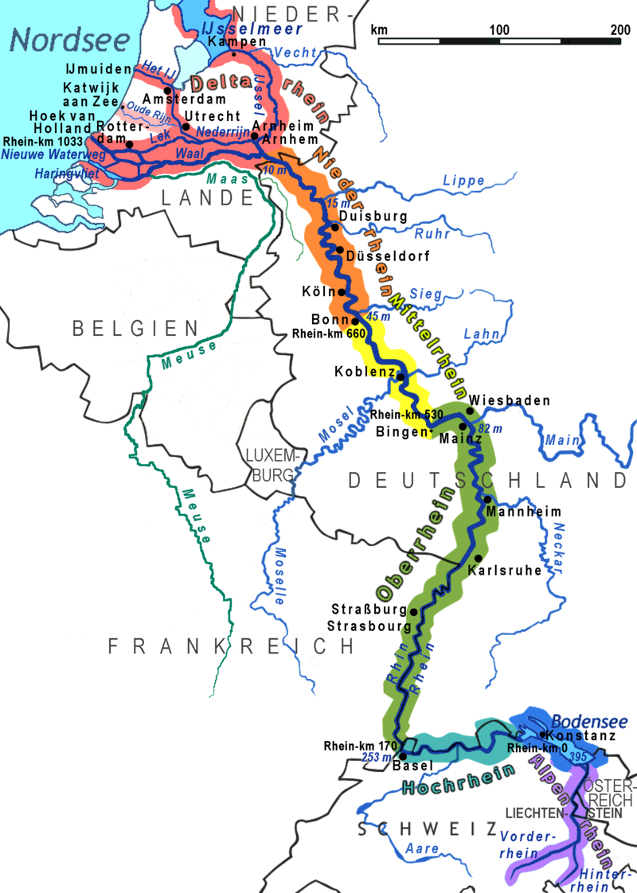
```
]

???

Major industrial heartland of Europe to this day, thanks to ease of transportation. But during the medieval era, governance on the river had this problem. There were a bunch of independent city states (I count about 13 major ones on this map), and each one of them charged tolls to any river boat that went by. Every prince along the river wanted to get their share of taxation, but in so doing, they made it incredibly expensive to ship anything for long distances, effectively stifling trade for centuries. 

---

## Common Pool Resource Problems

.pull-left[
```{r, out.width = 300}

```

```{r, out.width = 300}

```


]

.pull-right[
<br>
```{r}

```
]

???

This is a subset of the sort of Common Pool problems we discussed in module 2.

---

## "Overfishing The Common Tax Pool"

.pull-left[

- The same thing that happens with sheep and fish and smog happens with taxes too.

- When too many governments are "fishing from the same tax pool", they tend to tax more than what would be optimal .cite[(Berry 2008)].

]

.pull-right[
```{r, out.width=300}
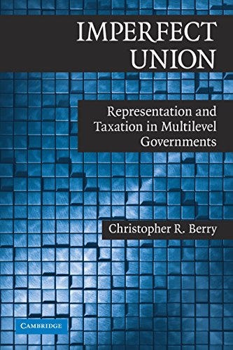
```
]

---

## Horizontal vs. Vertical Fragmentation

An important distinction here:

--

- **Horizontal fragmentation** is when a metropolitan area is divided geographically into several municipal governments, and citizens can vote with their feet to choose which government they want to live under. 

--

- **Vertical fragmentation** is when a single area is administered and taxed by multiple governments simultaneously. 

---

## Vertical Fragmentation


```{r}
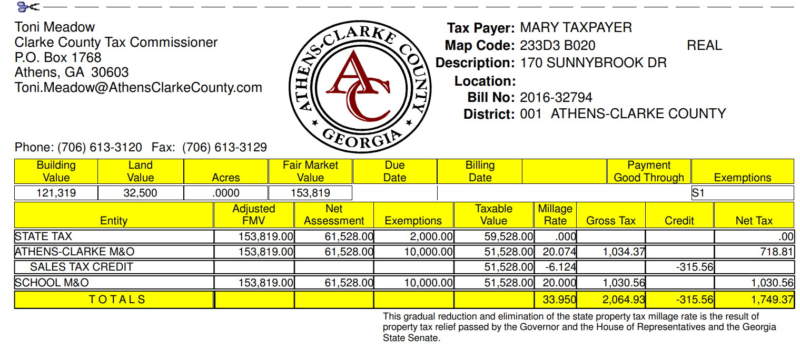
```

There are three governments with the authority to tax my home in Clarke County.


---

## Vertical Fragmentation

```{r}
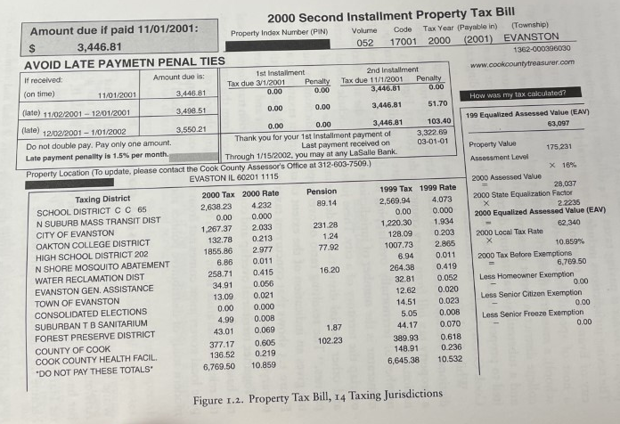
```

By contrast, there are **fourteen** governments taxing this home in Evanston, Illinois!

---

## Accountability

--

- A single local government is easier to keep track of and hold to account than dozens of overlapping general and special-purpose governments.

--

- Most special districts / school districts hold their elections **off-cycle**, separate local elections from state and national elections .cite[(Anzia 2012)].

--

- The biggest effect this has is on turnout .cite[(Berry & Gerson 2010)].

```{r, out.width=500}
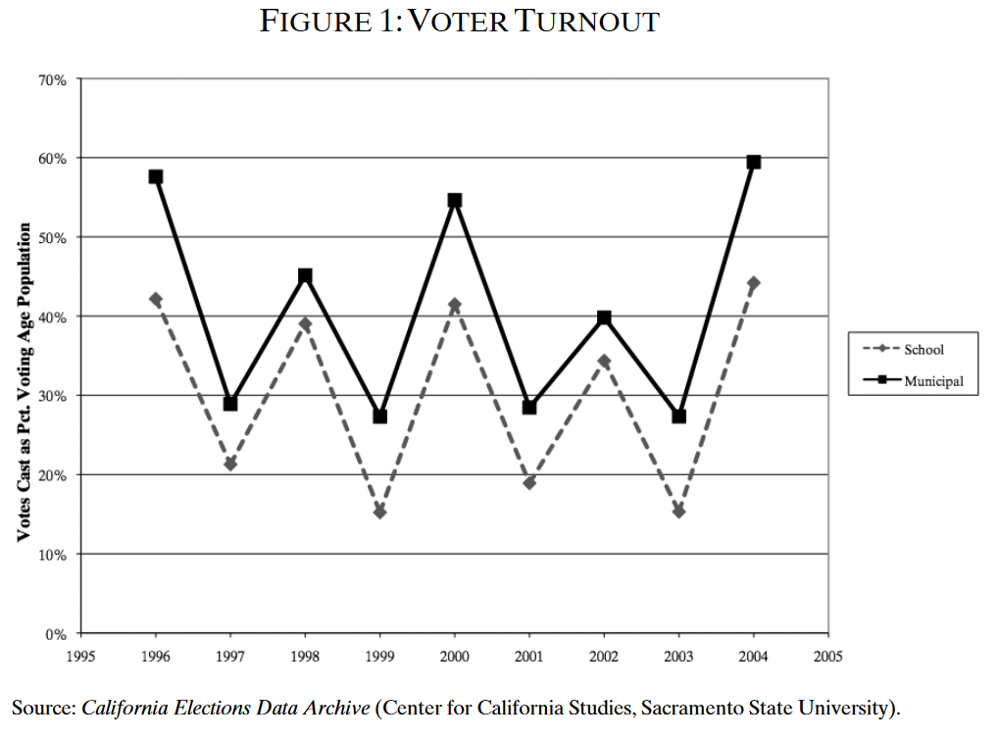
```

---

## Accountability

Election timing also influences *who* turns out to vote.

--

- People with a strong interest in the election outcome more likely to turnout off-cycle .cite[(Anzia 2011)].

  - e.g. lots of teachers turn out to school district elections

--

- People who turn out to off-cycle elections more likely to be wealthy, white, and Republican .cite[(Kogan et al. 2018)].

--

- But the *biggest* effect is on the share of senior citizens. 

  - Goes from 1/3 of the electorate in presidential elections to roughly 1/2 the electorate in off-cycle special elections .cite[(Kogan et al. 2018)].
  
--

This can have downstream effects on policy.

--

- Senior citizens tend to be more pro-police .cite[(Goldstein 2021)].

- They also tend to be more "NIMBY", opposed to new housing construction .cite[(Ornstein 2019)].

---

## Inefficiency

.pull-left[

- Lots of small governments mean lots of duplicate activities.

- Harder to take advantage of **economies of scale**.

- When Denmark compelled many of its local governments to **amalgamate**, the new, larger governments spent less on administration and more on public goods .cite[(Blom-Hansen et al. 2016).]

]

.pull-right[

]

---

## The Kansas City Border War

.pull-left[
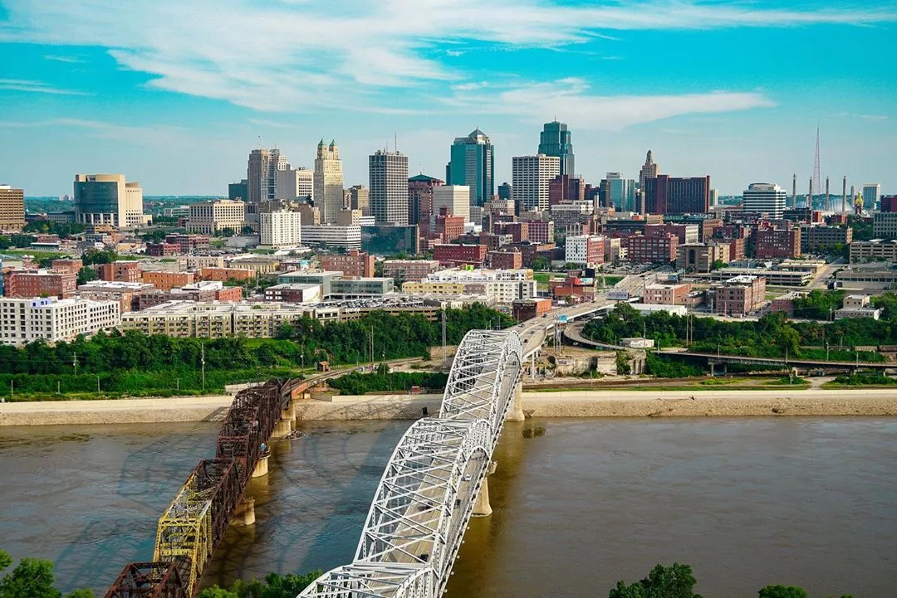
]

.pull-right[
[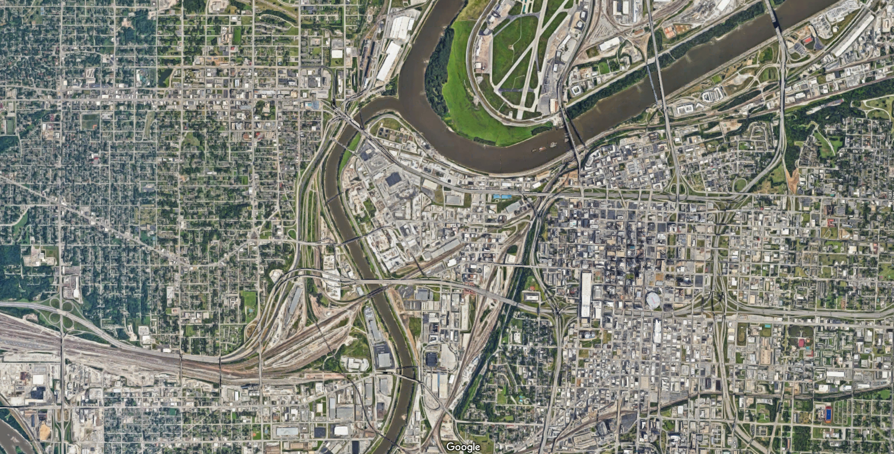](https://www.google.com/maps/@39.1055065,-94.6021232,5190m/data=!3m1!1e3)
]

--

<br>

For years, state and local governments spent hundreds of millions of dollars in subsidies ("corporate welfare") to lure businesses across the state line .cite[(Jensen & Malesky 2018)].

--

This "Race To The Bottom" is not isolated in Kansas City. State and local governments across the country spend billions in taxpayer-financed incentives to attract businesses.

---

## Two Theories

.pull-left[
- **Prisoners' Dilemma**: If I don't offer incentives, the other side will.
]

.pull-right[
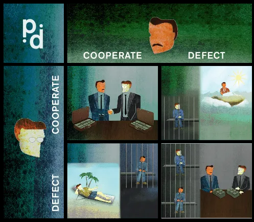
]

---

## Two Theories

.pull-left[
- **Prisoners' Dilemma**: If I don't offer incentives, the other side will.

- **Incentives To Pander**: Subsidies aren't effective at luring business investment, and politicians know it. But it's a visible signal of effort to voters.
]

.pull-right[
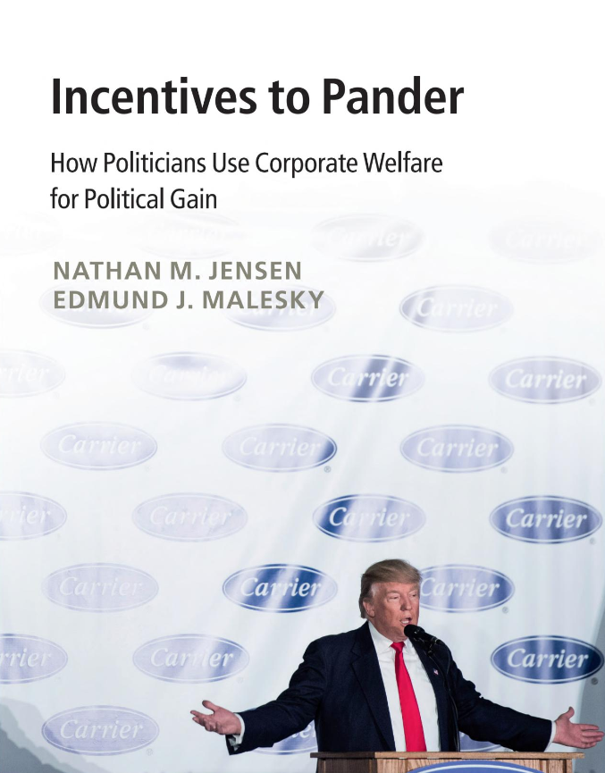
]

---

## Stadiums

As of 2023, there is a "truce" in the Kansas City Border War between the two state governors. Except...

--

.pull-left[
```{r}
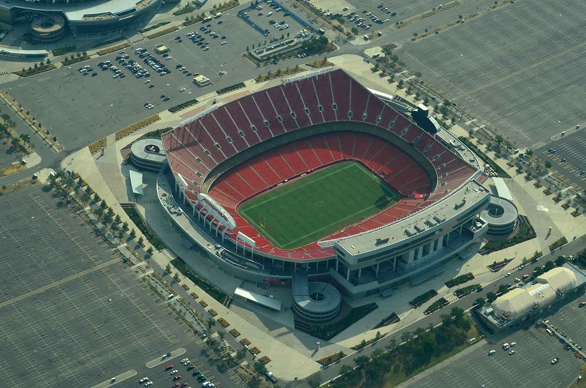
```
]

.pull-right[
```{r}

```
]

<br>

The KC Chiefs are currently on the Missouri side of the river, and Kansas is gearing up to attract them away when their lease on Arrowhead Stadium runs out in 2031.

--

- Stadium fights are great fodder for student presentations, so hopefully we'll hear more on this next week!

---

class: center, middle, inverse

# Summary

---

## Summary

--

- Democracy doesn't quite function in cities the way it does at the state and national level. 

  - The usual things we associate with democracy (e.g. political parties, media scrutiny, competitive elections) are often non-existent or barely functional.

--

- That may be okay, because there is robust political competition *between* cities rather than *within* cities.

  - In theory, "voting with your feet" gives people more choice and more freedom than voting at the ballot box.

--

- This form of political competition is not without its drawbacks, including inequities in who can afford  to vote with their feet, coordination problems between governments, overfishing the tax pool, difficulty holding government accountable, inefficiencies from small scale, and wasteful spending on economic incentives.

--

For fans of democracy, we've got our work cut out for us!