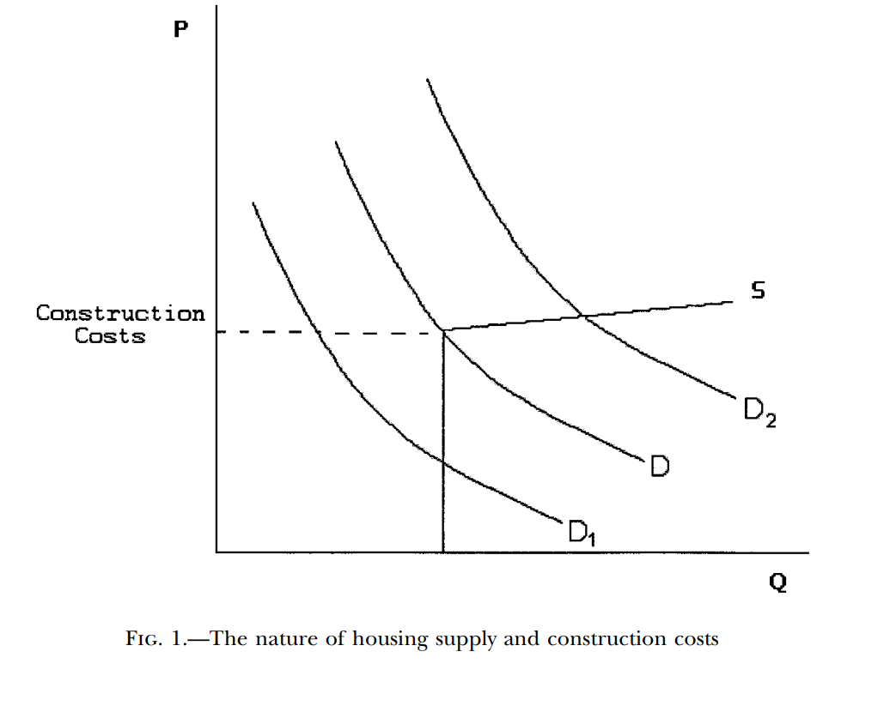
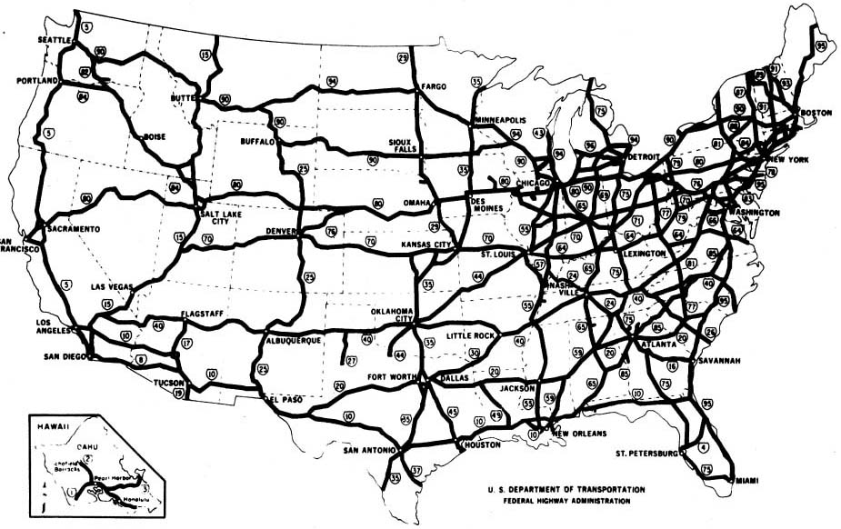
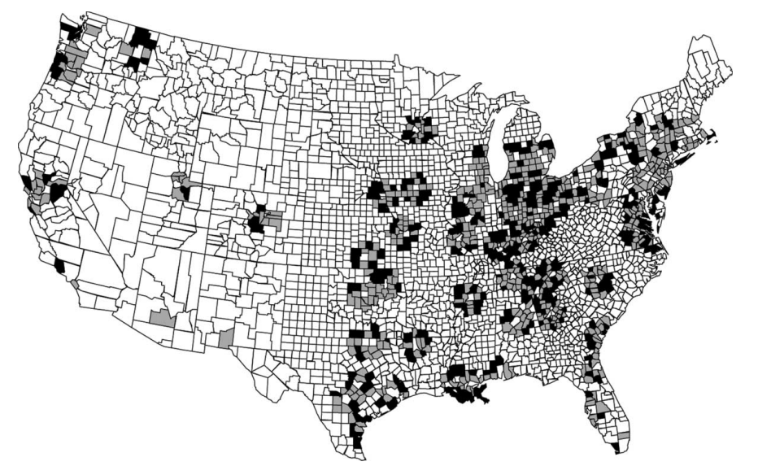
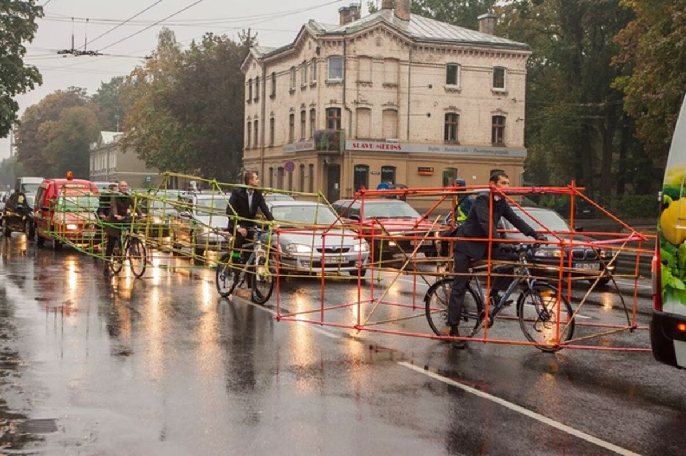
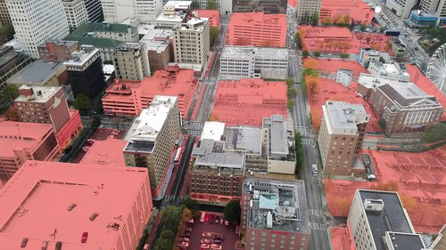
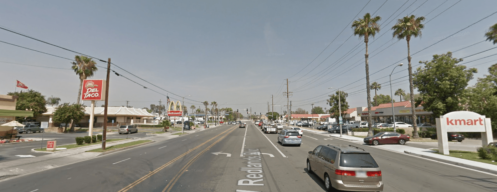
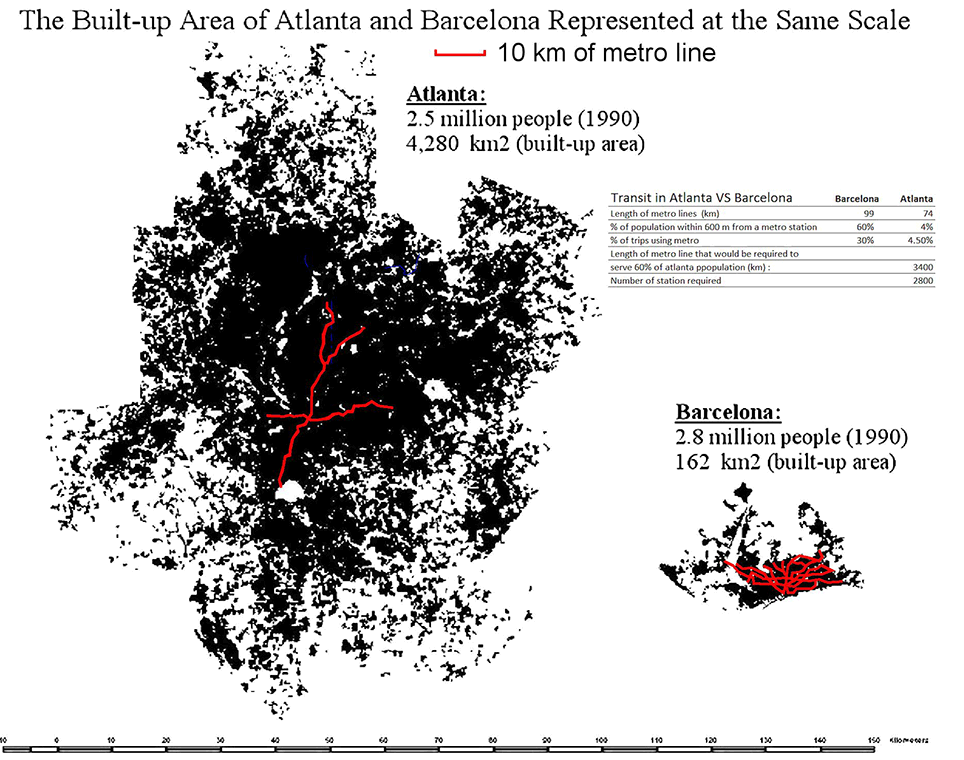

```{css, echo = FALSE}
.cite {
  font-weight: bold;
  font-size: 0.75em;
  color: #BA0C2F;
}
```

```{r Setup, include=FALSE}
library(tidyverse)
theme_set(theme_minimal(base_size = 16))
knitr::opts_chunk$set(comment=NA, fig.width=7, fig.height=5,
                      fig.align = 'center', out.width = 600,
                      message=FALSE, warning=FALSE, echo=FALSE)

image_link <- function(image,url,...){
  htmltools::a(
    href=url,
    htmltools::img(src=image,...)
    )
}
```

## Remember this?

```{r, out.width=700}
knitr::include_graphics('img/davis-fig-2.png')
```

???

By 1975, the population of these two cities was basically what you would have expected if there had been no war.

---

## Meanwhile, in the United States...

--

```{r, echo = FALSE, out.width=700}
library(tidyverse)
library(here)
library(readxl)

d <- read_xlsx(here('slides/data/urban-decline.xlsx'))

d <- d |> 
  pivot_longer(cols = `St. Louis`:Atlanta,
               names_to = 'city',
               values_to = 'population')

ggplot(data = d |> filter(city != 'Atlanta'),
       mapping = aes(x=Year, y=population/1000, color = city)) +
  geom_line() +
  labs(y='Population (thousands)', color = 'City')

```

---

## Shrinking Cities

Declining populations created decades of problems in cities across the United States.

--

.pull-left[


- One fundamental problem is **durable housing**. 

  - Cities like Detroit built enough housing for over 1.5 million people, but only ~600k live there today. Property values plummeted .cite[Glaeser & Gyourko (2005)].
]

.pull-right[
```{r}

```
]

---

## Shrinking Cities

Declining populations created decades of problems in cities across the United States.

.pull-left[

- One fundamental problem is **durable housing**. 

- Because US cities rely on property taxes for revenue, this creates a **vicious cycle** .cite[(Manville & Kulhman, 2018)]:

  - Shrinking populations reduce fiscal capacity, making it difficult to pay for city services (police, schools, etc.).  
  - ...which makes more people want to leave, shrinking the population further. 
]

.pull-right[
<br>
<br>
<br>
```{r}
knitr::include_graphics('img/detroit-homes.png')
```
]

???

   Glaeser & Gyourkou Durable Housing paper figure. When demand for a living in a particular city falls, it translates into dramatic decreases in property values. US cities rely on property taxes for revenue, which meant decades of financial crisis, as cities had difficulty paying for public services, police, schools, etc. 
     - This creates a *feedback loop*. Shrinking population reduces the value of city services, which causes more people to want to leave.
     - The United States is unique among wealthy nations where the term "inner city" is used to describe poor neighborhoods. In most countries, the "inner city" is where the rich people live. paris-rents.png
     - This is the strange result of our transportation policy choices.
     - It's only in recent decades that we've seen a reversal of this trend, and walkable central city neighborhoods are in increasingly high demand. In our next module: what this does to the housing market, and how policy can repond....(???)

---

## Why These Different Trajectories?

.pull-left[
```{r, out.width=400}
knitr::include_graphics('img/davis-fig-2.png')
```
]

.pull-right[
```{r, echo = FALSE, out.width=300}
library(tidyverse)
library(here)
library(readxl)

d <- read_xlsx(here('slides/data/urban-decline.xlsx'))

d <- d |> 
  pivot_longer(cols = `St. Louis`:Atlanta,
               names_to = 'city',
               values_to = 'population')

ggplot(data = d |> filter(city != 'Atlanta'),
       mapping = aes(x=Year, y=population/1000, color = city)) +
  geom_line() +
  labs(y='Population (thousands)', color = 'City')

```
]

--

- Because while Japan and Europe were undertaking a systematic effort to rebuild their cities after the war, the United States was undertaking a similarly ambitious effort to *destroy* our cities and replace them with something new. 

--

- This movement was ironically called "Urban Renewal", and it worked largely through **transportation** policy. 


---

## Urban Renewal

[](https://iqc.ou.edu/urbanchange)

Let's take 5-10 minutes to explore these before-and-after aerial photographs of US cities, and document the changes we observe.

---

class: center, middle, inverse

## Highways

---

## Highways

The Interstate Highway System did two important things to US cities:

--

  1. Destroyed many prewar neighborhoods (typically in majority Black areas). Ripped up the existing urban fabric, creating "border vacuums" .cite[(Jacobs, 1961)].

--

  2. Enabled a wave of suburbanization, emptying out the urban core of nearly every major metropolitan area in the country .cite[(Baum-Snow, 2007)].

???

Even though many of these central cities declined, most of their MSAs grew! (Detroit, St. Louis, etc. all their MSAs are more populous than in 1950).

---

## Did Highways Cause Suburbanization?

--

This is a surprisingly difficult chicken-and-egg question to answer.

--

```{r, out.width=500}
knitr::include_graphics('img/atlanta-sprawl.png')
```

Which came first: Atlanta's sprawl or its highways?

---

## Did Highways Cause Suburbanization?

A clever solution to the problem: look at the Eisenhower Administration's original plans for the Interstate Highway System:

--

```{r}

```

--

The cities that are central nodes in the network got more highways. Each additional highway reduced city populations by about 18% .cite[(Baum-Snow, 2007)].

---

## Did Highways Cause Political Polarization?

--

- There's some evidence that suburbanization during this period turbo-charged the geographic polarization we discussed earlier in the semester.

--

- Interstate Highways made it easier for Democrats and Republicans to sort themselves geographically: Republicans in the suburbs, Democrats in the cities .cite[(Nall, 2018)].

--

.pull-left[
```{r, out.width=300}
knitr::include_graphics('img/nall-fig1.png')
```
]

.pull-right[
<br>
```{r, out.width=400}

```
]


---

class: center, inverse, middle

# Cars Are A Geometry Problem

???

Beyond the Interstate Highway System in particular, let's talk about some fundamental problems with relying on automobiles for urban transportation.

---

## Cars Are A Geometry Problem

The fundamental problem with relying on automobiles for urban transportation is one of *geometry*.

--

1. Land is **scarce** in cities (basically by definition).

```{r, out.width=300}
knitr::include_graphics('img/land-value-cropped.png')
```

???

There's a *lot* of land in the United States, and as a result in most places it's pretty cheap. Where my folks live in south Georgia you can buy an acre of land for a few thousand dollars. But cities, basically by definition, have lots of people in close proximity. These are places where space is at a premium, and as a result, it's a lot more expensive! If you wanted to buy an *acre* of land in downtown Atlanta, it'd cost you well over a million dollars (not to mention the cost of the buildings on top of it). These are high-demand areas.


---

## Cars Are A Geometry Problem

The fundamental problem with relying on automobiles for urban transportation is one of *geometry*.

1. Land is **scarce** in cities (basically by definition).

2. Cars take up a **lot** of space.

```{r}
knitr::include_graphics('img/road-space-comparison.png')

# 
```

???

See also [xkcd](https://xkcd.com/2684/)

---

## Cars Are A Geometry Problem

The fundamental problem with relying on automobiles for urban transportation is one of *geometry*.

1. Land is **scarce** in cities (basically by definition).

2. Cars take up a **lot** of space.

```{r}
#knitr::include_graphics('img/road-space-comparison.png')


```

---

## Cars Are A Geometry Problem

The fundamental problem with relying on automobiles for urban transportation is one of *geometry*.

1. Land is **scarce** in cities (basically by definition).

2. Cars take up a **lot** of space.

3. All this means that cities with auto-dependent transportation systems are inherently self-limiting.

```{r, out.width=400}

#
```

---


## Cars Are A Geometry Problem

- A growing, car-dependent city needs to set aside more and more land for cars, precisely when that land is getting scarcer and more expensive. 

--

- There is an enormous *opportunity cost* from using that valuable space to move and store cars. 

--

.pull-left[
```{r}
knitr::include_url('https://www.youtube.com/embed/skm6hp99-5A?start=17')
```
]

.pull-right[
<br>
> *The automobile has dissolved the living tissue of the city. Its appetite for space is absolutely insatiable; moving and parked, it devours urban land, leaving buildings as mere islands of habitable space in a sea of dangerous and ugly traffic.* .cite[(James Marston Fitch, *NY Times*, 1960)]
]


???

Take a look at your hometown. What percent of it is dedicated to moving or storing cars?

[Parking dominates our cities (Herriges, 2019)](https://www.strongtowns.org/journal/2019/11/27/parking-dominates-our-cities-but-do-we-really-see-it)

---

## It's A Political Choice

Local governments across the country implement policies and regulations devoting space to automobiles.

--

**Off-Street Parking Minimums.**

- [Athens Code of Ordinances Sec. 9-30-2](https://library.municode.com/GA/athens-clarke_county/codes/code_of_ordinances?nodeId=PTIIICOOR_TIT9ZODEST_ARTIIDEST_CH9-30OREPARE_S9-30-2SPRE)

  - "Golf courses, except miniature. Eight spaces per hole, plus additional spaces for auxiliary uses set forth in this section. Miniature golf courses—Four spaces per hole."
  
  - "Churches. One space per four seats."
  
  - “Fraternity or sorority halls. [Dividing] the gross square footage of the building by 200. The result of this calculation will determine the number of people allowed to live on the premises; required parking is one parking space per 1.5 persons."

--

These regulations are often copy-pasted from other cities with little thought .cite[(Shoup 2004)], and are intended to keep parking free of charge in most places.

--

- (But of course we know that there's no such thing as "free", right?)

---

## It's A Political Choice

- [Many US local governments](https://www.strongtowns.org/journal/2023/1/12/5-cities-that-repealed-parking-minimums-in-2022) have begun to repeal parking mandates, as part of a deliberate push to make their cities more walkable / amenable to alternate modes of transportation.

--

- These changes are often met with fierce political resistance.

--

- The vast majority of Americans own and rely on automobiles, and few things get people more upset than (a) traffic congestion .cite[(Kahneman 2004)], or (b) trouble finding free parking.

--

```{r}
knitr::include_graphics('img/prince-ave-bike-lanes.png')
```

- Installing bike lanes on this stretch of Prince Avenue required *decades* of advocacy, planning, and community outreach.

---

## It's A Political Choice

But the benefits of creating more walkable places are substantial .cite[(Speck 2012)].

--

.pull-left[
Walkable cities are...

- more [economically productive](https://www.strongtowns.org/journal/2018/1/16/why-walkable-streets-are-more-economically-productive)

]

.pull-right[

```{r}
knitr::include_graphics('img/desmoines-pic2-min.png')
```

```{r}

```
]

---

## It's A Political Choice

But the benefits of creating more walkable places are substantial .cite[(Speck 2012)].

.pull-left[
Walkable cities are...

- more [economically productive](https://www.strongtowns.org/journal/2018/1/16/why-walkable-streets-are-more-economically-productive)

- safer

]

.pull-right[

```{r}
knitr::include_graphics('img/traffic-fatalities.jpeg')
```

]

---

## It's A Political Choice

But the benefits of creating more walkable places are substantial .cite[(Speck 2012)].

.pull-left[
Walkable cities are...

- more [economically productive](https://www.strongtowns.org/journal/2018/1/16/why-walkable-streets-are-more-economically-productive)

- safer

- [greener](https://coolclimate.org/maps)

]

.pull-right[

```{r}
knitr::include_graphics('img/co2-footprints.png')
```

]

---

### But transportation and housing policy are not independent...

```{r}

```

--

More on that in the next module!

---

## Journal Club: Readings

1. Baum-Snow (2007). [Did Highways Cause Suburbanization?](https://joeornstein.github.io/pols-4641/readings/Baum-Snow%20-%202007%20-%20Did%20Highways%20Cause%20Suburbanization.pdf)

2. Nall (2015). [The Political Consequences of Spatial Policies: How Interstate Highways Facilitated Geographic Polarization](https://joeornstein.github.io/pols-4641/readings/Nall%20-%202015%20-%20The%20Political%20Consequences%20of%20Spatial%20Policies%20How%20Interstate%20Highways%20Facilitated%20Geographic%20Polarization.pdf)

3. Glaeser & Gyourko (2005). [Urban Decline and Durable Housing](https://joeornstein.github.io/pols-4641/readings/Glaeser,%20Gyourko%20-%202005%20-%20Urban%20Decline%20and%20Durable%20Housing.pdf)

4. Manville & Kuhlmann (2018). [The Social and Fiscal Consequences of Urban Decline: Evidence from Large American Cities, 1980–2010.](https://joeornstein.github.io/pols-4641/readings/Manville%20and%20Kuhlmann%20-%202018%20-%20The%20Social%20and%20Fiscal%20Consequences%20of%20Urban%20Declin.pdf)

5. Speck, Jeff. [Walkable City Rules: 101 Steps to Making Better Places](https://ebookcentral.proquest.com/lib/ugalib/reader.action?docID=5969335) (Part I)

6. Shoup (2004). [The ideal source of local public revenue](https://joeornstein.github.io/pols-4641/readings/Shoup%20-%202004%20-%20The%20ideal%20source%20of%20local%20public%20revenue.pdf)

---

## Further Reading

.pull-left[
```{r, out.width=300}
knitr::include_graphics('img/shoup-cover.jpg')
```
]

.pull-right[
```{r, out.width=300}
knitr::include_graphics('img/speck-cover.jpg')
```
]