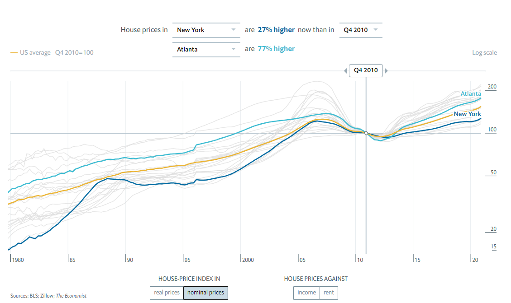
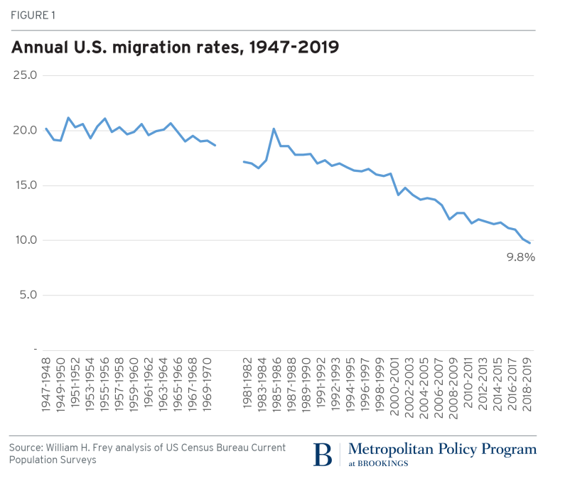
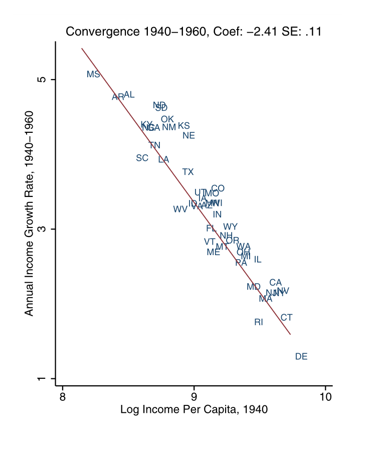
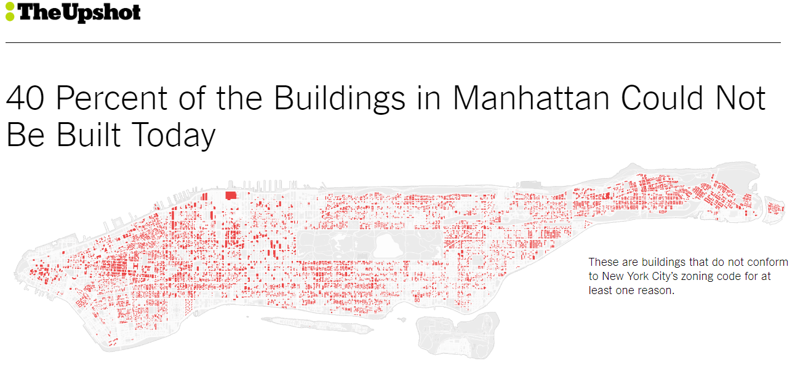

```{css, echo = FALSE}
.cite {
  font-weight: bold;
  font-size: 0.75em;
  color: #BA0C2F;
}
```

```{r Setup, include=FALSE}
library(tidyverse)
library(here)
theme_set(theme_minimal(base_size = 16))
knitr::opts_chunk$set(comment=NA, fig.width=7, fig.height=5,
                      fig.align = 'center', out.width = 600,
                      message=FALSE, warning=FALSE, echo=FALSE)

image_link <- function(image,url,...){
  htmltools::a(
    href=url,
    htmltools::img(src=image,...)
    )
}
```

## My Favorite Municipal Political Party

.pull-left[
```{r}
knitr::include_graphics('img/Jimmy-McMillan.jpg')
```
]

--

.pull-right[
```{r}

```
]

--

```{r, out.width=300}
knitr::include_url('https://www.youtube.com/embed/NrOY3yKUH4k')
```

???

Yes, I told you that there are no parties in municipal politics, and that's mostly true, with a few excellent exceptions.

https://www.youtube.com/embed/NrOY3yKUH4k

---

## Let's Play "Guess What Happened To The Rent"

```{r}
d <- read_csv(here('slides/data/City_zhvi_uc_sfrcondo_tier_0.33_0.67_sm_sa_month.csv'))

d <- d |> 
  pivot_longer(cols = `1/31/2000`:`2/28/2023`,
               names_to = 'date',
               values_to = 'zhvi') |> 
  mutate(date = as.Date(date, format = '%m/%d/%Y'))
```

```{r}
ggplot(data = d |> filter(!is.na(zhvi), date < '2010-06-01'),
       mapping = aes(x=date,y=zhvi, linetype = RegionName, group = RegionName)) +
  geom_line() +
  scale_y_continuous(labels = scales::dollar_format()) +
  scale_x_date(limits = c(min(d$date), max(d$date))) +
  labs(x = 'Date', y= 'Zillow Home Price Index', linetype = 'City')
```

---

## Let's Play "Guess What Happened To The Rent"

```{r}
ggplot(data = d |> filter(!is.na(zhvi), date < '2010-06-01'),
       mapping = aes(x=date,y=zhvi, linetype = RegionName, group = RegionName)) +
  geom_line() +
  scale_y_continuous(labels = scales::dollar_format(),
                     limits = c(1e5, 6.5e5)) +
  scale_x_date(limits = c(min(d$date), max(d$date))) +
  labs(x = 'Date', y= 'Zillow Home Price Index', linetype = 'City')
```

???

Wait, I need a bit more space on the y-axis

---

## Let's Play "Guess What Happened To The Rent"

```{r}
ggplot(data = d |> filter(!is.na(zhvi)),
       mapping = aes(x=date,y=zhvi, linetype = RegionName, group = RegionName)) +
  geom_line() +
  scale_y_continuous(labels = scales::dollar_format(),
                     limits = c(1e5, 6.5e5)) +
  scale_x_date(limits = c(min(d$date), max(d$date))) +
  labs(x = 'Date', y= 'Zillow Home Price Index', linetype = 'City')
```


???



https://www.economist.com/graphic-detail/usa-house-prices

---

## Today

1. Why does it matter if the rent is high?

2. What is causing the rent to be high?

3. Why does politics make the rent high?

4. How can we make the rent less high?

---

class: center, middle, inverse

## Part I. Why Does It Matter?

???

## High Home Prices Cause...

- Financial Hardship

- Homelessness

- Gentrification/Displacement

- Inequality

- Declines in Economic Productivity

- Sprawl / Increased Carbon Emissions

- Reduced Fertility


hardship (homelessness), family formation, productivity, STUCK, inequality (Henry George sign; public improvements all go to landowners); links to transportation policy - pushes people to suburbs and exurbs, long commute times; single-family only cities are financially precarious (Suburban Ponzi Scheme)

---

## Rent Burden

When housing costs grow faster than income, renters must spend a growing share of their income on rent.

--


.pull-left[

]

.pull-right[

]

---

## Homelessness

Places with more expensive housing tend to have more people who live without it.

--


---

## Gentrification / Displacement

.pull-left[

<br>

- In cities throughout the country, neighborhoods that were previously affordable have become expensive.

- Renters in these areas must make the difficult choice to accept an increasing rent burden or leave their homes and communities.
]
.pull-right[
<br>
<br>

]

???

In many cities, the surge in rents has spurred gentrification and displacement of existing residents.

---

## Urban Sprawl

- We tend to think of displacement as something that only happens to low-income renters, but middle class families get displaced from places with high housing costs too.

--

- It's just called "moving to the suburbs".

--

.pull-left[
```{r}
knitr::include_graphics('img/us_lower_48_american_commute.png')
```
]

.pull-right[
```{r}
knitr::include_graphics('img/super-commmuters.png')
```
]

???

https://www.apartmentlist.com/research/traffic-trains-or-teleconference-the-changing-american-commute

Comes with all the climate change problems we discussed before.

---

## Interstate Mobility

**Gut check:** Are Americans more or less likely to move across state lines today than they were 100 years ago?

--

.pull-left[
- Surprisingly, the answer is less. Much less!
]

.pull-right[
```{r}

```
]

---

## Interstate Mobility

**Gut check:** Are Americans more or less likely to move across state lines today than they were 100 years ago?

.pull-left[
- Surprisingly, the answer is less. Much less!

- This has important economic effects. In the early 20th century, lots of people moved to places where they could earn higher wages.
]

.pull-right[
```{r}
knitr::include_graphics('img/great-migration.png')
```
]

---

## Interstate Mobility

**Gut check:** Are Americans more or less likely to move across state lines today than they were 100 years ago?

.pull-left[
- Surprisingly, the answer is less. Much less!

- This has important economic effects. In the early 20th century, lots of people moved to places where they could earn higher wages.

- As a result, we saw strong **regional convergence** .cite[(Ganong & Shoag, 2017)]. 

]

.pull-right[
```{r}

```
]

---

## Interstate Mobility

**Gut check:** Are Americans more or less likely to move across state lines today than they were 100 years ago?

.pull-left[
- Surprisingly, the answer is less. Much less!

- This has important economic effects. In the early 20th century, lots of people moved to places where they could earn higher wages.

- As a result, we saw strong **regional convergence** .cite[(Ganong & Shoag, 2017)]. 

- Today, people are less likely to move to places with higher wages because so much of their paycheck would get eaten by housing. The result is declining regional convergence.

]

.pull-right[
```{r}
knitr::include_graphics('img/ganong-shoag-fig1b.png')
```
]

---

## Other Economic Effects

- When housing costs deter people from moving to high-wage cities, the entire country is poorer than it otherwise would be.

  - By some estimates, about **8.9%** poorer .cite[(Hsieh & Moretti, 2019)].
  
--

- Income inequality is higher too, as property owners receive a larger share of national income.

  - Capital's share of national income rose from 32% to 40% in the years since WWII. 
  
  - That increase is **entirely** due to the rising cost of housing .cite[(Rognile 2019)].

---

## Summary (Part I)

The rising cost of housing is a root cause of so many problems bedeviling American society today:

- Financial Hardship

- Homelessness

- Gentrification/Displacement

- Inequality

- Declines in Economic Productivity

- Sprawl 

- Climate Change

- Reduced Fertility

--

So why has the cost of housing gone up so dramatically, and what can we do about it?


---

class: center, middle, inverse

## Part II. Why Is The Rent So High?

---

## Why Is The Rent So High?

--

- Well, like the price of anything, the price of housing is determined by a combination of **supply and demand**.

--

- When cities don't build enough new housing to meet rising demand, they tend to be much more expensive .cite[Glaeser & Gyourko (2018)].


```{r, out.width=500}
knitr::include_graphics('img/permits-and-home-prices.png')
```

---

## Why Is The Rent So High?

--

- Why can't cities build enough housing to meet demand? Because in city after city, it's illegal!

--

- Nearly every US city zones most of its land for single-family detached homes. Combined with minimum lot sizes and parking minimums, this severely restricts the number of housing units that can be built by right.

[](https://www.nytimes.com/interactive/2019/06/18/upshot/cities-across-america-question-single-family-zoning.html)

---

## Zoning Restrictions

Even in places like New York City where multifamily housing is permitted, zoning laws significantly restrict how much housing can be built compared to a century ago.

<br>

[](https://www.nytimes.com/interactive/2016/05/19/upshot/forty-percent-of-manhattans-buildings-could-not-be-built-today.html)

---

## Wait A Minute.

--

How do we know that new building doesn't make the problem **worse**?

--

.pull-left[

]

.pull-right[

]

--

New housing is often wildly unaffordable. How can building new housing bring down rents if *this* is what gets built?

--

- It can be helpful to imagine what would happen if The Mark were torn down and replaced with a parking lot. What happens to the 1,000 people living there? .cite[(Bratu et al. 2023)].

???

928 beds (Phase I), 446 beds (Phase II)
https://www.redandblack.com/athensnews/the-mark-athens-to-expand-add-more-than-400-new-beds/article_d5ca095c-bf04-11e9-a476-0bf42f0cb720.html


---

## How Do We Know New Supply Helps Bring Down Rent?

- First, there's cross-city evidence .cite[Glaeser & Gyourko (2018)]. Places with more building are less expensive, all else equal.

---

## How Do We Know New Supply Helps Bring Down Rent?

- Within cities, the science gets tougher.

--

  - If a new luxury condo gets built, and then all the rents in the neighborhood go up, which way does the causal arrow go?
  
  - Did the condo get built because the neighborhood was desirable? Or did the neighborhood become desirable because of the condo?

--

- .cite[Pennington (2022)] tackles the question in a clever way, looking at San Francisco neighborhoods where more housing got built because the original structure burned down.

.pull-left[
```{r}

```
]

.pull-right[
```{r, out.width=250}

```
]

---

## Summary (Part II)

- The price of housing is a product of supply and demand.

- In the most expensive cities, demand is rising faster than supply can keep up.

- Zoning restrictions make it illegal to build new housing by right in many of the most high-demand neighborhoods.

--

So why don't we just fix zoning? Why do buildings literally have to burn down in San Francisco before they permit new ones?

--

That brings us to Part III.

---

## Journal Club This Week

1. Bowman, Sam, John Myers, and Ben Southwood. 2021. [“The Housing Theory of Everything.”](https://worksinprogress.co/issue/the-housing-theory-of-everything) *Works in Progress*.

2. Schleicher, David (2013). [City Unplanning](https://joeornstein.github.io/pols-4641/readings/Schleicher%20-%202013%20-%20City%20Unplanning.pdf)

3. Fischel, William (2016). [The Rise of the Homevoters: How the Growth Machine Was Subverted by OPEC and Earth Day](https://joeornstein.github.io/pols-4641/readings/Fischel%20-%202016%20-%20The%20Rise%20of%20the%20Homevoters.pdf)

4. Einstein, Palmer & Glick (2019). [Who Participates in Local Government? Evidence from Meeting Minutes](https://joeornstein.github.io/pols-4641/readings/Einstein%20et%20al.%20-%202019%20-%20Who%20Participates%20in%20Local%20Government%20Evidence%20fro.pdf)

5. Einstein, Ornstein & Palmer (2022). [Who Represents The Renters?](https://joeornstein.github.io/pols-4641/readings/Einstein%20et%20al.%20-%202022%20-%20Who%20Represents%20the%20Renters.pdf)

6. Yglesias, Matt (2021). [Homelessness is about housing](https://www.slowboring.com/p/homelessness-housing)
