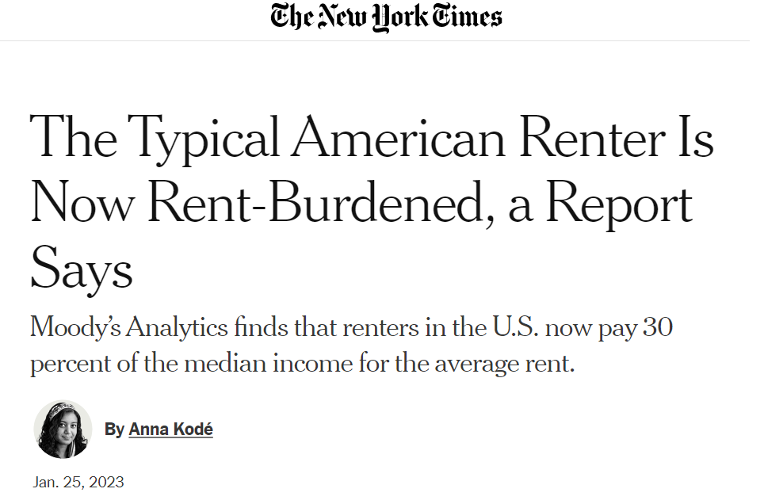
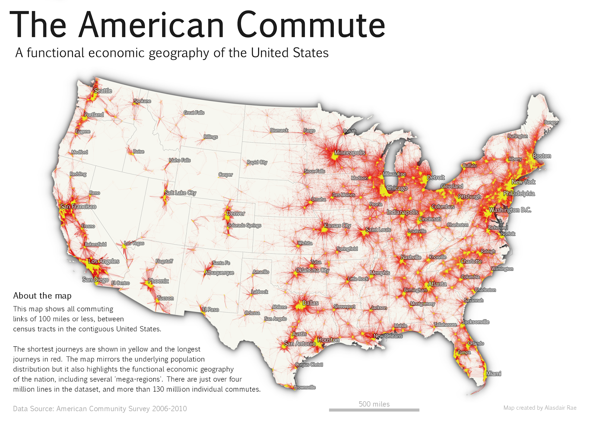
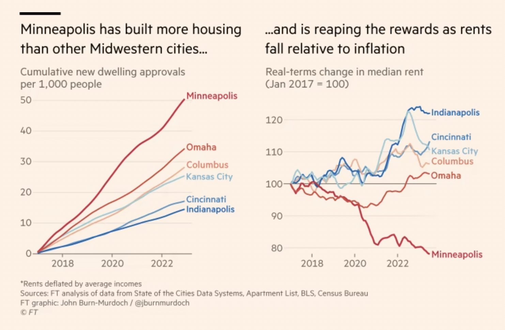
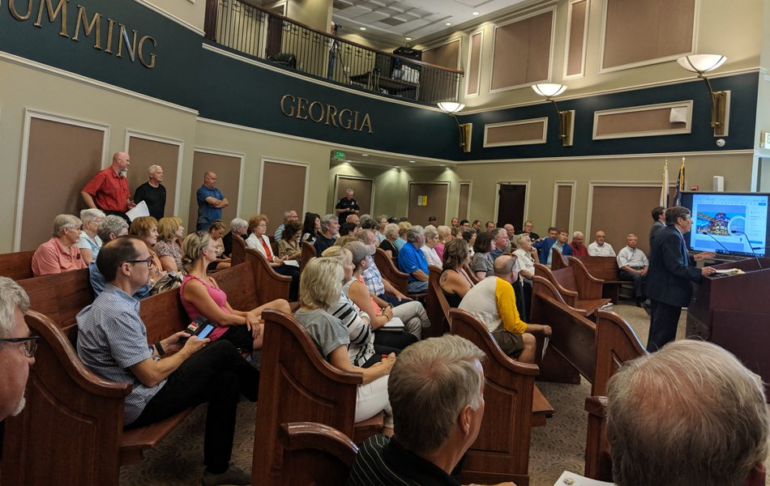
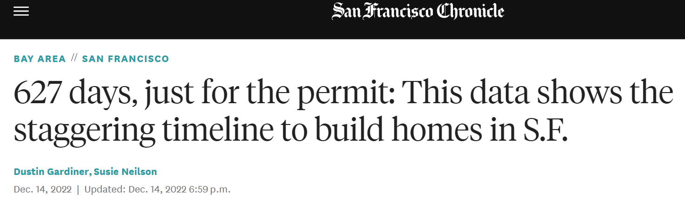
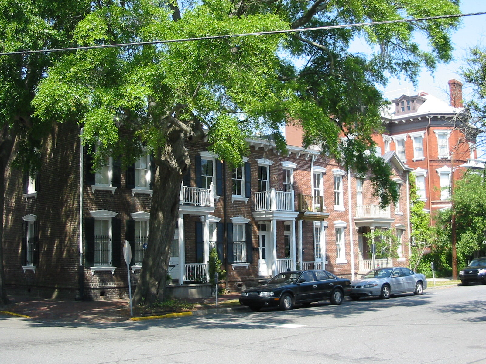

```{css, echo = FALSE}
.cite {
  font-weight: bold;
  font-size: 0.75em;
  color: #BA0C2F;
}
```

```{r Setup, include=FALSE}
library(tidyverse)
library(here)
theme_set(theme_minimal(base_size = 16))
knitr::opts_chunk$set(comment=NA, fig.width=7, fig.height=5,
                      fig.align = 'center', out.width = 600,
                      message=FALSE, warning=FALSE, echo=FALSE)

image_link <- function(image,url,...){
  htmltools::a(
    href=url,
    htmltools::img(src=image,...)
    )
}
```

## My Favorite Municipal Political Party

.pull-left[
```{r}
knitr::include_graphics('img/Jimmy-McMillan.jpg')
```
]

--

.pull-right[
```{r}
knitr::include_graphics('img/rent-is-too-damn-high-ballot.png')
```
]

--

```{r, out.width=300}
knitr::include_url('https://www.youtube.com/embed/NrOY3yKUH4k')
```

???

Yes, I told you that there are no parties in municipal politics, and that's mostly true, with a few excellent exceptions.

https://www.youtube.com/embed/NrOY3yKUH4k

---

## Let's Play "Guess What Happened To The Rent"

```{r}
d <- read_csv(here('slides/data/City_zhvi_uc_sfrcondo_tier_0.33_0.67_sm_sa_month.csv'))

d <- d |> 
  pivot_longer(cols = `1/31/2000`:`2/28/2023`,
               names_to = 'date',
               values_to = 'zhvi') |> 
  mutate(date = as.Date(date, format = '%m/%d/%Y'))
```

```{r}
ggplot(data = d |> filter(!is.na(zhvi), date < '2010-06-01'),
       mapping = aes(x=date,y=zhvi, linetype = RegionName, group = RegionName)) +
  geom_line() +
  scale_y_continuous(labels = scales::dollar_format()) +
  scale_x_date(limits = c(min(d$date), max(d$date))) +
  labs(x = 'Date', y= 'Zillow Home Price Index', linetype = 'City')
```

---

## Let's Play "Guess What Happened To The Rent"

```{r}
ggplot(data = d |> filter(!is.na(zhvi), date < '2010-06-01'),
       mapping = aes(x=date,y=zhvi, linetype = RegionName, group = RegionName)) +
  geom_line() +
  scale_y_continuous(labels = scales::dollar_format(),
                     limits = c(1e5, 6.5e5)) +
  scale_x_date(limits = c(min(d$date), max(d$date))) +
  labs(x = 'Date', y= 'Zillow Home Price Index', linetype = 'City')
```

???

Wait, I need a bit more space on the y-axis

---

## Let's Play "Guess What Happened To The Rent"

```{r}
ggplot(data = d |> filter(!is.na(zhvi)),
       mapping = aes(x=date,y=zhvi, linetype = RegionName, group = RegionName)) +
  geom_line() +
  scale_y_continuous(labels = scales::dollar_format(),
                     limits = c(1e5, 6.5e5)) +
  scale_x_date(limits = c(min(d$date), max(d$date))) +
  labs(x = 'Date', y= 'Zillow Home Price Index', linetype = 'City')
```


???


https://www.economist.com/graphic-detail/usa-house-prices

---

## This Week

1. Why does it matter if the rent is too high?

2. What is causing the rent to be too high?

3. How does politics make the rent too high?

4. What can we do to make the rent less high?

---

class: center, middle, inverse

## Part I. Why Does It Matter?

???

## High Home Prices Cause...

- Financial Hardship

- Homelessness

- Gentrification/Displacement

- Inequality

- Declines in Economic Productivity

- Sprawl / Increased Carbon Emissions

- Reduced Fertility


hardship (homelessness), family formation, productivity, STUCK, inequality (Henry George sign; public improvements all go to landowners); links to transportation policy - pushes people to suburbs and exurbs, long commute times; single-family only cities are financially precarious (Suburban Ponzi Scheme)

---

## Rent Burden

When housing costs grow faster than income, renters must spend a growing share of their income on rent.

--


.pull-left[

]

.pull-right[

]

---

## Homelessness

Places with more expensive housing tend to have more people who live without it.

--

```{r}
knitr::include_graphics('img/homelessness-vs-housing-costs-colburn-adern.png')
```

???

Note: PIT stands for "point in time", one method for estimating the rate of homelessness

---

## Gentrification / Displacement

.pull-left[

<br>

- In cities throughout the country, neighborhoods that were previously affordable have become expensive.

- Renters in these areas must make the difficult choice to accept an increasing rent burden or leave their homes and communities.
]
.pull-right[
<br>
<br>

]

???

In many cities, the surge in rents has spurred gentrification and displacement of existing residents.

---

## Urban Sprawl

We tend to think of displacement as something that only happens to low-income renters, but middle class families get displaced from places with high housing costs too.

--


```{r}

```

---

## Urban Sprawl

We tend to think of displacement as something that only happens to low-income renters, but middle class families get displaced from places with high housing costs too.

.pull-left[
```{r}
knitr::include_graphics('img/co2-footprints.png')
```
]

.pull-right[
```{r}
knitr::include_graphics('img/super-commmuters.png')
```
]

???

It's just called "moving to the suburbs"

https://www.apartmentlist.com/research/traffic-trains-or-teleconference-the-changing-american-commute

Comes with all the climate change problems we discussed before.

---

## Interstate Mobility

**Gut check:** Are Americans more or less likely to move across state lines today than they were 100 years ago?

--

.pull-left[
- Surprisingly, the answer is less. Much less!
]

.pull-right[
```{r}
knitr::include_graphics('img/migration-rates.png')
```
]

---

## Interstate Mobility

**Gut check:** Are Americans more or less likely to move across state lines today than they were 100 years ago?

.pull-left[
- Surprisingly, the answer is less. Much less!

- This has important economic effects. In the early 20th century, lots of people moved to places where they could earn higher wages.
]

.pull-right[
```{r}
knitr::include_graphics('img/great-migration.png')
```
]

---

## Interstate Mobility

**Gut check:** Are Americans more or less likely to move across state lines today than they were 100 years ago?

.pull-left[
- Surprisingly, the answer is less. Much less!

- This has important economic effects. In the early 20th century, lots of people moved to places where they could earn higher wages.

- As a result, we saw strong **regional convergence** .cite[(Ganong & Shoag, 2017)]. 

]

.pull-right[
```{r}
knitr::include_graphics('img/ganong-shoag-fig1.png')
```
]

---

## Interstate Mobility

**Gut check:** Are Americans more or less likely to move across state lines today than they were 100 years ago?

.pull-left[
- Surprisingly, the answer is less. Much less!

- This has important economic effects. In the early 20th century, lots of people moved to places where they could earn higher wages.

- As a result, we saw strong **regional convergence** .cite[(Ganong & Shoag, 2017)]. 

- Today, people are less likely to move to places with higher wages because so much of their paycheck would get eaten by housing. The result is declining regional convergence.

]

.pull-right[
```{r}
knitr::include_graphics('img/ganong-shoag-fig1b.png')
```
]

---

## Other Economic Effects

- When housing costs deter people from moving to high-wage cities, the entire country is poorer than it otherwise would be.

--

  - By some estimates, about **8.9%** poorer .cite[(Hsieh & Moretti, 2019)].
  
--

- Income inequality is higher too, as property owners receive a larger share of national income.

--

  - Capital's share of national income rose from 32% to 40% in the years since WWII. 

--
  
  - That increase is almost **entirely** due to the rising cost of housing .cite[(Rognile 2019)].

---

## Summary (Part I)

The rising cost of housing is a root cause of so many problems bedeviling American society today:

- Financial Hardship

- Homelessness

- Gentrification/Displacement

- Inequality

- Declines in Economic Productivity

- Sprawl 

- Climate Change

- Reduced Fertility

--

So why has the cost of housing gone up so dramatically, and what can we do about it?


---

class: center, middle, inverse

## Part II. Why Is The Rent So High?

---

## Why Is The Rent So High?

--

- Well, like the price of anything, the price of housing is determined by a combination of **supply and demand**.

--

- When cities don't build enough new housing to meet rising demand, they tend to be much more expensive .cite[Glaeser & Gyourko (2018)].


```{r, out.width=500}
knitr::include_graphics('img/permits-and-home-prices.png')
```

---

## Why Is The Rent So High?

--

- Why can't cities build enough housing to meet demand? Because in city after city, it's illegal!

--

- Nearly every US city zones most of its land for single-family detached homes. This severely restricts the number of housing units that can be built by right.

[](https://www.nytimes.com/interactive/2019/06/18/upshot/cities-across-america-question-single-family-zoning.html)

---

## Zoning and Building Codes Create Housing Scarcity

Even in places like New York City where multifamily housing is permitted, zoning laws significantly restrict how much housing can be built compared to a century ago.

<br>

[](https://www.nytimes.com/interactive/2016/05/19/upshot/forty-percent-of-manhattans-buildings-could-not-be-built-today.html)

---

## Zoning and Building Codes Create Housing Scarcity

Every US city has dozens of well-meaning regulations that, in the aggregate, reduce the number of housing units that can be built and drive up the cost of housing:


.pull-left[
- Minimum Lot Sizes
- Building Height Maximums
- Setbacks
- Parking Mandates
- Historic Preservation Ordinances
- [Second Egress Requirements](https://slate.com/business/2021/12/staircases-floor-plan-twitter-housing-apartments.html)
]

.pull-right[
```{r}
knitr::include_graphics('img/stair-daddy.png')
```
]

---

## Wait A Minute.

--

How do we know that new building doesn't make the problem **worse**?

--

.pull-left[

]

.pull-right[

]

--

New housing is often wildly unaffordable. How can building new housing bring down rents if *this* is what gets built?

---

## "Filtering"

It can be helpful to imagine what would happen if The Mark were torn down and replaced with a parking lot. What happens to the 1,500 renters living there?

--

- Those 1,500 renters still have to live somewhere! So they take all the money they would have spent on The Mark and bid up the cost of housing throughout the rest of the market.

--

- In this way, even high-cost new housing can reduce the *average* cost of housing in a city, by "filtering" out the highest-income households .cite[(Bratu et al. 2023)].

???

928 beds (Phase I), 446 beds (Phase II)
https://www.redandblack.com/athensnews/the-mark-athens-to-expand-add-more-than-400-new-beds/article_d5ca095c-bf04-11e9-a476-0bf42f0cb720.html

---

## How Do We Know New Supply Helps Bring Down Rent?

First, there's cross-city evidence .cite[Glaeser & Gyourko (2018)]. Places with more building are less expensive, all else equal.


```{r}
knitr::include_graphics('img/permits-and-home-prices.png')
```

---

## How Do We Know New Supply Helps Bring Down Rent?

We can also look at cases where there was a big change in housing policy, like Minneapolis, which eliminated single-family zoning in 2018:

```{r}

```

---

## How Do We Know New Supply Helps Bring Down Rent?

Or Auckland, New Zealand, which implemented a major upzoning in 2016:

```{r}
knitr::include_graphics('img/auckland-ft.png')
```

???

Lotta back and forth on this one. Here are the relevant papers / blog posts. I ultimately come down more on the side of "allowing more building ends up creating more buildings":

- [Paper](https://cdn.auckland.ac.nz/assets/business/about/our-research/research-institutes-and-centres/Economic-Policy-Centre--EPC-/006WP%20-%204.pdf)
- [Auckland Myth](https://www.fresheconomicthinking.com/p/the-auckland-myth-there-is-no-evidence)
- [Response](https://onefinaleffort.com/blog/a-response-to-murray-and-helm-on-aucklands-upzoning)


---

## Summary (Part II)

- The price of housing is a product of supply and demand.

- In the most expensive cities, demand is rising faster than supply can keep up.

- Zoning restrictions make it illegal to build new housing by right in many of the most high-demand neighborhoods.

  - The US is a free-market economy for most products people buy, but for housing it's practically a command economy. Every new home that gets built is ultimately a political choice.

--

So why don't we choose to build more homes?

--

That brings us to Part III.

---

class: center, middle, inverse

## Part III. The Political Barriers To New Housing

---

## A Zoning Board Meeting

```{r}

```

--

**Exercise**: What are the five most common concerns brought up by residents at these sorts of meetings?

---

## Neighborhood Defenders


.pull-left[
.cite[Einstein, Glick & Palmer (2019)] read *thousands* of comments from zoning/planning meetings in Massachusetts.

- Comments opposing new construction 4x more frequent than comments supporting new construction.

- Most common concerns:

  - Traffic (23%)
  - Environment (19%)
  - Flooding (15%)
  - Safety (15%)
  - Density (12%)
  - Aesthetics (12%)
  - Septic/Water Systems (11%)
  - Neighborhood Character (10%)
  - Parking (10%)

]

.pull-right[

```{r, out.width='80%'}
knitr::include_graphics('img/neighborhood-defenders-cover.png')
```

]

---

## This Illustrates A Few Important Concepts

1. Housing as a Collective Action Problem

2. Vetocracy

3. Horizontal Fragmentation

4. Who Represents The Renters?

---

## 1. Housing As A Collective Action Problem

--

The Logic of Collective Action .cite[(Olson, 1965)]:

- Some policies have **diffuse benefits** and **concentrated costs**.

  - Free trade is a classic example.

- It is difficult to organize collective action in favor of these policies. (Nobody benefits enough to care deeply.)

- But it is very easy to organize interest groups in opposition. 

---

## 1. Housing As A Collective Action Problem

Zoning reform has that same flavor .cite[(Schleicher, 2013)]:

--

- New construction has **diffuse** benefits: 

  - Slightly lower rents for everybody!

--

- And **concentrated** costs borne by neighbors:

  - More cars on the street
  - Harder to find parking
  - Crowding neighborhood schools and parks
  - Building shadows block the sun from my garden!
  - Etc.
  
--

- So it's much easier to organize opposition to new housing ("Homevoters", "Neighborhood Defenders", "NIMBYs", "BANANAs") than it is to organize support.
  
---

## 2. Vetocracy

Combine that with political institutions where every new housing project must jump through a series of hoops to get approved...

--

- Neighborhood Advisory Committees
- Zoning Boards of Appeals
- Planning Commissions
- Historic Preservation District approval (where applicable)
- Environmental Review (required in states like New York and California)
- City Council Approval
- Mayoral Veto

--

...and you get a situation where a committed opposition has multiple opportunities to block or significantly delay new housing.

```{r, out.width='80%'}

```

---

## 3. Horizontal Fragmentation

This is all further exacerbated by horizontal fragmentation.

--

- The benefits of new construction accrue to the entire metropolitan area.

- But the negative externalities are borne locally.

--

- Cities are reticent to build new housing if it means they bear all the costs but see only a small share of the benefits.

--

And the people who *most* benefit from a city building new housing -- potential renters -- don't get a vote, because they don't live there!

---

## 4. Who Represents The Renters?

This all might be okay if public officeholders were looking out for the interests of renters. But at every level of government -- city councilmembers, mayors, state legislators, members of Congress -- renters are significantly underrepresented.

--

- Roughly 1/3 of Americans rent, but over 93% of public officials are homeowners .cite[(Einstein, Ornstein, & Palmer, 2022)]. 

--

```{r, out.width = '60%'}
knitr::include_graphics('img/scatter_owners.png')
```

???

Lots of possible reasons for this: renters are less tied to their community, likely to be younger, less likely to run for office; some evidence that voters are less likely to vote for someone they know is a renter.

homevoters, neighborhood defenders (who represents the renters?), collective action problems/szea, vetocracy, fragmentation (the people who'd most benefit from upzoning don't get a vote!)

---

## Summary (Part III)

- Because new housing has concentrated costs and diffuse benefits, it is easier to mobilize opposition than support.

- Multiple veto points to modify zoning codes create status quo bias. 

- Horizontal fragmentation means that cities don't internalize all the benefits of new housing.

- The biggest beneficiaries of new construction -- renters -- are underrepresented at every stage of the decision-making process.

--

How do you overcome all these political obstacles? Let's end on a note of optimism (Part IV).

---

class: center, middle, inverse

## Part IV. Going Forward

---

## The "Missing Middle"

Our cities used to build a wide range of housing options for people at different stages of life, but in most places we've now regulated them out of existence.

```{r}
knitr::include_graphics('img/missing-middle.jpg')
```

--

The most promising reforms of the past decade involve efforts to legalize this "missing middle".

???

Next time you walk around Athens, notice what types of homes you see. All the "Missing Middle" was built a long time ago and grandfathered in.

The path from housing scarcity to housing abundance doesn't require radical deregulation. It can be incremental and organic.

missing middle (includes things like ADUs) / incremental densification, YIMBY movement, election timing, progress at the state level

---

## State-Level Reforms

The most consequential zoning reforms are often at the state-level, where lawmakers can internalize the benefits of housing growth.

--

For example, California has passed a torrent of legislation since 2019:

- **AB 68 (2019)**: Legalizes Accessory Dwelling Units (ADUs) statewide

- **AB 725 (2020)**: Requires municipalities to permit some Missing Middle housing

- **SB 9 (2021)**: Allows duplexes in single-family zones

- **SB 10 (2021)**: Allows multifamily housing near transit without triggering environmental review

- **SB 886 (2022)**: Streamlines the approval process for universities to build student housing

- **AB 2097 (2022)**: Prohibits parking mandates within 1/2 mile of public transit

--

State level is where localized opposition holds the least influence, and broad-based interest groups that want to promote economic growth / housing affordability are more likely to be able to wield influence.


???

All these interlocking regulations need to be addressed [simultaneously](https://www.bloomberg.com/news/articles/2020-07-29/to-add-housing-zoning-code-reform-is-just-a-start)! (Allowing duplexes doesn't actually get you more duplexes unless you relax regulations around minimum lot sizes, parking, environmental review, etc.)

---

## We Live In Exciting Times!

This sort of ["gentle density"](https://www.strongtowns.org/journal/2019/12/11/is-gentle-density-enough) can create millions of new homes and reduce car-dependence without requiring a radical transformation of our neighborhoods.

After decades of Urban Renewal, suburbanization, and disinvestment, we have a tremendous opportunity to repair the fabric of our cities.

.pull-left[

```{r}

```
]

.pull-right[
```{r, out.width = '70%'}
knitr::include_graphics('img/gentle-density1.jpg')
```

```{r, out.width='70%'}
knitr::include_graphics('img/gentle-density2.jpg')
```
]


???

[US needs 3.8 million housing units](https://www.nytimes.com/2022/07/14/upshot/housing-shortage-us.html)