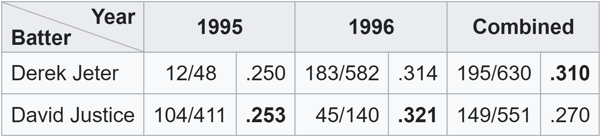
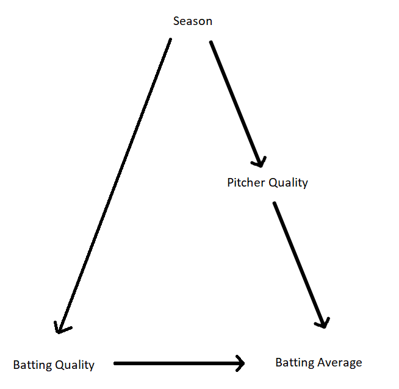

An useful way to think about the problem of measurement is to first consider an extreme case. For example, this illustration of [Simpson's Paradox](https://en.wikipedia.org/wiki/Simpson's_paradox):

In both 1995 and 1996, David Justice had a higher batting average than Derek Jeter. But when you look at their *combined* batting average across both years, Justice has the higher batting average. So which is the best measure of hitting ability, the aggregated or disaggregated batting average? Who was the better batter? 

As Judea Pearl shows in this [nice paper](pearl-2013.pdf), causal DAGs can help cleanly resolve Simpson's Paradox issues. Since I lack the wherewithal to learn a special purpose software to draw a DAG, let me go ahead and render this one in MS Paint...

Nice. Looking clean and professional. The point is that one's batting average depends on more than just hitting ability. It also depends on, for instance, the quality of the pitchers you face. Since the baseball season determines both who bats and who pitches, the variable `Season` confounds batting average as a measure of quality. 

**Measurement fundamentally invokes a causal claim**. A good measure changes whenever the latent characteristic we care about changes. A bad measure has a non-causal, back-door path between the latent characteristic and the observed measure. Only once you close off the back-door path between Batting Quality and Batting Average (by conditioning on Season) does their observed correlation correspond to the true causal relationship. 
