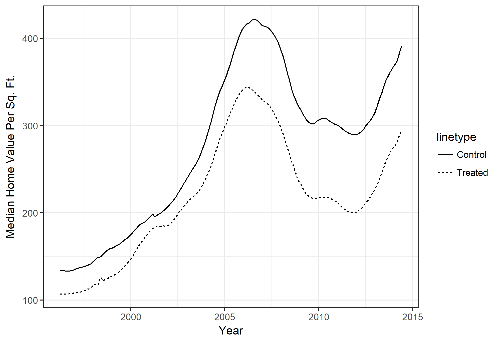
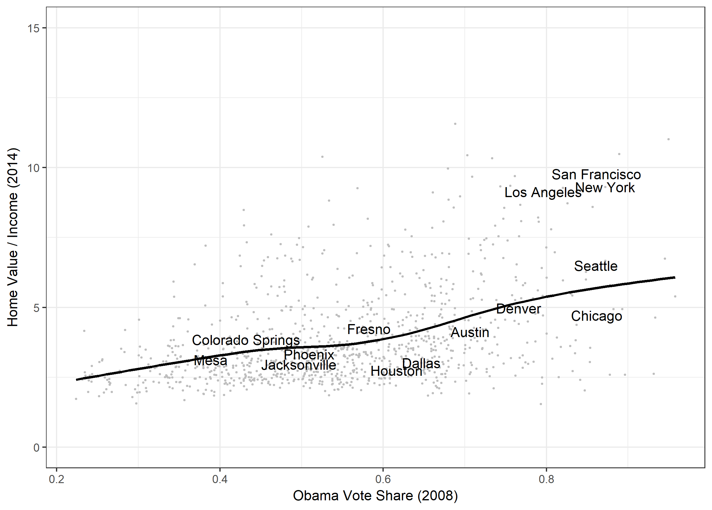
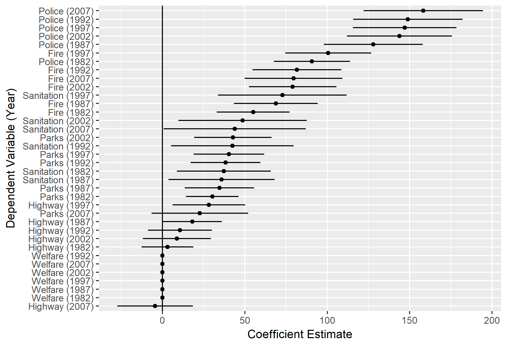
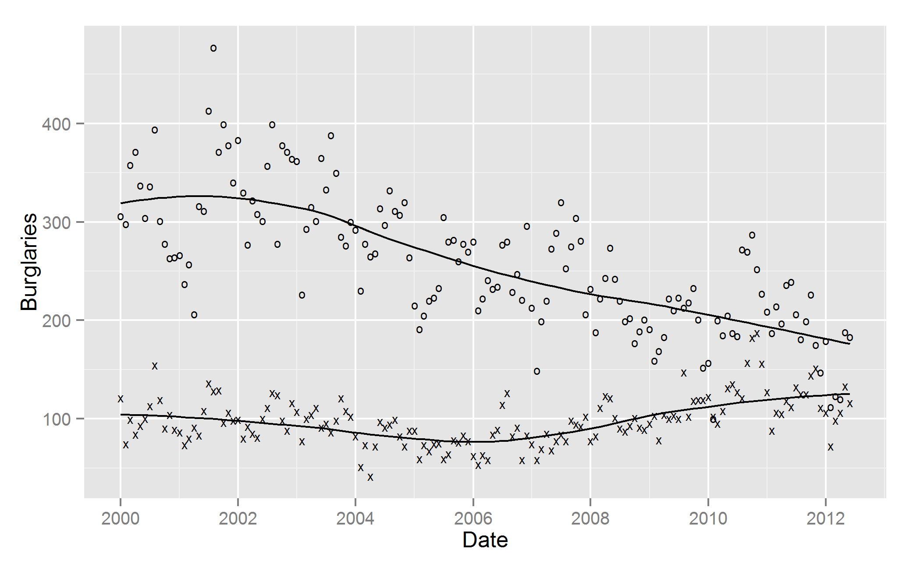
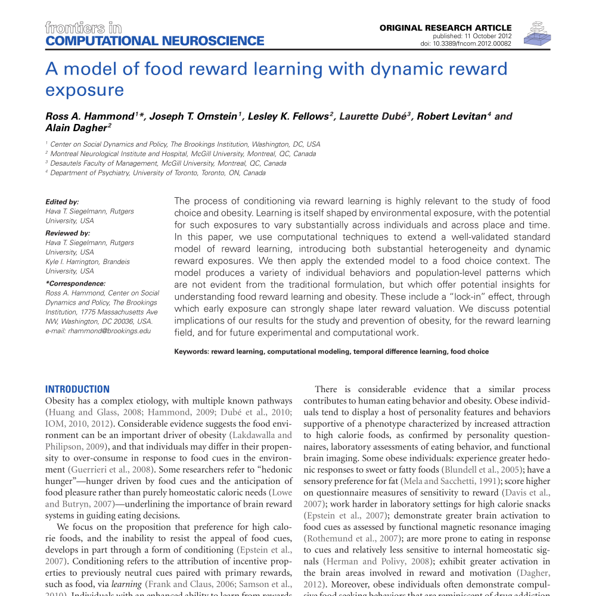

<!--html_preserve-->

  
Research

  
A gallery of my published and ongoing research projects.

<!--/html_preserve-->

### Urban Political Economy
Papers on land use policy, public spending, and segregation in US cities.

<!--html_preserve-->

  

    
    

      
      

        
        <a href="ElectionTiming.html" class="galleryItemLabel">Municipal Election Timing and the Politics of Urban Growth</a>
        
Working Paper.

      

      
      

        
        <a href="papers/ornstein-zone-defense.pdf" class="galleryItemLabel">Zone Defense: Why Liberal Cities Build Fewer Houses</a>
        
Working Paper.

      

      
      

        
        <a href="papers/dcsm.pdf" class="galleryItemLabel">Diverse Cities Spend More</a>
        
Working Paper.

      

      
      
    

      
  

      

      
<!--/html_preserve-->      
      
### Research Methods
Papers on agent-based modeling, spatial econometrics, and local public opinion estimation.

<!--html_preserve-->      

      
   

   
      

      
      
        

          
          <a href="SRP.html" class="galleryItemLabel">Stacked Regression and Poststratification</a>
          
Political Analysis (Forthcoming).

        

        
        

          
          <a href="research/zig-zag/index.html" class="galleryItemLabel">Zig Zag: When Noisy Regression Discontinuities Yield Exaggerated Claims</a>
          
Working Paper.

        

        
      
        

          
          <a href="papers/Ornstein-Hammond2017.pdf" class="galleryItemLabel">The Burglary Boost: A Note on Detecting Contagion Using the Knox Test</a>
          
Journal of Quantitative Criminology, 2017, with Ross A. Hammond.

        

        
      
      

      
  

  

<!--/html_preserve-->

### Public Health
Computational modeling to inform public health policymaking.

<!--html_preserve-->      

      
   

   
      

      
        

          
          <a href="papers/Hammond_et_al-2014-Annals_of_the_New_York_Academy_of_Sciences.pdf" class="galleryItemLabel">A model of social influence on body mass index</a>
          
Annals of the New York Academy of Sciences, 2014, with Ross A. Hammond.

        

        
        

          
          <a href="papers/Hammond-2012.pdf" class="galleryItemLabel">A model of food reward learning with dynamic reward exposure</a>
          
Frontiers in Computational Neuroscience, 2012, with Ross A. Hammond, et al.

        

        
        
      
      

      
  

  

<!--/html_preserve-->

### Other

These papers defy categorization, or fall into a category with only one entry.

<!--html_preserve-->      

      
   

   
      

      
                

          
          <a href="MonotonicityFailure.html" class="galleryItemLabel">Frequency of monotonicity failure under Instant Runoff Voting: estimates based on a spatial model of elections</a>
          
Public Choice, 2014, with Bob Norman.

        

        
        
      
      

      
  

  

<!--/html_preserve-->

