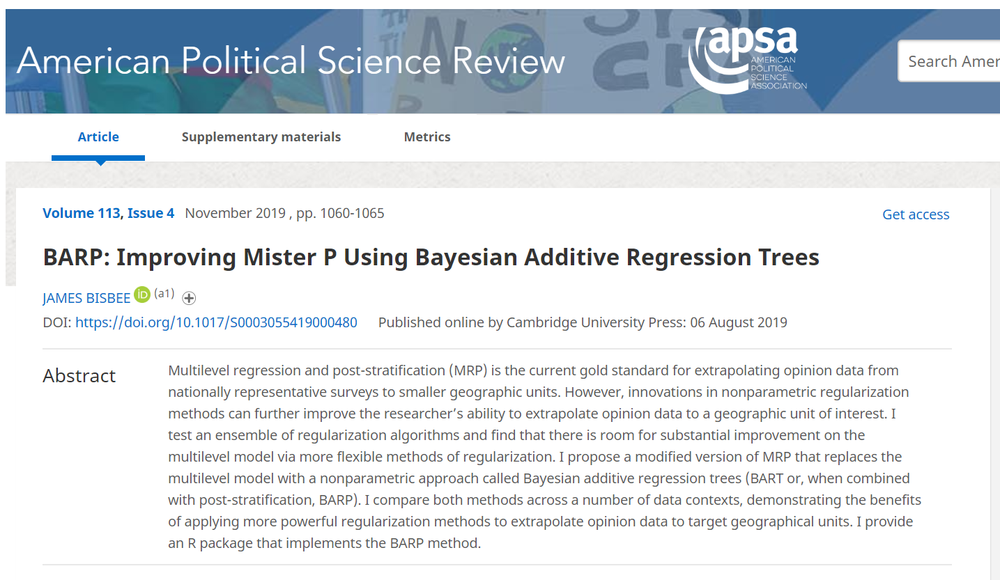
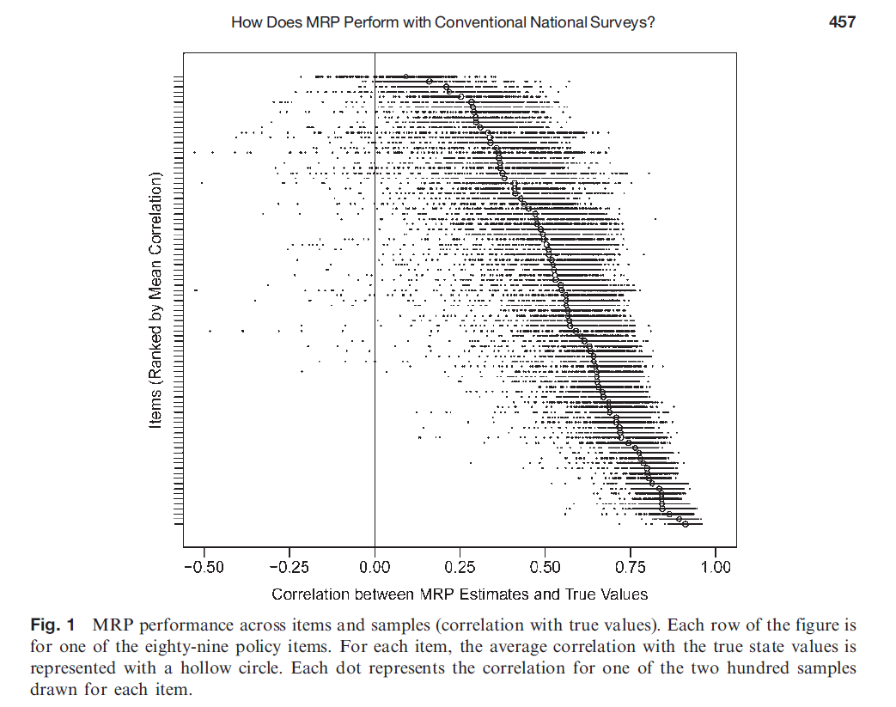
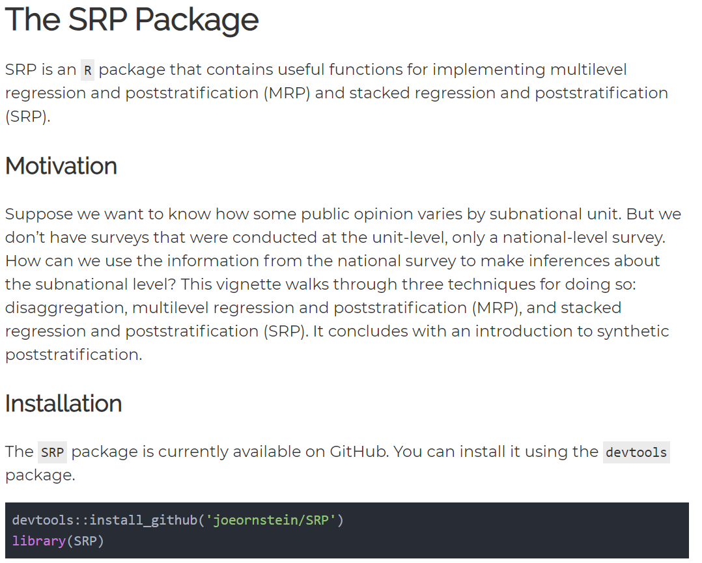

```{r Setup, include=FALSE}
library(tidyverse)
library(directlabels)
library(gganimate)
theme_set(theme_minimal(base_size = 16))
knitr::opts_chunk$set(comment=NA, fig.width=7, fig.height=5, 
                      fig.align = 'center', out.width = 600,
                      message=FALSE, warning=FALSE, echo=FALSE)
```

## Multilevel Regression and Poststratification (MRP)

--

1. Fit a multilevel regression model

--

2. Generate predictions for each covariate combination

--

3. Poststratify

???

- Very deliberately chosen acronym, after multiple rounds of focus testing. If multilevel regression and poststratification is "Mister P", then stacked regression and poststratification is his sophisticated cousin "Se\~{n}or P". 
- Would love feedback on the package from folks in this group. If useful for the community, I would be happy to make changes and publish a new version on CRAN.
- This is the MRP Reading Group, so this abbreviated slide is for completeness.


---

## "Poststratification Is Key"


--

"...it's not crucial that the $\theta_j$ be estimated using multilevel regression. More generally, we can use any *regularized prediction* method..."

???

As Gelman notes, the secret sauce is in the postratification. You can use any kind of model in the first stage as long as it produces regularized predictions.

---

class: center, middle

## What Model To Use?


???

This opens up this really gnarly model selection problem. If you're not using multilevel regression, what do you use? And what criteria do you use to select the best model? There have been a number of methods that have stepped in to fill this space.

---

## BARP



???

BARP does have a great acronym.

---

## Why stop there?

Lots of machine learning alternatives:

- LASSO / Ridge regression

- Classification trees

- Random forest

- Gradient boosting

- KNN

- Neural Networks

- Gaussian Process Regression


---

## Stacking

--

- Fundamentally, MRP is an exercise in out-of-sample prediction. 

--

- So the choice of first-stage model should be evaluated by that metric. 

--

- **Stacking** .small[(Wolpert, 1992; Breiman, 1996)] is a principled approach.

--

.center[

]


???

- We observe some opinions in a small survey sample, and we want to use that training data to make generalized predictions about opinions in places that we didn't observe (or, didn't observe enough)
- Stacking builds out-of-sample prediction performance into the estimation of the model, which is a really nice feature for this application.


---

# Stacked Regression

#### Build an ensemble model average (EMA) from $K$ models:

$$f(X) = \sum_{k=1}^K w_kf_k(X)$$

where $w_i \geq 0$ for all $i$ and $\sum w_i = 1$

--

(MRP and BARP are both special cases.)

--

#### Estimate $w$ through a two-step process:


1. Generate *out-of-sample predictions* through cross-validation.

2. Find the $w$ vector that minimizes out-of-sample prediction error.


<!-- (I really tried to find a good flowchart on stacking, but nobody has yet produced one that is more illuminating than confusing...) -->


???

Split the training data into $k$ folds, hold out each fold as a test set and estimate each model with the remaining data.

---

## Five Steps of SRP

--

1. Fit $M$ models to your training data.

--

2. Obtain out-of-sample predictions for each observation through cross-validation.

--

3. Select model weights $w$ that minimize cross-validated prediction error.

--

4. Predictions in each cell are $\sum w_k f_k(X)$

--

5. Poststratify as usual.

---


class: center, middle

# Results

---

## Monte Carlo

$$y_i = z_{1i} + z_{2i} + z_{3i} + \theta(D^0_i z_{1i} z_{2i} - D^1_i z_{1i} z_{3i}) + \varepsilon_i$$

--

### SRP First Stage Models

- Multilevel Regression

- LASSO

- KNN

- Random Forest

- Gradient Boosting

--

When $\theta = 0$, MRP and SRP perform equally well.


???

Funky DGP. 
- When $\theta = 0$, the DGP is linear-additive, and MRP and SRP perform equally well. 
- As $\theta$ increases, you get multiplicative interaction effects but only for subunits in certain geographic areas.


---

#### When $\theta = 5$...

```{r monte carlo illustrative animation, echo=FALSE}


load('data/vignette_results.RData')

results <- results %>% 
  select(-num) %>% 
  pivot_longer(cols = c('disag_estimate', 'mrp_estimate', 'srp_estimate'), 
               names_to = 'estimator', values_to = 'estimate') %>% 
  mutate(estimator = recode(estimator, # Recode estimator labels
                            disag_estimate = 'Disaggregation',
                            mrp_estimate = 'MRP',
                            srp_estimate = 'SRP')) %>% 
  mutate(estimator = factor(estimator, # Order the factor levels
                            levels = c('Disaggregation', 'MRP', 'SRP')))

p <- ggplot(data = results, aes(x=estimate, y=true_mean)) +
  geom_point(alpha = 0.5) +
  labs(x = 'Estimate', y='True Mean') +
  geom_abline(slope = 1, intercept = 0, linetype = 'dashed')

animation <- p + 
  transition_states(estimator, transition_length = 2,
                    state_length = 3) +
  ggtitle('{closest_state}') +
  enter_fade() + exit_fade()

animation

```

---


## Empirical Application

- Buttice & Highton (2013)

- 89 issue areas drawn from NAES and CCES

- Treat disaggregated state means as the "truth"

--

**Individual-Level Covariates:** sex, age, race, education

**State-Level Covariates:** presidential vote share, religious conservatism

???

That's all well and good. What happens when you put it to real data?

---

## MRP mostly performs well

```{r buttice-higton figure}

```

---

## SRP outperforms MRP, particularly for large datasets

```{r empirical application animation}
load('data/empirical_application_data.RData')

p <- ggplot(dat, aes(x=MRP.correlation, y=SRP.correlation)) + 
  geom_point(alpha = 0.5) + geom_abline(intercept=0,slope=1, linetype = 'dashed') +
  xlab("MRP Correlation") +
  ylab("SRP Correlation") +
  ggtitle("n = 10,000")

animation <- p + transition_states(sample.size, transition_length = 2,
                    state_length = 3) +
  ggtitle('n = {closest_state}') +
  enter_fade() + exit_fade()

animation

```

???

Performs best with large survey datasets. When $n=10000$, there's just no reason *not* to use it. 

---

class: center, middle

# R Package

???

For MRP reading group, would be really grateful for feedback.

---


### Installation

```{r install package, eval=FALSE, warning=FALSE, include=TRUE, echo=TRUE}
devtools::install_github('joeornstein/SRP')
library(SRP)
```

### Fit models in the usual way

```{r fit models, eval=FALSE, echo=TRUE}
# Estimate HLM
hlmFormula <- y ~ (1|x1) +  (1|x2) + unit_covariate + (1|unit) 
hlmModel <- lmer(hlmFormula, data = trainset)

# Tune KNN
knnFormula <- y ~ x1 + x2 + latitude + longitude + unit_covariate
knn_train <- train.kknn(knnFormula, data=trainset, kmax = 201) 
k_best <- knn_train$best.parameters$k

# Tune Random Forest
forestFormula <- y ~ x1 + x2 + latitude + longitude + unit_covariate
forestModel <- ranger(forestFormula, data = trainset)
```

???

Can install it using the `devtools` package, and here's what the workflow looks like.

---

## Stacking Function

```{r stack weights function, eval=FALSE, echo=TRUE}
stackWeights <- getStackWeights(trainset = trainset,
                                hlmFormula = hlmFormula,
                                lasso_vars = lasso_vars,
                                lasso_factors = lasso_factors,
                                forestFormula = forestFormula,
                                knnFormula = knnFormula, k_best = k_best,
                                gbm_vars = gbm_vars, gbm_factors = NULL, 
                                gbm_params = list(eta = 0.02), gbm_tune = xgb.tune, 
                                nfolds = 5)
```

---

## Poststratification Function

```{r poststratification function, eval=FALSE, echo=TRUE}
# Generate Model Predictions
M1 <- predict(hlmModel, PSFrame, allow.new.levels = T)
M2 <- predict(lassoModel, newx = PSFrame_lasso, s = lassoModel$lambda.min)
M3 <- kknn(knnFormula, train = trainset, test = PSFrame, k = k_best)$fitted.values
M4 <- predict(forestModel, PSFrame)$predictions
M5 <- predict(gbmModel, PSFrame_gbm)
M <- cbind(M1,M2,M3,M4,M5) %>% as.matrix

pred <- M %*% stackWeights

#Poststratify
srp_estimates <- poststratify(pred, PSFrame)
```


---

[](https://joeornstein.github.io/software/SRP/)


???

Vignette available on my website.

---

# Thanks!

```{r thanks, out.width = 350}

```