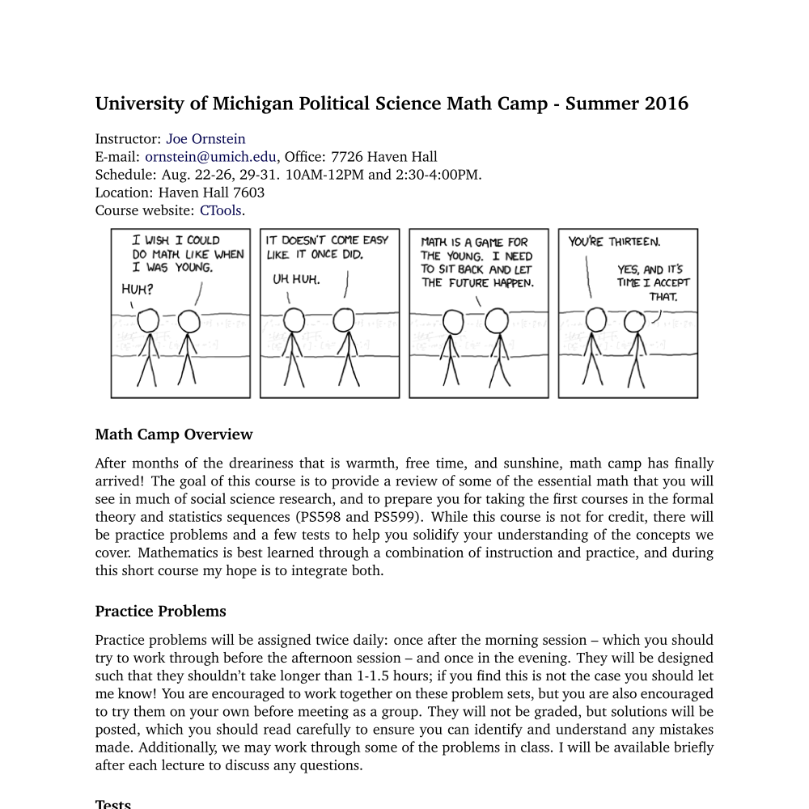

<!--html_preserve-->

  
Teaching

  
A collection of syllabi from courses I have taught.

  
  

    
    

      
      
      

        
        <a href="teaching/Syllabus-Political-Economy-of-Cities.pdf" class="galleryItemLabel">Political Economy of Cities</a>
        
University of Michigan

      

      
      

        
        <a href="teaching/Syllabus-Math-Camp-2016.pdf" class="galleryItemLabel">Political Science Math Camp</a>
        
University of Michigan

      

      
    

  

  

<!--/html_preserve-->
